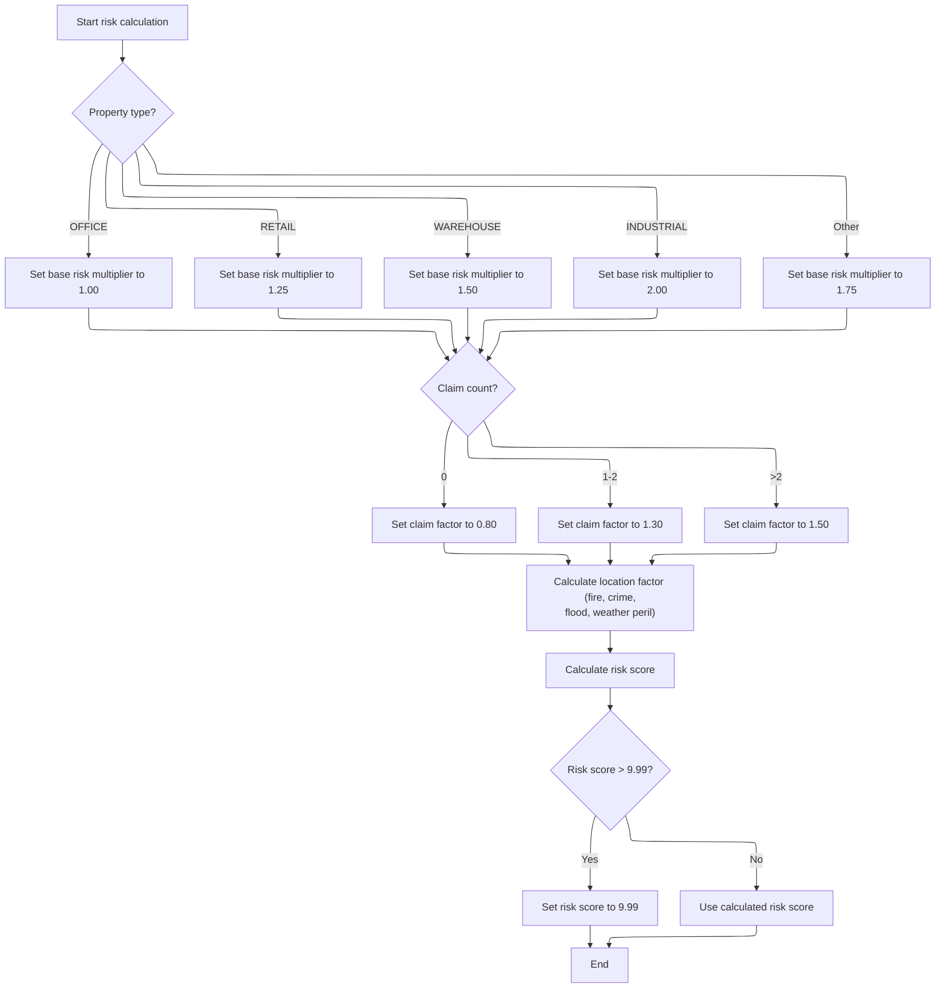

# Overview

This document describes the flow for processing property insurance policy records. Each record is validated for a policy number, assigned risk multipliers and a location risk factor, and receives a calculated risk score or an error log.

## Dependencies

### Program

- RISKPROG (<SwmPath>[base/src/lgarsk01.cbl](base/src/lgarsk01.cbl)</SwmPath>)

## Input and Output Tables/Files used

### RISKPROG (<SwmPath>[base/src/lgarsk01.cbl](base/src/lgarsk01.cbl)</SwmPath>)

| Table / File Name                                                                                                                       | Type | Description                                                            | Usage Mode | Key Fields / Layout Highlights |
| --------------------------------------------------------------------------------------------------------------------------------------- | ---- | ---------------------------------------------------------------------- | ---------- | ------------------------------ |
| <SwmToken path="base/src/lgarsk01.cbl" pos="12:3:5" line-data="           SELECT ERROR-FILE ASSIGN TO ERRFILE">`ERROR-FILE`</SwmToken>  | File | Error log for invalid or failed insurance policy records               | Output     | File resource                  |
| <SwmToken path="base/src/lgarsk01.cbl" pos="88:3:5" line-data="               WRITE ERROR-RECORD">`ERROR-RECORD`</SwmToken>             | File | Details of policy records with validation or read errors               | Output     | File resource                  |
| <SwmToken path="base/src/lgarsk01.cbl" pos="80:3:5" line-data="           READ INPUT-FILE">`INPUT-FILE`</SwmToken>                      | File | Insurance policy risk input records (policy, property, claims, perils) | Input      | File resource                  |
| <SwmToken path="base/src/lgarsk01.cbl" pos="9:3:5" line-data="           SELECT OUTPUT-FILE ASSIGN TO OUTFILE">`OUTPUT-FILE`</SwmToken> | File | Calculated risk scores and categories for insurance policies           | Output     | File resource                  |
| <SwmToken path="base/src/lgarsk01.cbl" pos="36:3:5" line-data="       01  OUTPUT-RECORD.">`OUTPUT-RECORD`</SwmToken>                    | File | Output record with policy number, risk score, and risk category        | Output     | File resource                  |

## Detailed View of the Program's Functionality

a. Program Initialization and File Handling

The program begins by defining three files: an input file for reading policy records, an output file for writing processed results, and an error file for logging any issues encountered during processing. Each file is assigned a status code to track its open/close state and any errors.

During initialization, the program attempts to open all three files. If the input file fails to open, an error message is displayed, and the program sets a flag to indicate the end of file processing, effectively preventing further operations.

b. Main Processing Loop

The core logic is orchestrated in a main routine that repeatedly processes records until the end-of-file flag is set. For each iteration, the following steps are performed:

1. The program reads the next record from the input file.
2. If the end of the file is reached, it sets the end-of-file flag and exits the processing routine.
3. If a read error occurs (other than end-of-file), the program logs the error by writing the policy number and an error message to the error file, then exits the processing routine for that record.
4. If the record is read successfully, the program proceeds to validate the data, calculate the risk, and write the output.

c. Record Validation

Before any calculations, the program validates the policy number. If the policy number is missing (i.e., it contains only spaces), the program logs an error message "INVALID POLICY NUMBER" to the error file and skips further processing for that record. Only records with a valid policy number proceed to the next steps.

d. Risk Calculation

For valid records, the program calculates a risk score using several factors:

1. **Base Risk Multiplier**: Determined by the property type. Each property type (office, retail, warehouse, industrial) is mapped to a specific multiplier. Any other property type receives a default multiplier.
2. **Claim Factor**: Based on the number of claims:
   - Zero claims: lowest multiplier.
   - One or two claims: medium multiplier.
   - More than two claims: highest multiplier.
3. **Location Factor**: Calculated as a weighted sum of four risk percentages: fire, crime, flood, and weather. Each is multiplied by a specific weight, and the sum is added to a base value.
4. **Final Risk Score**: The base risk multiplier, claim factor, and location factor are multiplied together to produce the final risk score. If this score exceeds a maximum threshold, it is capped.

e. Output Record Writing

After calculating the risk score, the program prepares the output record:

1. The policy number and risk score are written to the output.
2. The risk score is categorized:
   - Scores below a lower threshold are labeled "LOW".
   - Scores below a higher threshold are labeled "MEDIUM".
   - Scores above the higher threshold are labeled "HIGH".
3. The completed output record is written to the output file.

f. Closing Files

Once all records have been processed (i.e., the end-of-file flag is set), the program closes all files to ensure data integrity and proper resource management.

# Rule Definition

| Paragraph Name                                                                                                                                       | Rule ID | Category          | Description                                                                                                                                                                                                                                                 | Conditions                                                                           | Remarks                                                                                                                                                                                                           |
| ---------------------------------------------------------------------------------------------------------------------------------------------------- | ------- | ----------------- | ----------------------------------------------------------------------------------------------------------------------------------------------------------------------------------------------------------------------------------------------------------- | ------------------------------------------------------------------------------------ | ----------------------------------------------------------------------------------------------------------------------------------------------------------------------------------------------------------------- |
| <SwmToken path="base/src/lgarsk01.cbl" pos="66:3:5" line-data="           PERFORM 2000-PROCESS UNTIL WS-EOF = &#39;Y&#39;">`2000-PROCESS`</SwmToken> | RL-001  | Conditional Logic | The program reads policy records sequentially from the input file. If the end of the file is reached, it stops processing further records.                                                                                                                  | Triggered on each iteration of the main processing loop when reading the input file. | Input records are 400 characters, fixed-length. End-of-file is detected using the file status or AT END clause.                                                                                                   |
| <SwmToken path="base/src/lgarsk01.cbl" pos="66:3:5" line-data="           PERFORM 2000-PROCESS UNTIL WS-EOF = &#39;Y&#39;">`2000-PROCESS`</SwmToken> | RL-002  | Conditional Logic | If a read error occurs (other than end-of-file), the program writes an error record to the error file with the policy number (if available) and the message 'ERROR READING RECORD', padded to 90 characters, then skips further processing for that record. | Triggered when the file status after a read is not '00' and not end-of-file.         | Error record format: 100 characters, with policy number left-justified, padded to 10 characters, and error message left-justified, padded to 90 characters. Message: 'ERROR READING RECORD'.                      |
| <SwmToken path="base/src/lgarsk01.cbl" pos="92:3:7" line-data="           PERFORM 2100-VALIDATE-DATA">`2100-VALIDATE-DATA`</SwmToken>                | RL-003  | Conditional Logic | The program checks that the policy number is present and not all spaces. If missing or all spaces, it writes an error record with the message 'INVALID POLICY NUMBER', padded to 90 characters, and skips further processing for that record.               | Triggered for each input record after a successful read.                             | Error record format: 100 characters, with policy number left-justified, padded to 10 characters (spaces if missing), and error message left-justified, padded to 90 characters. Message: 'INVALID POLICY NUMBER'. |
| <SwmToken path="base/src/lgarsk01.cbl" pos="93:3:7" line-data="           PERFORM 2200-CALCULATE-RISK">`2200-CALCULATE-RISK`</SwmToken>              | RL-004  | Data Assignment   | Assigns a base risk multiplier based on the property type field. Specific values are mapped to specific multipliers, with a default for any other value.                                                                                                    | Triggered for each valid input record during risk calculation.                       | Property type to multiplier mapping:                                                                                                                                                                              |

- 'OFFICE': <SwmToken path="base/src/lgarsk01.cbl" pos="110:3:5" line-data="                   MOVE 1.00 TO WS-BS-RS">`1.00`</SwmToken>
- 'RETAIL': <SwmToken path="base/src/lgarsk01.cbl" pos="112:3:5" line-data="                   MOVE 1.25 TO WS-BS-RS">`1.25`</SwmToken>
- 'WAREHOUSE': <SwmToken path="base/src/lgarsk01.cbl" pos="114:3:5" line-data="                   MOVE 1.50 TO WS-BS-RS">`1.50`</SwmToken>
- 'INDUSTRIAL': <SwmToken path="base/src/lgarsk01.cbl" pos="116:3:5" line-data="                   MOVE 2.00 TO WS-BS-RS">`2.00`</SwmToken>
- Any other value: <SwmToken path="base/src/lgarsk01.cbl" pos="118:3:5" line-data="                   MOVE 1.75 TO WS-BS-RS">`1.75`</SwmToken> | | <SwmToken path="base/src/lgarsk01.cbl" pos="93:3:7" line-data="           PERFORM 2200-CALCULATE-RISK">`2200-CALCULATE-RISK`</SwmToken> | RL-005 | Data Assignment | Assigns a claim factor based on the integer value of the claim count field. | Triggered for each valid input record during risk calculation. | Claim count to factor mapping:
- 0: <SwmToken path="base/src/lgarsk01.cbl" pos="122:3:5" line-data="               MOVE 0.80 TO WS-CL-F">`0.80`</SwmToken>
- 1 or 2: <SwmToken path="base/src/lgarsk01.cbl" pos="124:3:5" line-data="               MOVE 1.30 TO WS-CL-F">`1.30`</SwmToken>
- Greater than 2: <SwmToken path="base/src/lgarsk01.cbl" pos="114:3:5" line-data="                   MOVE 1.50 TO WS-BS-RS">`1.50`</SwmToken> | | <SwmToken path="base/src/lgarsk01.cbl" pos="93:3:7" line-data="           PERFORM 2200-CALCULATE-RISK">`2200-CALCULATE-RISK`</SwmToken> | RL-006 | Computation | Calculates the location factor using peril values as raw integers, applying specified weights. | Triggered for each valid input record during risk calculation. | Location factor formula: 1 + (fire peril \* <SwmToken path="base/src/lgarsk01.cbl" pos="130:10:12" line-data="               (IN-FR-PR * 0.2) +">`0.2`</SwmToken>) + (crime peril \* <SwmToken path="base/src/lgarsk01.cbl" pos="130:10:12" line-data="               (IN-FR-PR * 0.2) +">`0.2`</SwmToken>) + (flood peril \* <SwmToken path="base/src/lgarsk01.cbl" pos="132:10:12" line-data="               (IN-FL-PR * 0.3) +">`0.3`</SwmToken>) + (weather peril \* <SwmToken path="base/src/lgarsk01.cbl" pos="130:10:12" line-data="               (IN-FR-PR * 0.2) +">`0.2`</SwmToken>) All peril values are integers, not divided by 100. | | <SwmToken path="base/src/lgarsk01.cbl" pos="93:3:7" line-data="           PERFORM 2200-CALCULATE-RISK">`2200-CALCULATE-RISK`</SwmToken> | RL-007 | Computation | Computes the risk score as the product of base risk multiplier, claim factor, and location factor. The result is rounded to two decimal places (round half up) and capped at <SwmToken path="base/src/lgarsk01.cbl" pos="138:11:13" line-data="           IF WS-F-RSK &gt; 9.99">`9.99`</SwmToken> if it exceeds this value. | Triggered for each valid input record after risk factors are assigned/calculated. | Risk score = base risk multiplier \* claim factor \* location factor Rounded to two decimal places (round half up) Capped at <SwmToken path="base/src/lgarsk01.cbl" pos="138:11:13" line-data="           IF WS-F-RSK &gt; 9.99">`9.99`</SwmToken> if result exceeds <SwmToken path="base/src/lgarsk01.cbl" pos="138:11:13" line-data="           IF WS-F-RSK &gt; 9.99">`9.99`</SwmToken> | | <SwmToken path="base/src/lgarsk01.cbl" pos="94:3:7" line-data="           PERFORM 2300-WRITE-OUTPUT">`2300-WRITE-OUTPUT`</SwmToken> | RL-008 | Conditional Logic | Assigns a risk category based on the final risk score: 'LOW', 'MEDIUM', or 'HIGH'. | Triggered for each valid input record after risk score is computed. | Risk category mapping:
- If risk score < <SwmToken path="base/src/lgarsk01.cbl" pos="147:11:13" line-data="               WHEN WS-F-RSK &lt; 3.00">`3.00`</SwmToken>: 'LOW'
- If risk score >= <SwmToken path="base/src/lgarsk01.cbl" pos="147:11:13" line-data="               WHEN WS-F-RSK &lt; 3.00">`3.00`</SwmToken> and < <SwmToken path="base/src/lgarsk01.cbl" pos="149:11:13" line-data="               WHEN WS-F-RSK &lt; 6.00">`6.00`</SwmToken>: 'MEDIUM'
- If risk score >= <SwmToken path="base/src/lgarsk01.cbl" pos="149:11:13" line-data="               WHEN WS-F-RSK &lt; 6.00">`6.00`</SwmToken>: 'HIGH' Output field is left-justified, padded to 10 characters. | | <SwmToken path="base/src/lgarsk01.cbl" pos="94:3:7" line-data="           PERFORM 2300-WRITE-OUTPUT">`2300-WRITE-OUTPUT`</SwmToken> | RL-009 | Data Assignment | For each valid input record, writes a 100-character, fixed-length output record to the output file with the policy number, risk score (as integer, left-padded with zeros), risk category, and filler spaces. | Triggered for each valid input record after risk score and category are determined. | Output record format: 100 characters
- Policy number: left-justified, padded to 10 characters
- Risk score: risk score \* 100, rounded, left-padded with zeros to 5 digits, no decimal point
- Risk category: left-justified, padded to 10 characters
- Filler: 75 spaces | | <SwmToken path="base/src/lgarsk01.cbl" pos="66:3:5" line-data="           PERFORM 2000-PROCESS UNTIL WS-EOF = &#39;Y&#39;">`2000-PROCESS`</SwmToken>, <SwmToken path="base/src/lgarsk01.cbl" pos="92:3:7" line-data="           PERFORM 2100-VALIDATE-DATA">`2100-VALIDATE-DATA`</SwmToken> | RL-010 | Data Assignment | For each error case, writes a 100-character, fixed-length error record to the error file with the policy number (spaces if missing) and the error message, both left-justified and padded as specified. | Triggered for each error case (read error, invalid policy number, etc.). | Error record format: 100 characters
- Policy number: left-justified, padded to 10 characters (spaces if missing)
- Error message: left-justified, padded to 90 characters No variable-length records allowed. |

# User Stories

## User Story 1: Sequential reading and error handling for input records

---

### Story Description:

As a system, I want to read policy records sequentially from the input file, detect end-of-file, and handle read errors by writing error records so that only valid records are processed and errors are logged appropriately.

---

### Business Rule Mapping:

| Rule ID | Paragraph Name                                                                                                                                       | Rule Description                                                                                                                                                                                                                                            |
| ------- | ---------------------------------------------------------------------------------------------------------------------------------------------------- | ----------------------------------------------------------------------------------------------------------------------------------------------------------------------------------------------------------------------------------------------------------- |
| RL-001  | <SwmToken path="base/src/lgarsk01.cbl" pos="66:3:5" line-data="           PERFORM 2000-PROCESS UNTIL WS-EOF = &#39;Y&#39;">`2000-PROCESS`</SwmToken> | The program reads policy records sequentially from the input file. If the end of the file is reached, it stops processing further records.                                                                                                                  |
| RL-002  | <SwmToken path="base/src/lgarsk01.cbl" pos="66:3:5" line-data="           PERFORM 2000-PROCESS UNTIL WS-EOF = &#39;Y&#39;">`2000-PROCESS`</SwmToken> | If a read error occurs (other than end-of-file), the program writes an error record to the error file with the policy number (if available) and the message 'ERROR READING RECORD', padded to 90 characters, then skips further processing for that record. |

---

### Relevant Functionality:

- <SwmToken path="base/src/lgarsk01.cbl" pos="66:3:5" line-data="           PERFORM 2000-PROCESS UNTIL WS-EOF = &#39;Y&#39;">`2000-PROCESS`</SwmToken>
  1. **RL-001:**
     - Loop:
       - Read next input record
       - If end-of-file detected:
         - Set end-of-file flag
         - Exit processing loop
  2. **RL-002:**
     - If read error (not end-of-file):
       - Set error record policy number to input policy number (if available)
       - Set error message to 'ERROR READING RECORD', pad to 90 characters
       - Write error record
       - Skip further processing for this record

## User Story 2: Validation of policy number and error reporting

---

### Story Description:

As a system, I want to validate that each policy record contains a valid policy number and write an error record if the policy number is missing or invalid, ensuring error records are formatted correctly, so that only records with valid identifiers are processed and errors are consistently reported.

---

### Business Rule Mapping:

| Rule ID | Paragraph Name                                                                                                                                                                                                                                                                              | Rule Description                                                                                                                                                                                                                              |
| ------- | ------------------------------------------------------------------------------------------------------------------------------------------------------------------------------------------------------------------------------------------------------------------------------------------- | --------------------------------------------------------------------------------------------------------------------------------------------------------------------------------------------------------------------------------------------- |
| RL-010  | <SwmToken path="base/src/lgarsk01.cbl" pos="66:3:5" line-data="           PERFORM 2000-PROCESS UNTIL WS-EOF = &#39;Y&#39;">`2000-PROCESS`</SwmToken>, <SwmToken path="base/src/lgarsk01.cbl" pos="92:3:7" line-data="           PERFORM 2100-VALIDATE-DATA">`2100-VALIDATE-DATA`</SwmToken> | For each error case, writes a 100-character, fixed-length error record to the error file with the policy number (spaces if missing) and the error message, both left-justified and padded as specified.                                       |
| RL-003  | <SwmToken path="base/src/lgarsk01.cbl" pos="92:3:7" line-data="           PERFORM 2100-VALIDATE-DATA">`2100-VALIDATE-DATA`</SwmToken>                                                                                                                                                       | The program checks that the policy number is present and not all spaces. If missing or all spaces, it writes an error record with the message 'INVALID POLICY NUMBER', padded to 90 characters, and skips further processing for that record. |

---

### Relevant Functionality:

- <SwmToken path="base/src/lgarsk01.cbl" pos="66:3:5" line-data="           PERFORM 2000-PROCESS UNTIL WS-EOF = &#39;Y&#39;">`2000-PROCESS`</SwmToken>
  1. **RL-010:**
     - Set error policy number (spaces if missing), left-justified, padded to 10 characters
     - Set error message, left-justified, padded to 90 characters
     - Write error record
- <SwmToken path="base/src/lgarsk01.cbl" pos="92:3:7" line-data="           PERFORM 2100-VALIDATE-DATA">`2100-VALIDATE-DATA`</SwmToken>
  1. **RL-003:**
     - If policy number is missing or all spaces:
       - Set error message to 'INVALID POLICY NUMBER', pad to 90 characters
       - Write error record
       - Skip further processing for this record

## User Story 3: Risk calculation for valid policy records

---

### Story Description:

As a system, I want to calculate the risk score and risk category for each valid policy record using property type, claim count, peril values, and specified formulas so that each policy is accurately assessed for risk.

---

### Business Rule Mapping:

| Rule ID | Paragraph Name                                                                                                                          | Rule Description                                                                                                                                                                                                                                                                                                             |
| ------- | --------------------------------------------------------------------------------------------------------------------------------------- | ---------------------------------------------------------------------------------------------------------------------------------------------------------------------------------------------------------------------------------------------------------------------------------------------------------------------------- |
| RL-004  | <SwmToken path="base/src/lgarsk01.cbl" pos="93:3:7" line-data="           PERFORM 2200-CALCULATE-RISK">`2200-CALCULATE-RISK`</SwmToken> | Assigns a base risk multiplier based on the property type field. Specific values are mapped to specific multipliers, with a default for any other value.                                                                                                                                                                     |
| RL-005  | <SwmToken path="base/src/lgarsk01.cbl" pos="93:3:7" line-data="           PERFORM 2200-CALCULATE-RISK">`2200-CALCULATE-RISK`</SwmToken> | Assigns a claim factor based on the integer value of the claim count field.                                                                                                                                                                                                                                                  |
| RL-006  | <SwmToken path="base/src/lgarsk01.cbl" pos="93:3:7" line-data="           PERFORM 2200-CALCULATE-RISK">`2200-CALCULATE-RISK`</SwmToken> | Calculates the location factor using peril values as raw integers, applying specified weights.                                                                                                                                                                                                                               |
| RL-007  | <SwmToken path="base/src/lgarsk01.cbl" pos="93:3:7" line-data="           PERFORM 2200-CALCULATE-RISK">`2200-CALCULATE-RISK`</SwmToken> | Computes the risk score as the product of base risk multiplier, claim factor, and location factor. The result is rounded to two decimal places (round half up) and capped at <SwmToken path="base/src/lgarsk01.cbl" pos="138:11:13" line-data="           IF WS-F-RSK &gt; 9.99">`9.99`</SwmToken> if it exceeds this value. |
| RL-008  | <SwmToken path="base/src/lgarsk01.cbl" pos="94:3:7" line-data="           PERFORM 2300-WRITE-OUTPUT">`2300-WRITE-OUTPUT`</SwmToken>     | Assigns a risk category based on the final risk score: 'LOW', 'MEDIUM', or 'HIGH'.                                                                                                                                                                                                                                           |

---

### Relevant Functionality:

- <SwmToken path="base/src/lgarsk01.cbl" pos="93:3:7" line-data="           PERFORM 2200-CALCULATE-RISK">`2200-CALCULATE-RISK`</SwmToken>
  1. **RL-004:**
     - If property type is 'OFFICE', set base multiplier to <SwmToken path="base/src/lgarsk01.cbl" pos="110:3:5" line-data="                   MOVE 1.00 TO WS-BS-RS">`1.00`</SwmToken>
     - Else if 'RETAIL', set to <SwmToken path="base/src/lgarsk01.cbl" pos="112:3:5" line-data="                   MOVE 1.25 TO WS-BS-RS">`1.25`</SwmToken>
     - Else if 'WAREHOUSE', set to <SwmToken path="base/src/lgarsk01.cbl" pos="114:3:5" line-data="                   MOVE 1.50 TO WS-BS-RS">`1.50`</SwmToken>
     - Else if 'INDUSTRIAL', set to <SwmToken path="base/src/lgarsk01.cbl" pos="116:3:5" line-data="                   MOVE 2.00 TO WS-BS-RS">`2.00`</SwmToken>
     - Else set to <SwmToken path="base/src/lgarsk01.cbl" pos="118:3:5" line-data="                   MOVE 1.75 TO WS-BS-RS">`1.75`</SwmToken>
  2. **RL-005:**
     - If claim count is 0, set claim factor to <SwmToken path="base/src/lgarsk01.cbl" pos="122:3:5" line-data="               MOVE 0.80 TO WS-CL-F">`0.80`</SwmToken>
     - Else if claim count is 1 or 2, set to <SwmToken path="base/src/lgarsk01.cbl" pos="124:3:5" line-data="               MOVE 1.30 TO WS-CL-F">`1.30`</SwmToken>
     - Else set to <SwmToken path="base/src/lgarsk01.cbl" pos="114:3:5" line-data="                   MOVE 1.50 TO WS-BS-RS">`1.50`</SwmToken>
  3. **RL-006:**
     - Compute location factor as:
       - 1 + (fire peril \* <SwmToken path="base/src/lgarsk01.cbl" pos="130:10:12" line-data="               (IN-FR-PR * 0.2) +">`0.2`</SwmToken>) + (crime peril \* <SwmToken path="base/src/lgarsk01.cbl" pos="130:10:12" line-data="               (IN-FR-PR * 0.2) +">`0.2`</SwmToken>) + (flood peril \* <SwmToken path="base/src/lgarsk01.cbl" pos="132:10:12" line-data="               (IN-FL-PR * 0.3) +">`0.3`</SwmToken>) + (weather peril \* <SwmToken path="base/src/lgarsk01.cbl" pos="130:10:12" line-data="               (IN-FR-PR * 0.2) +">`0.2`</SwmToken>)
  4. **RL-007:**
     - Compute risk score = base multiplier \* claim factor \* location factor
     - Round to two decimal places (round half up)
     - If risk score > <SwmToken path="base/src/lgarsk01.cbl" pos="138:11:13" line-data="           IF WS-F-RSK &gt; 9.99">`9.99`</SwmToken>, set to <SwmToken path="base/src/lgarsk01.cbl" pos="138:11:13" line-data="           IF WS-F-RSK &gt; 9.99">`9.99`</SwmToken>
- <SwmToken path="base/src/lgarsk01.cbl" pos="94:3:7" line-data="           PERFORM 2300-WRITE-OUTPUT">`2300-WRITE-OUTPUT`</SwmToken>
  1. **RL-008:**
     - If risk score < <SwmToken path="base/src/lgarsk01.cbl" pos="147:11:13" line-data="               WHEN WS-F-RSK &lt; 3.00">`3.00`</SwmToken>, set category to 'LOW'
     - Else if < <SwmToken path="base/src/lgarsk01.cbl" pos="149:11:13" line-data="               WHEN WS-F-RSK &lt; 6.00">`6.00`</SwmToken>, set to 'MEDIUM'
     - Else set to 'HIGH'

## User Story 4: Writing formatted output and error records

---

### Story Description:

As a system, I want to write each processed policy record and error record to their respective output files in a fixed-length, formatted structure so that the results are consistent and ready for downstream processing or review.

---

### Business Rule Mapping:

| Rule ID | Paragraph Name                                                                                                                                                                                                                                                                              | Rule Description                                                                                                                                                                                              |
| ------- | ------------------------------------------------------------------------------------------------------------------------------------------------------------------------------------------------------------------------------------------------------------------------------------------- | ------------------------------------------------------------------------------------------------------------------------------------------------------------------------------------------------------------- |
| RL-010  | <SwmToken path="base/src/lgarsk01.cbl" pos="66:3:5" line-data="           PERFORM 2000-PROCESS UNTIL WS-EOF = &#39;Y&#39;">`2000-PROCESS`</SwmToken>, <SwmToken path="base/src/lgarsk01.cbl" pos="92:3:7" line-data="           PERFORM 2100-VALIDATE-DATA">`2100-VALIDATE-DATA`</SwmToken> | For each error case, writes a 100-character, fixed-length error record to the error file with the policy number (spaces if missing) and the error message, both left-justified and padded as specified.       |
| RL-009  | <SwmToken path="base/src/lgarsk01.cbl" pos="94:3:7" line-data="           PERFORM 2300-WRITE-OUTPUT">`2300-WRITE-OUTPUT`</SwmToken>                                                                                                                                                         | For each valid input record, writes a 100-character, fixed-length output record to the output file with the policy number, risk score (as integer, left-padded with zeros), risk category, and filler spaces. |

---

### Relevant Functionality:

- <SwmToken path="base/src/lgarsk01.cbl" pos="66:3:5" line-data="           PERFORM 2000-PROCESS UNTIL WS-EOF = &#39;Y&#39;">`2000-PROCESS`</SwmToken>
  1. **RL-010:**
     - Set error policy number (spaces if missing), left-justified, padded to 10 characters
     - Set error message, left-justified, padded to 90 characters
     - Write error record
- <SwmToken path="base/src/lgarsk01.cbl" pos="94:3:7" line-data="           PERFORM 2300-WRITE-OUTPUT">`2300-WRITE-OUTPUT`</SwmToken>
  1. **RL-009:**
     - Set output policy number to input policy number, left-justified, padded to 10 characters
     - Set risk score to (risk score \* 100), rounded, left-padded with zeros to 5 digits
     - Set risk category, left-justified, padded to 10 characters
     - Set filler to 75 spaces
     - Write output record

# Workflow

# Orchestrating file operations and record processing

This section coordinates the main program flow, ensuring that initialization, record processing, and resource closure occur in the correct sequence. It acts as the orchestrator for file and record operations, delegating detailed work to other sections.

| Rule ID | Category        | Rule Name                         | Description                                                                                                                               | Implementation Details                                                                  |
| ------- | --------------- | --------------------------------- | ----------------------------------------------------------------------------------------------------------------------------------------- | --------------------------------------------------------------------------------------- |
| BR-001  | Decision Making | Initialization before processing  | Initialization is performed before any record processing begins, ensuring all resources and state are prepared for subsequent operations. | No specific constants or output formats are defined in this section for initialization. |
| BR-002  | Decision Making | Iterative record processing       | Each policy record is processed one at a time in a loop, continuing until the end-of-file condition is met.                               | The end-of-file indicator is 'Y' when processing should stop; initial value is 'N'.     |
| BR-003  | Decision Making | Resource closure after processing | After all records have been processed, resources are closed to complete the operation and ensure data integrity.                          | No specific constants or output formats are defined in this section for closure.        |

<SwmSnippet path="/base/src/lgarsk01.cbl" line="64">

---

<SwmToken path="base/src/lgarsk01.cbl" pos="64:1:3" line-data="       0000-MAIN.">`0000-MAIN`</SwmToken> handles the overall flow: it opens files, loops through policy records by calling <SwmToken path="base/src/lgarsk01.cbl" pos="66:3:5" line-data="           PERFORM 2000-PROCESS UNTIL WS-EOF = &#39;Y&#39;">`2000-PROCESS`</SwmToken> until <SwmToken path="base/src/lgarsk01.cbl" pos="66:9:11" line-data="           PERFORM 2000-PROCESS UNTIL WS-EOF = &#39;Y&#39;">`WS-EOF`</SwmToken> is 'Y', then closes files. Calling <SwmToken path="base/src/lgarsk01.cbl" pos="66:3:5" line-data="           PERFORM 2000-PROCESS UNTIL WS-EOF = &#39;Y&#39;">`2000-PROCESS`</SwmToken> lets us process each record one at a time, so we can validate, calculate risk, and write output for every policy in the input file.

```cobol
       0000-MAIN.
           PERFORM 1000-INIT
           PERFORM 2000-PROCESS UNTIL WS-EOF = 'Y'
           PERFORM 3000-CLOSE
           GOBACK.
```

---

</SwmSnippet>

# Reading, validating, and error handling for policy records

```mermaid
%%{init: {"flowchart": {"defaultRenderer": "elk"}} }%%
flowchart TD
    node1["Read next input policy record"] --> node2{"End of input file?"}
    click node1 openCode "base/src/lgarsk01.cbl:80:81"
    node2 -->|"Yes"| node3["Set WS-EOF to 'Y' and exit"]
    click node2 openCode "base/src/lgarsk01.cbl:81:82"
    click node3 openCode "base/src/lgarsk01.cbl:81:83"
    node2 -->|"No"| node4{"Input file read successful?"}
    click node4 openCode "base/src/lgarsk01.cbl:85:90"
    node4 -->|"No"| node5["Write error record with IN-POLICY-NUM
and ERR-MESSAGE, then exit"]
    click node5 openCode "base/src/lgarsk01.cbl:86:89"
    node4 -->|"Yes"| node6["Validate policy number"]
    click node6 openCode "base/src/lgarsk01.cbl:92:92"
    node6 --> node7{"Policy number valid?"}
    click node7 openCode "base/src/lgarsk01.cbl:101:105"
    node7 -->|"No"| node8["Write error record 'INVALID POLICY
NUMBER', then exit"]
    click node8 openCode "base/src/lgarsk01.cbl:102:104"
    node7 -->|"Yes"| node9["Calculate risk"]
    click node9 openCode "base/src/lgarsk01.cbl:93:93"
    node9 --> node10["Write output record"]
    click node10 openCode "base/src/lgarsk01.cbl:94:94"

classDef HeadingStyle fill:#777777,stroke:#333,stroke-width:2px;

%% Swimm:
%% %%{init: {"flowchart": {"defaultRenderer": "elk"}} }%%
%% flowchart TD
%%     node1["Read next input policy record"] --> node2{"End of input file?"}
%%     click node1 openCode "<SwmPath>[base/src/lgarsk01.cbl](base/src/lgarsk01.cbl)</SwmPath>:80:81"
%%     node2 -->|"Yes"| node3["Set <SwmToken path="base/src/lgarsk01.cbl" pos="66:9:11" line-data="           PERFORM 2000-PROCESS UNTIL WS-EOF = &#39;Y&#39;">`WS-EOF`</SwmToken> to 'Y' and exit"]
%%     click node2 openCode "<SwmPath>[base/src/lgarsk01.cbl](base/src/lgarsk01.cbl)</SwmPath>:81:82"
%%     click node3 openCode "<SwmPath>[base/src/lgarsk01.cbl](base/src/lgarsk01.cbl)</SwmPath>:81:83"
%%     node2 -->|"No"| node4{"Input file read successful?"}
%%     click node4 openCode "<SwmPath>[base/src/lgarsk01.cbl](base/src/lgarsk01.cbl)</SwmPath>:85:90"
%%     node4 -->|"No"| node5["Write error record with <SwmToken path="base/src/lgarsk01.cbl" pos="86:3:7" line-data="               MOVE IN-POLICY-NUM TO ERR-POLICY-NUM">`IN-POLICY-NUM`</SwmToken>
%% and <SwmToken path="base/src/lgarsk01.cbl" pos="87:13:15" line-data="               MOVE &#39;ERROR READING RECORD&#39; TO ERR-MESSAGE">`ERR-MESSAGE`</SwmToken>, then exit"]
%%     click node5 openCode "<SwmPath>[base/src/lgarsk01.cbl](base/src/lgarsk01.cbl)</SwmPath>:86:89"
%%     node4 -->|"Yes"| node6["Validate policy number"]
%%     click node6 openCode "<SwmPath>[base/src/lgarsk01.cbl](base/src/lgarsk01.cbl)</SwmPath>:92:92"
%%     node6 --> node7{"Policy number valid?"}
%%     click node7 openCode "<SwmPath>[base/src/lgarsk01.cbl](base/src/lgarsk01.cbl)</SwmPath>:101:105"
%%     node7 -->|"No"| node8["Write error record 'INVALID POLICY
%% NUMBER', then exit"]
%%     click node8 openCode "<SwmPath>[base/src/lgarsk01.cbl](base/src/lgarsk01.cbl)</SwmPath>:102:104"
%%     node7 -->|"Yes"| node9["Calculate risk"]
%%     click node9 openCode "<SwmPath>[base/src/lgarsk01.cbl](base/src/lgarsk01.cbl)</SwmPath>:93:93"
%%     node9 --> node10["Write output record"]
%%     click node10 openCode "<SwmPath>[base/src/lgarsk01.cbl](base/src/lgarsk01.cbl)</SwmPath>:94:94"
%% 
%% classDef HeadingStyle fill:#777777,stroke:#333,stroke-width:2px;
```



This section governs the reading, validation, and error handling for policy records. It ensures that only records with a present policy number are processed further, and logs errors for missing policy numbers or file read failures.

| Rule ID | Category        | Rule Name                     | Description                                                                                                                                                                                     | Implementation Details                                                                                                                                           |
| ------- | --------------- | ----------------------------- | ----------------------------------------------------------------------------------------------------------------------------------------------------------------------------------------------- | ---------------------------------------------------------------------------------------------------------------------------------------------------------------- |
| BR-001  | Reading Input   | End of input file handling    | When the end of the input file is reached, the end-of-file flag is set to 'Y' and no further processing occurs for that record.                                                                 | The end-of-file flag is set to 'Y'. No output record is written for this condition.                                                                              |
| BR-002  | Data validation | Input file read error logging | If the input file read operation fails (status not '00'), an error record is written containing the policy number and the message 'ERROR READING RECORD', and processing for that record stops. | The error record contains the policy number (string, 10 characters) and the error message (string, 90 characters). The error message is 'ERROR READING RECORD'.  |
| BR-003  | Data validation | Policy number required        | If the policy number field is missing (contains only spaces), an error record is written with the message 'INVALID POLICY NUMBER', and processing for that record stops.                        | The error record contains the policy number (string, 10 characters) and the error message (string, 90 characters). The error message is 'INVALID POLICY NUMBER'. |

<SwmSnippet path="/base/src/lgarsk01.cbl" line="79">

---

In <SwmToken path="base/src/lgarsk01.cbl" pos="79:1:3" line-data="       2000-PROCESS.">`2000-PROCESS`</SwmToken>, we read the next input record, check for end-of-file, and handle read errors by logging them and exiting. This sets up the flow for validation and risk calculation only if the record is valid.

```cobol
       2000-PROCESS.
           READ INPUT-FILE
               AT END MOVE 'Y' TO WS-EOF
               GO TO 2000-EXIT
           END-READ

           IF WS-INPUT-STATUS NOT = '00'
               MOVE IN-POLICY-NUM TO ERR-POLICY-NUM
               MOVE 'ERROR READING RECORD' TO ERR-MESSAGE
               WRITE ERROR-RECORD
               GO TO 2000-EXIT
           END-IF
```

---

</SwmSnippet>

<SwmSnippet path="/base/src/lgarsk01.cbl" line="92">

---

After handling read errors, we call <SwmToken path="base/src/lgarsk01.cbl" pos="92:3:7" line-data="           PERFORM 2100-VALIDATE-DATA">`2100-VALIDATE-DATA`</SwmToken> to check if the policy number is present. If validation passes, we move on to calculate risk and write output; otherwise, we log an error and exit, so only valid records get processed.

```cobol
           PERFORM 2100-VALIDATE-DATA
           PERFORM 2200-CALCULATE-RISK
           PERFORM 2300-WRITE-OUTPUT
```

---

</SwmSnippet>

<SwmSnippet path="/base/src/lgarsk01.cbl" line="100">

---

<SwmToken path="base/src/lgarsk01.cbl" pos="100:1:5" line-data="       2100-VALIDATE-DATA.">`2100-VALIDATE-DATA`</SwmToken> checks if the policy number is just spaces (meaning it's missing), logs 'INVALID POLICY NUMBER' to the error record, and exits early. This prevents any further processing for records without a valid policy number.

```cobol
       2100-VALIDATE-DATA.
           IF IN-POLICY-NUM = SPACES
               MOVE 'INVALID POLICY NUMBER' TO ERR-MESSAGE
               WRITE ERROR-RECORD
               GO TO 2000-EXIT
           END-IF.
```

---

</SwmSnippet>

# Assigning risk multipliers and computing risk score



This section calculates the risk score for a property insurance policy by assigning multipliers based on property type and claim history, computing a location risk factor, and combining these to produce a final risk score. The score is capped at a maximum value to ensure consistency in risk assessment.

| Rule ID | Category    | Rule Name                        | Description                                                                                                                                                                                                                                                                                                                                                                                                                                                                                                                                                                                                                                                                                                                                                                          | Implementation Details                                                                                                                                                                                                                                                                                                                                                                                                                                                                                                                                                                                                                                                                                                                                                       |
| ------- | ----------- | -------------------------------- | ------------------------------------------------------------------------------------------------------------------------------------------------------------------------------------------------------------------------------------------------------------------------------------------------------------------------------------------------------------------------------------------------------------------------------------------------------------------------------------------------------------------------------------------------------------------------------------------------------------------------------------------------------------------------------------------------------------------------------------------------------------------------------------ | ---------------------------------------------------------------------------------------------------------------------------------------------------------------------------------------------------------------------------------------------------------------------------------------------------------------------------------------------------------------------------------------------------------------------------------------------------------------------------------------------------------------------------------------------------------------------------------------------------------------------------------------------------------------------------------------------------------------------------------------------------------------------------- |
| BR-001  | Calculation | Property type risk multiplier    | Assign a base risk multiplier according to property type: <SwmToken path="base/src/lgarsk01.cbl" pos="110:3:5" line-data="                   MOVE 1.00 TO WS-BS-RS">`1.00`</SwmToken> for office, <SwmToken path="base/src/lgarsk01.cbl" pos="112:3:5" line-data="                   MOVE 1.25 TO WS-BS-RS">`1.25`</SwmToken> for retail, <SwmToken path="base/src/lgarsk01.cbl" pos="114:3:5" line-data="                   MOVE 1.50 TO WS-BS-RS">`1.50`</SwmToken> for warehouse, <SwmToken path="base/src/lgarsk01.cbl" pos="116:3:5" line-data="                   MOVE 2.00 TO WS-BS-RS">`2.00`</SwmToken> for industrial, and <SwmToken path="base/src/lgarsk01.cbl" pos="118:3:5" line-data="                   MOVE 1.75 TO WS-BS-RS">`1.75`</SwmToken> for any other type. | The mapping is: OFFICE = <SwmToken path="base/src/lgarsk01.cbl" pos="110:3:5" line-data="                   MOVE 1.00 TO WS-BS-RS">`1.00`</SwmToken>, RETAIL = <SwmToken path="base/src/lgarsk01.cbl" pos="112:3:5" line-data="                   MOVE 1.25 TO WS-BS-RS">`1.25`</SwmToken>, WAREHOUSE = <SwmToken path="base/src/lgarsk01.cbl" pos="114:3:5" line-data="                   MOVE 1.50 TO WS-BS-RS">`1.50`</SwmToken>, INDUSTRIAL = <SwmToken path="base/src/lgarsk01.cbl" pos="116:3:5" line-data="                   MOVE 2.00 TO WS-BS-RS">`2.00`</SwmToken>, all others = <SwmToken path="base/src/lgarsk01.cbl" pos="118:3:5" line-data="                   MOVE 1.75 TO WS-BS-RS">`1.75`</SwmToken>. The multiplier is a number with two decimal places. |
| BR-002  | Calculation | Claim count risk factor          | Assign a claim factor based on the number of claims: <SwmToken path="base/src/lgarsk01.cbl" pos="122:3:5" line-data="               MOVE 0.80 TO WS-CL-F">`0.80`</SwmToken> for zero claims, <SwmToken path="base/src/lgarsk01.cbl" pos="124:3:5" line-data="               MOVE 1.30 TO WS-CL-F">`1.30`</SwmToken> for one or two claims, <SwmToken path="base/src/lgarsk01.cbl" pos="114:3:5" line-data="                   MOVE 1.50 TO WS-BS-RS">`1.50`</SwmToken> for more than two claims.                                                                                                                                                                                                                                                                                     | The mapping is: 0 claims = <SwmToken path="base/src/lgarsk01.cbl" pos="122:3:5" line-data="               MOVE 0.80 TO WS-CL-F">`0.80`</SwmToken>, 1-2 claims = <SwmToken path="base/src/lgarsk01.cbl" pos="124:3:5" line-data="               MOVE 1.30 TO WS-CL-F">`1.30`</SwmToken>, more than 2 claims = <SwmToken path="base/src/lgarsk01.cbl" pos="114:3:5" line-data="                   MOVE 1.50 TO WS-BS-RS">`1.50`</SwmToken>. The factor is a number with two decimal places.                                                                                                                                                                                                                                                                                    |
| BR-003  | Calculation | Location risk factor calculation | Calculate the location factor as 1 plus <SwmToken path="base/src/lgarsk01.cbl" pos="130:10:12" line-data="               (IN-FR-PR * 0.2) +">`0.2`</SwmToken> times the fire risk, <SwmToken path="base/src/lgarsk01.cbl" pos="130:10:12" line-data="               (IN-FR-PR * 0.2) +">`0.2`</SwmToken> times the crime risk, <SwmToken path="base/src/lgarsk01.cbl" pos="132:10:12" line-data="               (IN-FL-PR * 0.3) +">`0.3`</SwmToken> times the flood risk, and <SwmToken path="base/src/lgarsk01.cbl" pos="130:10:12" line-data="               (IN-FR-PR * 0.2) +">`0.2`</SwmToken> times the weather peril risk.                                                                                                                                                   | The formula is: 1 + (fire risk \* <SwmToken path="base/src/lgarsk01.cbl" pos="130:10:12" line-data="               (IN-FR-PR * 0.2) +">`0.2`</SwmToken>) + (crime risk \* <SwmToken path="base/src/lgarsk01.cbl" pos="130:10:12" line-data="               (IN-FR-PR * 0.2) +">`0.2`</SwmToken>) + (flood risk \* <SwmToken path="base/src/lgarsk01.cbl" pos="132:10:12" line-data="               (IN-FL-PR * 0.3) +">`0.3`</SwmToken>) + (weather peril risk \* <SwmToken path="base/src/lgarsk01.cbl" pos="130:10:12" line-data="               (IN-FR-PR * 0.2) +">`0.2`</SwmToken>). The result is a number with two decimal places.                                                                                                                                    |
| BR-004  | Calculation | Risk score calculation and cap   | Calculate the final risk score by multiplying the base risk multiplier, claim factor, and location factor. If the result exceeds <SwmToken path="base/src/lgarsk01.cbl" pos="138:11:13" line-data="           IF WS-F-RSK &gt; 9.99">`9.99`</SwmToken>, set the risk score to <SwmToken path="base/src/lgarsk01.cbl" pos="138:11:13" line-data="           IF WS-F-RSK &gt; 9.99">`9.99`</SwmToken>.                                                                                                                                                                                                                                                                                                                                                                                 | The risk score is the product of the three factors, rounded to two decimal places. If the result is greater than <SwmToken path="base/src/lgarsk01.cbl" pos="138:11:13" line-data="           IF WS-F-RSK &gt; 9.99">`9.99`</SwmToken>, the score is set to <SwmToken path="base/src/lgarsk01.cbl" pos="138:11:13" line-data="           IF WS-F-RSK &gt; 9.99">`9.99`</SwmToken>.                                                                                                                                                                                                                                                                                                                                                                                           |

<SwmSnippet path="/base/src/lgarsk01.cbl" line="107">

---

In <SwmToken path="base/src/lgarsk01.cbl" pos="107:1:5" line-data="       2200-CALCULATE-RISK.">`2200-CALCULATE-RISK`</SwmToken>, we assign a base risk multiplier based on property type. The mapping is hardcoded: office, retail, warehouse, industrial get specific values, anything else gets a default. No validation is done on the input, so the function assumes the property type is valid or defaults to 'OTHER'.

```cobol
       2200-CALCULATE-RISK.
           EVALUATE IN-PROPERTY-TYPE
               WHEN 'OFFICE'
                   MOVE 1.00 TO WS-BS-RS
               WHEN 'RETAIL'
                   MOVE 1.25 TO WS-BS-RS
               WHEN 'WAREHOUSE'
                   MOVE 1.50 TO WS-BS-RS
               WHEN 'INDUSTRIAL'
                   MOVE 2.00 TO WS-BS-RS
               WHEN OTHER
                   MOVE 1.75 TO WS-BS-RS
           END-EVALUATE
```

---

</SwmSnippet>

<SwmSnippet path="/base/src/lgarsk01.cbl" line="121">

---

After setting the base risk multiplier, we calculate the claim factor based on claim count: zero claims gets a lower multiplier, 1-2 claims gets a medium one, more than 2 gets the highest. This feeds into the final risk calculation, and again, no validation is done on the input.

```cobol
           IF IN-CLAIM-COUNT = 0
               MOVE 0.80 TO WS-CL-F
           ELSE IF IN-CLAIM-COUNT <= 2
               MOVE 1.30 TO WS-CL-F
           ELSE
               MOVE 1.50 TO WS-CL-F
           END-IF
```

---

</SwmSnippet>

<SwmSnippet path="/base/src/lgarsk01.cbl" line="129">

---

Finally, we compute the location factor as a weighted sum of fire, crime, flood, and weather risks, then multiply everything together for the final risk score. If the score is above <SwmToken path="base/src/lgarsk01.cbl" pos="138:11:13" line-data="           IF WS-F-RSK &gt; 9.99">`9.99`</SwmToken>, it's capped. No validation is done on the input percentages, so the function assumes they're reasonable.

```cobol
           COMPUTE WS-LOC-F = 1 +
               (IN-FR-PR * 0.2) +
               (IN-CR-PR * 0.2) +
               (IN-FL-PR * 0.3) +
               (IN-WE-PR * 0.2)

           COMPUTE WS-F-RSK ROUNDED =
               WS-BS-RS * WS-CL-F * WS-LOC-F

           IF WS-F-RSK > 9.99
               MOVE 9.99 TO WS-F-RSK
           END-IF.
```

---

</SwmSnippet>

&nbsp;

*This is an auto-generated document by Swimm 🌊 and has not yet been verified by a human*

<SwmMeta version="3.0.0" repo-id="Z2l0aHViJTNBJTNBU3dpbW1pby1nZW5hcHAtaG91c2UlM0ElM0FHaXJpLVN3aW1t" repo-name="Swimmio-genapp-house"><sup>Powered by [Swimm](https://app.swimm.io/)</sup></SwmMeta>
