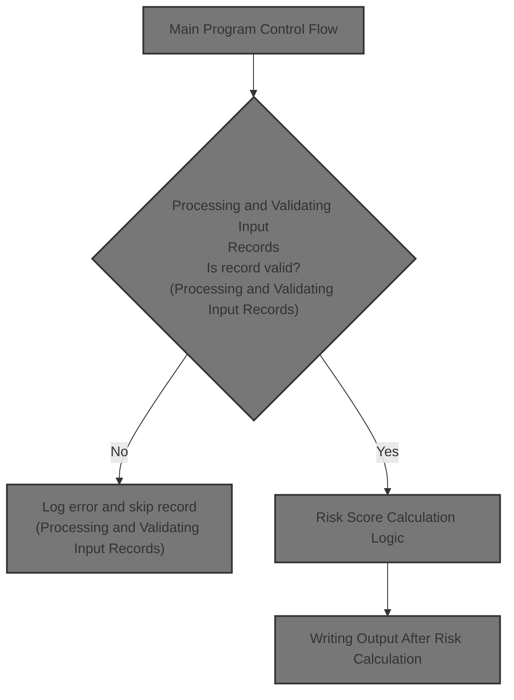
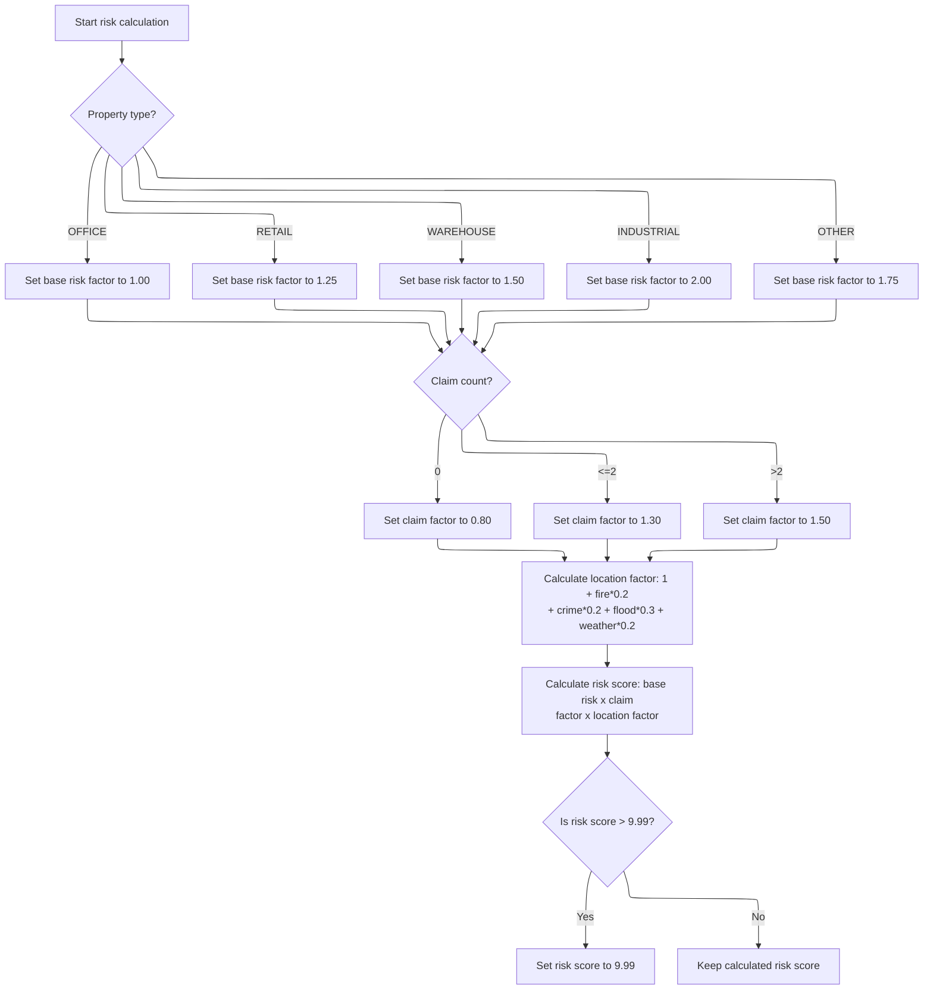
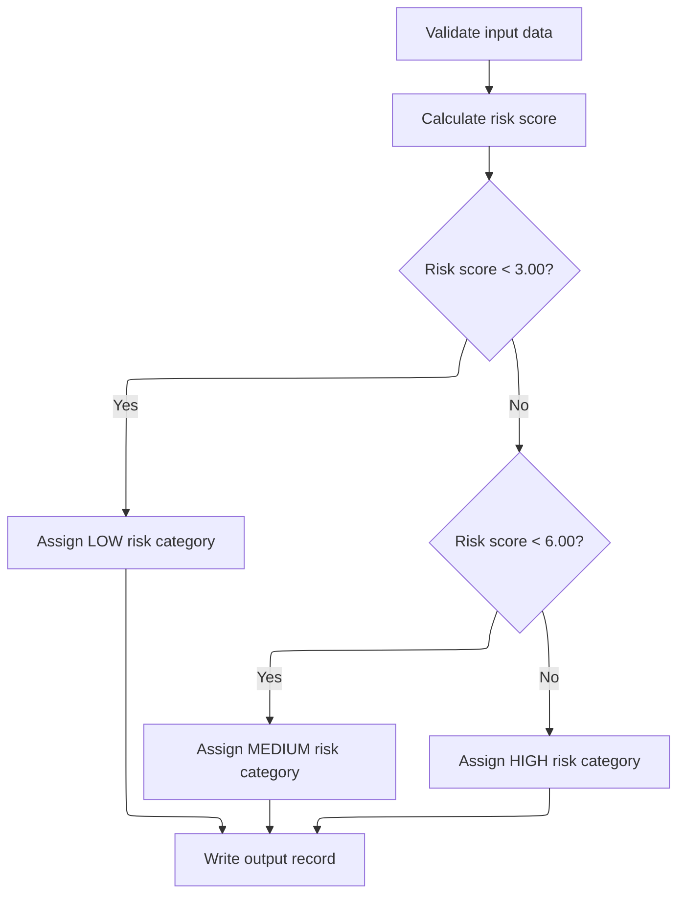

# Overview

This document explains how property insurance policy records are validated, scored for risk, categorized, and output for further processing. Invalid records are logged with errors, ensuring only valid data is used.



## Dependencies

### Program

- RISKPROG (<SwmPath>[base/src/lgarsk01.cbl](base/src/lgarsk01.cbl)</SwmPath>)

## Input and Output Tables/Files used

### RISKPROG (<SwmPath>[base/src/lgarsk01.cbl](base/src/lgarsk01.cbl)</SwmPath>)

| Table / File Name                                                                                                                       | Type | Description                                  | Usage Mode | Key Fields / Layout Highlights |
| --------------------------------------------------------------------------------------------------------------------------------------- | ---- | -------------------------------------------- | ---------- | ------------------------------ |
| <SwmToken path="base/src/lgarsk01.cbl" pos="12:3:5" line-data="           SELECT ERROR-FILE ASSIGN TO ERRFILE">`ERROR-FILE`</SwmToken>  | File | Policy processing errors and messages        | Output     | File resource                  |
| <SwmToken path="base/src/lgarsk01.cbl" pos="88:3:5" line-data="               WRITE ERROR-RECORD">`ERROR-RECORD`</SwmToken>             | File | Policy number and error message details      | Output     | File resource                  |
| <SwmToken path="base/src/lgarsk01.cbl" pos="80:3:5" line-data="           READ INPUT-FILE">`INPUT-FILE`</SwmToken>                      | File | Property insurance policy input records      | Input      | File resource                  |
| <SwmToken path="base/src/lgarsk01.cbl" pos="9:3:5" line-data="           SELECT OUTPUT-FILE ASSIGN TO OUTFILE">`OUTPUT-FILE`</SwmToken> | File | Risk assessment results for each policy      | Output     | File resource                  |
| <SwmToken path="base/src/lgarsk01.cbl" pos="154:3:5" line-data="           WRITE OUTPUT-RECORD.">`OUTPUT-RECORD`</SwmToken>             | File | Policy number, risk score, and risk category | Output     | File resource                  |

## Detailed View of the Program's Functionality

Main Program Control Flow

The program begins by initializing the system. This involves opening the input, output, and error files. If there is an error opening the input file, the program logs an error message and sets a flag to indicate the end of processing.

After initialization, the program enters a loop that continues until the end-of-file flag is set. In each iteration of the loop, the program processes one input record. This involves reading the record, validating it, calculating a risk score, and writing the results to the output file. If the end of the input file is reached, or if a read error occurs, the loop exits.

Once all records have been processed, the program closes all files and exits.

Processing and Validating Input Records

For each record, the program attempts to read from the input file. If the end of the file is reached, it sets the end-of-file flag and skips further processing for that iteration. If there is a read error, it logs the error by writing the policy number and an error message to the error file, then skips further processing for that record.

After a successful read, the program validates the input data. Specifically, it checks whether the policy number is present. If the policy number is missing (i.e., it contains only spaces), the program logs an error message and skips further processing for that record. Only records with a valid policy number proceed to the risk calculation step.

Risk Score Calculation Logic

The risk calculation begins by determining a base risk factor based on the property type. The program assigns a specific value for each recognized property type (OFFICE, RETAIL, WAREHOUSE, INDUSTRIAL), and a default value for any other type.

Next, the program adjusts the risk based on the number of claims associated with the policy. If there are no claims, a lower claim factor is used. If there are one or two claims, a higher factor is applied. For more than two claims, the highest factor is used.

The program then calculates a location factor. This is a weighted sum of four peril values: fire, crime, flood, and weather. Each peril contributes a specific weight to the overall location factor.

The final risk score is computed by multiplying the base risk, claim factor, and location factor together. If the calculated risk score exceeds a maximum threshold, it is capped at that value to prevent excessively high scores.

Writing Output After Risk Calculation

After calculating the risk score, the program prepares the output record. It copies the policy number and the calculated risk score to the output structure.

The program then assigns a risk category based on the risk score. If the score is less than a lower threshold, the category is set to LOW. If the score is between the lower and an upper threshold, the category is set to MEDIUM. Otherwise, the category is set to HIGH. The category string is padded to a fixed length.

Finally, the program writes the completed output record to the output file, making the results available for further use or reporting.

# Rule Definition

| Paragraph Name                                                                                                                                                                                                                                                                              | Rule ID | Category          | Description                                                                                                                                                                                                                                                                                                                                                                                                                                                                                                                                                                                              | Conditions                                                         | Remarks                                                                                                                                                                                                                                                                                                                                                                                                                                                                                                                                                                                                                                                                                       |
| ------------------------------------------------------------------------------------------------------------------------------------------------------------------------------------------------------------------------------------------------------------------------------------------- | ------- | ----------------- | -------------------------------------------------------------------------------------------------------------------------------------------------------------------------------------------------------------------------------------------------------------------------------------------------------------------------------------------------------------------------------------------------------------------------------------------------------------------------------------------------------------------------------------------------------------------------------------------------------- | ------------------------------------------------------------------ | --------------------------------------------------------------------------------------------------------------------------------------------------------------------------------------------------------------------------------------------------------------------------------------------------------------------------------------------------------------------------------------------------------------------------------------------------------------------------------------------------------------------------------------------------------------------------------------------------------------------------------------------------------------------------------------------- |
| DATA DIVISION, FILE SECTION, FD <SwmToken path="base/src/lgarsk01.cbl" pos="80:3:5" line-data="           READ INPUT-FILE">`INPUT-FILE`</SwmToken>, 01 <SwmToken path="base/src/lgarsk01.cbl" pos="21:3:5" line-data="       01  INPUT-RECORD.">`INPUT-RECORD`</SwmToken>                   | RL-001  | Data Assignment   | Each input record is exactly 400 characters long. Fields are extracted by their defined positions and lengths.                                                                                                                                                                                                                                                                                                                                                                                                                                                                                           | For every record read from the input file.                         | Record length: 400 characters. Fields: policy number (1-10, string), property type (11-25, string), address (26-280, string), zipcode (281-288, string), fire peril (289-290, number), crime peril (291-292, number), flood peril (293-294, number), weather peril (295-296, number), claim count (297-299, number), total claims (300-308, number).                                                                                                                                                                                                                                                                                                                                          |
| <SwmToken path="base/src/lgarsk01.cbl" pos="92:3:7" line-data="           PERFORM 2100-VALIDATE-DATA">`2100-VALIDATE-DATA`</SwmToken>                                                                                                                                                       | RL-002  | Conditional Logic | If the policy number field is blank (all spaces), log an error and skip further processing for that record.                                                                                                                                                                                                                                                                                                                                                                                                                                                                                              | Policy number field is blank (all spaces).                         | Error file record: policy number (10 chars), error message (left-justified, space-padded to 90 chars). Error message: 'INVALID POLICY NUMBER'.                                                                                                                                                                                                                                                                                                                                                                                                                                                                                                                                                |
| Not explicitly shown in code, implied in field definitions and calculations                                                                                                                                                                                                                 | RL-003  | Conditional Logic | Blanks and non-numeric values in numeric fields (peril values, claim count, total claims) are treated as zero. No error is logged for these cases.                                                                                                                                                                                                                                                                                                                                                                                                                                                       | Numeric field is blank or contains non-numeric value.              | No error is logged for invalid numeric fields. All such fields are treated as zero for calculations.                                                                                                                                                                                                                                                                                                                                                                                                                                                                                                                                                                                          |
| <SwmToken path="base/src/lgarsk01.cbl" pos="93:3:7" line-data="           PERFORM 2200-CALCULATE-RISK">`2200-CALCULATE-RISK`</SwmToken>                                                                                                                                                     | RL-004  | Conditional Logic | Property type is compared case-insensitively to 'OFFICE', 'RETAIL', 'WAREHOUSE', 'INDUSTRIAL'. If not matched, treated as 'OTHER'.                                                                                                                                                                                                                                                                                                                                                                                                                                                                       | Property type does not match any allowed value (case-insensitive). | Allowed values: 'OFFICE', 'RETAIL', 'WAREHOUSE', 'INDUSTRIAL'. Default: 'OTHER'.                                                                                                                                                                                                                                                                                                                                                                                                                                                                                                                                                                                                              |
| <SwmToken path="base/src/lgarsk01.cbl" pos="93:3:7" line-data="           PERFORM 2200-CALCULATE-RISK">`2200-CALCULATE-RISK`</SwmToken>                                                                                                                                                     | RL-005  | Data Assignment   | Base risk factor is set according to property type.                                                                                                                                                                                                                                                                                                                                                                                                                                                                                                                                                      | Property type is one of the allowed values or 'OTHER'.             | OFFICE: <SwmToken path="base/src/lgarsk01.cbl" pos="110:3:5" line-data="                   MOVE 1.00 TO WS-BS-RS">`1.00`</SwmToken>, RETAIL: <SwmToken path="base/src/lgarsk01.cbl" pos="112:3:5" line-data="                   MOVE 1.25 TO WS-BS-RS">`1.25`</SwmToken>, WAREHOUSE: <SwmToken path="base/src/lgarsk01.cbl" pos="114:3:5" line-data="                   MOVE 1.50 TO WS-BS-RS">`1.50`</SwmToken>, INDUSTRIAL: <SwmToken path="base/src/lgarsk01.cbl" pos="116:3:5" line-data="                   MOVE 2.00 TO WS-BS-RS">`2.00`</SwmToken>, OTHER: <SwmToken path="base/src/lgarsk01.cbl" pos="118:3:5" line-data="                   MOVE 1.75 TO WS-BS-RS">`1.75`</SwmToken> |
| <SwmToken path="base/src/lgarsk01.cbl" pos="93:3:7" line-data="           PERFORM 2200-CALCULATE-RISK">`2200-CALCULATE-RISK`</SwmToken>                                                                                                                                                     | RL-006  | Data Assignment   | Claim factor is set according to claim count.                                                                                                                                                                                                                                                                                                                                                                                                                                                                                                                                                            | Claim count is 0, 1-2, or greater than 2.                          | 0: <SwmToken path="base/src/lgarsk01.cbl" pos="122:3:5" line-data="               MOVE 0.80 TO WS-CL-F">`0.80`</SwmToken>, 1-2: <SwmToken path="base/src/lgarsk01.cbl" pos="124:3:5" line-data="               MOVE 1.30 TO WS-CL-F">`1.30`</SwmToken>, >2: <SwmToken path="base/src/lgarsk01.cbl" pos="114:3:5" line-data="                   MOVE 1.50 TO WS-BS-RS">`1.50`</SwmToken>                                                                                                                                                                                                                                                                                                       |
| <SwmToken path="base/src/lgarsk01.cbl" pos="93:3:7" line-data="           PERFORM 2200-CALCULATE-RISK">`2200-CALCULATE-RISK`</SwmToken>                                                                                                                                                     | RL-007  | Computation       | Location factor is calculated as 1 + (fire peril \* <SwmToken path="base/src/lgarsk01.cbl" pos="130:10:12" line-data="               (IN-FR-PR * 0.2) +">`0.2`</SwmToken>) + (crime peril \* <SwmToken path="base/src/lgarsk01.cbl" pos="130:10:12" line-data="               (IN-FR-PR * 0.2) +">`0.2`</SwmToken>) + (flood peril \* <SwmToken path="base/src/lgarsk01.cbl" pos="132:10:12" line-data="               (IN-FL-PR * 0.3) +">`0.3`</SwmToken>) + (weather peril \* <SwmToken path="base/src/lgarsk01.cbl" pos="130:10:12" line-data="               (IN-FR-PR * 0.2) +">`0.2`</SwmToken>). | Always calculated for each record.                                 | fire peril, crime peril, flood peril, weather peril are numeric values (treated as zero if blank/non-numeric).                                                                                                                                                                                                                                                                                                                                                                                                                                                                                                                                                                                |
| <SwmToken path="base/src/lgarsk01.cbl" pos="93:3:7" line-data="           PERFORM 2200-CALCULATE-RISK">`2200-CALCULATE-RISK`</SwmToken>                                                                                                                                                     | RL-008  | Computation       | Risk score is calculated as base risk factor × claim factor × location factor, rounded to two decimals (round half up). If result > <SwmToken path="base/src/lgarsk01.cbl" pos="138:11:13" line-data="           IF WS-F-RSK &gt; 9.99">`9.99`</SwmToken>, cap at <SwmToken path="base/src/lgarsk01.cbl" pos="138:11:13" line-data="           IF WS-F-RSK &gt; 9.99">`9.99`</SwmToken>.                                                                                                                                                                                                                 | Always calculated for each valid record.                           | Risk score: rounded to two decimals, capped at <SwmToken path="base/src/lgarsk01.cbl" pos="138:11:13" line-data="           IF WS-F-RSK &gt; 9.99">`9.99`</SwmToken>.                                                                                                                                                                                                                                                                                                                                                                                                                                                                                                                         |
| <SwmToken path="base/src/lgarsk01.cbl" pos="94:3:7" line-data="           PERFORM 2300-WRITE-OUTPUT">`2300-WRITE-OUTPUT`</SwmToken>                                                                                                                                                         | RL-009  | Conditional Logic | Risk category is assigned based on risk score: <<SwmToken path="base/src/lgarsk01.cbl" pos="147:11:13" line-data="               WHEN WS-F-RSK &lt; 3.00">`3.00`</SwmToken> LOW, >=<SwmToken path="base/src/lgarsk01.cbl" pos="147:11:13" line-data="               WHEN WS-F-RSK &lt; 3.00">`3.00`</SwmToken> and <<SwmToken path="base/src/lgarsk01.cbl" pos="149:11:13" line-data="               WHEN WS-F-RSK &lt; 6.00">`6.00`</SwmToken> MEDIUM, >=<SwmToken path="base/src/lgarsk01.cbl" pos="149:11:13" line-data="               WHEN WS-F-RSK &lt; 6.00">`6.00`</SwmToken> HIGH.              | Risk score value after rounding and capping.                       | LOW: <<SwmToken path="base/src/lgarsk01.cbl" pos="147:11:13" line-data="               WHEN WS-F-RSK &lt; 3.00">`3.00`</SwmToken>, MEDIUM: >=<SwmToken path="base/src/lgarsk01.cbl" pos="147:11:13" line-data="               WHEN WS-F-RSK &lt; 3.00">`3.00`</SwmToken> and <<SwmToken path="base/src/lgarsk01.cbl" pos="149:11:13" line-data="               WHEN WS-F-RSK &lt; 6.00">`6.00`</SwmToken>, HIGH: >=<SwmToken path="base/src/lgarsk01.cbl" pos="149:11:13" line-data="               WHEN WS-F-RSK &lt; 6.00">`6.00`</SwmToken>. Output field: left-justified, space-padded to 10 characters.                                                                                  |
| <SwmToken path="base/src/lgarsk01.cbl" pos="94:3:7" line-data="           PERFORM 2300-WRITE-OUTPUT">`2300-WRITE-OUTPUT`</SwmToken>                                                                                                                                                         | RL-010  | Data Assignment   | Output record contains policy number, risk score (5-character string, two implied decimals, right-justified, zero-filled), risk category (left-justified, space-padded to 10), and filler to 100 characters.                                                                                                                                                                                                                                                                                                                                                                                             | For each valid processed record.                                   | Output record: policy number (10 chars), risk score (5 chars, two implied decimals, right-justified, zero-filled), risk category (10 chars, left-justified, space-padded), filler (75 chars).                                                                                                                                                                                                                                                                                                                                                                                                                                                                                                 |
| <SwmToken path="base/src/lgarsk01.cbl" pos="92:3:7" line-data="           PERFORM 2100-VALIDATE-DATA">`2100-VALIDATE-DATA`</SwmToken>                                                                                                                                                       | RL-011  | Data Assignment   | Error file contains records for each input record with missing policy number: policy number and error message (left-justified, space-padded to 90 chars).                                                                                                                                                                                                                                                                                                                                                                                                                                                | Policy number is blank.                                            | Error record: policy number (10 chars), error message (90 chars, left-justified, space-padded).                                                                                                                                                                                                                                                                                                                                                                                                                                                                                                                                                                                               |
| <SwmToken path="base/src/lgarsk01.cbl" pos="65:3:5" line-data="           PERFORM 1000-INIT">`1000-INIT`</SwmToken>, <SwmToken path="base/src/lgarsk01.cbl" pos="67:3:5" line-data="           PERFORM 3000-CLOSE">`3000-CLOSE`</SwmToken>                                                  | RL-012  | Conditional Logic | The output file must always be created, even if no valid records are processed.                                                                                                                                                                                                                                                                                                                                                                                                                                                                                                                          | Program runs, regardless of input validity.                        | Output file is opened at program start and closed at end, ensuring creation.                                                                                                                                                                                                                                                                                                                                                                                                                                                                                                                                                                                                                  |
| <SwmToken path="base/src/lgarsk01.cbl" pos="66:3:5" line-data="           PERFORM 2000-PROCESS UNTIL WS-EOF = &#39;Y&#39;">`2000-PROCESS`</SwmToken>, <SwmToken path="base/src/lgarsk01.cbl" pos="92:3:7" line-data="           PERFORM 2100-VALIDATE-DATA">`2100-VALIDATE-DATA`</SwmToken> | RL-013  | Conditional Logic | The program processes all records, logging errors as they occur, and does not stop processing on the first error.                                                                                                                                                                                                                                                                                                                                                                                                                                                                                        | Any error occurs during processing of a record.                    | Processing continues for all records, errors are logged as they occur.                                                                                                                                                                                                                                                                                                                                                                                                                                                                                                                                                                                                                        |
| <SwmToken path="base/src/lgarsk01.cbl" pos="67:3:5" line-data="           PERFORM 3000-CLOSE">`3000-CLOSE`</SwmToken>                                                                                                                                                                       | RL-014  | Data Assignment   | All files are closed after processing is complete.                                                                                                                                                                                                                                                                                                                                                                                                                                                                                                                                                       | After all records have been processed.                             | All files (input, output, error) are closed at end of processing.                                                                                                                                                                                                                                                                                                                                                                                                                                                                                                                                                                                                                             |

# User Stories

## User Story 1: Read and validate input records

---

### Story Description:

As a system, I want to read each input record as a fixed-width file, extract fields by their defined positions and lengths, treat blanks and non-numeric values in numeric fields as zero, and log an error for missing policy numbers so that all input data is reliably interpreted and errors are captured without stopping processing.

---

### Business Rule Mapping:

| Rule ID | Paragraph Name                                                                                                                                                                                                                                                                              | Rule Description                                                                                                                                          |
| ------- | ------------------------------------------------------------------------------------------------------------------------------------------------------------------------------------------------------------------------------------------------------------------------------------------- | --------------------------------------------------------------------------------------------------------------------------------------------------------- |
| RL-013  | <SwmToken path="base/src/lgarsk01.cbl" pos="66:3:5" line-data="           PERFORM 2000-PROCESS UNTIL WS-EOF = &#39;Y&#39;">`2000-PROCESS`</SwmToken>, <SwmToken path="base/src/lgarsk01.cbl" pos="92:3:7" line-data="           PERFORM 2100-VALIDATE-DATA">`2100-VALIDATE-DATA`</SwmToken> | The program processes all records, logging errors as they occur, and does not stop processing on the first error.                                         |
| RL-002  | <SwmToken path="base/src/lgarsk01.cbl" pos="92:3:7" line-data="           PERFORM 2100-VALIDATE-DATA">`2100-VALIDATE-DATA`</SwmToken>                                                                                                                                                       | If the policy number field is blank (all spaces), log an error and skip further processing for that record.                                               |
| RL-011  | <SwmToken path="base/src/lgarsk01.cbl" pos="92:3:7" line-data="           PERFORM 2100-VALIDATE-DATA">`2100-VALIDATE-DATA`</SwmToken>                                                                                                                                                       | Error file contains records for each input record with missing policy number: policy number and error message (left-justified, space-padded to 90 chars). |
| RL-001  | DATA DIVISION, FILE SECTION, FD <SwmToken path="base/src/lgarsk01.cbl" pos="80:3:5" line-data="           READ INPUT-FILE">`INPUT-FILE`</SwmToken>, 01 <SwmToken path="base/src/lgarsk01.cbl" pos="21:3:5" line-data="       01  INPUT-RECORD.">`INPUT-RECORD`</SwmToken>                   | Each input record is exactly 400 characters long. Fields are extracted by their defined positions and lengths.                                            |
| RL-003  | Not explicitly shown in code, implied in field definitions and calculations                                                                                                                                                                                                                 | Blanks and non-numeric values in numeric fields (peril values, claim count, total claims) are treated as zero. No error is logged for these cases.        |

---

### Relevant Functionality:

- <SwmToken path="base/src/lgarsk01.cbl" pos="66:3:5" line-data="           PERFORM 2000-PROCESS UNTIL WS-EOF = &#39;Y&#39;">`2000-PROCESS`</SwmToken>
  1. **RL-013:**
     - For each record:
       - If error, log error
       - Continue to next record
- <SwmToken path="base/src/lgarsk01.cbl" pos="92:3:7" line-data="           PERFORM 2100-VALIDATE-DATA">`2100-VALIDATE-DATA`</SwmToken>
  1. **RL-002:**
     - If policy number is blank:
       - Move policy number to error record field
       - Move error message to error record field
       - Write error record to error file
       - Skip further processing for this record
  2. **RL-011:**
     - Format policy number as 10-char string
     - Format error message as 90-char string, left-justified, space-padded
     - Write error record
- **DATA DIVISION**
  1. **RL-001:**
     - Read 400-character record from input file
     - Extract substrings for each field according to position and length
     - Assign extracted values to working variables for processing
- **Not explicitly shown in code**
  1. **RL-003:**
     - For each numeric field:
       - If blank or non-numeric, treat as zero
       - Otherwise, use the numeric value

## User Story 2: Calculate risk factors and assign risk category

---

### Story Description:

As a system, I want to normalize the property type, assign base and claim factors, calculate the location factor and risk score (with rounding and capping), and assign a risk category so that each valid policy record is assessed accurately according to business rules.

---

### Business Rule Mapping:

| Rule ID | Paragraph Name                                                                                                                          | Rule Description                                                                                                                                                                                                                                                                                                                                                                                                                                                                                                                                                                                         |
| ------- | --------------------------------------------------------------------------------------------------------------------------------------- | -------------------------------------------------------------------------------------------------------------------------------------------------------------------------------------------------------------------------------------------------------------------------------------------------------------------------------------------------------------------------------------------------------------------------------------------------------------------------------------------------------------------------------------------------------------------------------------------------------- |
| RL-004  | <SwmToken path="base/src/lgarsk01.cbl" pos="93:3:7" line-data="           PERFORM 2200-CALCULATE-RISK">`2200-CALCULATE-RISK`</SwmToken> | Property type is compared case-insensitively to 'OFFICE', 'RETAIL', 'WAREHOUSE', 'INDUSTRIAL'. If not matched, treated as 'OTHER'.                                                                                                                                                                                                                                                                                                                                                                                                                                                                       |
| RL-005  | <SwmToken path="base/src/lgarsk01.cbl" pos="93:3:7" line-data="           PERFORM 2200-CALCULATE-RISK">`2200-CALCULATE-RISK`</SwmToken> | Base risk factor is set according to property type.                                                                                                                                                                                                                                                                                                                                                                                                                                                                                                                                                      |
| RL-006  | <SwmToken path="base/src/lgarsk01.cbl" pos="93:3:7" line-data="           PERFORM 2200-CALCULATE-RISK">`2200-CALCULATE-RISK`</SwmToken> | Claim factor is set according to claim count.                                                                                                                                                                                                                                                                                                                                                                                                                                                                                                                                                            |
| RL-007  | <SwmToken path="base/src/lgarsk01.cbl" pos="93:3:7" line-data="           PERFORM 2200-CALCULATE-RISK">`2200-CALCULATE-RISK`</SwmToken> | Location factor is calculated as 1 + (fire peril \* <SwmToken path="base/src/lgarsk01.cbl" pos="130:10:12" line-data="               (IN-FR-PR * 0.2) +">`0.2`</SwmToken>) + (crime peril \* <SwmToken path="base/src/lgarsk01.cbl" pos="130:10:12" line-data="               (IN-FR-PR * 0.2) +">`0.2`</SwmToken>) + (flood peril \* <SwmToken path="base/src/lgarsk01.cbl" pos="132:10:12" line-data="               (IN-FL-PR * 0.3) +">`0.3`</SwmToken>) + (weather peril \* <SwmToken path="base/src/lgarsk01.cbl" pos="130:10:12" line-data="               (IN-FR-PR * 0.2) +">`0.2`</SwmToken>). |
| RL-008  | <SwmToken path="base/src/lgarsk01.cbl" pos="93:3:7" line-data="           PERFORM 2200-CALCULATE-RISK">`2200-CALCULATE-RISK`</SwmToken> | Risk score is calculated as base risk factor × claim factor × location factor, rounded to two decimals (round half up). If result > <SwmToken path="base/src/lgarsk01.cbl" pos="138:11:13" line-data="           IF WS-F-RSK &gt; 9.99">`9.99`</SwmToken>, cap at <SwmToken path="base/src/lgarsk01.cbl" pos="138:11:13" line-data="           IF WS-F-RSK &gt; 9.99">`9.99`</SwmToken>.                                                                                                                                                                                                                 |
| RL-009  | <SwmToken path="base/src/lgarsk01.cbl" pos="94:3:7" line-data="           PERFORM 2300-WRITE-OUTPUT">`2300-WRITE-OUTPUT`</SwmToken>     | Risk category is assigned based on risk score: <<SwmToken path="base/src/lgarsk01.cbl" pos="147:11:13" line-data="               WHEN WS-F-RSK &lt; 3.00">`3.00`</SwmToken> LOW, >=<SwmToken path="base/src/lgarsk01.cbl" pos="147:11:13" line-data="               WHEN WS-F-RSK &lt; 3.00">`3.00`</SwmToken> and <<SwmToken path="base/src/lgarsk01.cbl" pos="149:11:13" line-data="               WHEN WS-F-RSK &lt; 6.00">`6.00`</SwmToken> MEDIUM, >=<SwmToken path="base/src/lgarsk01.cbl" pos="149:11:13" line-data="               WHEN WS-F-RSK &lt; 6.00">`6.00`</SwmToken> HIGH.              |

---

### Relevant Functionality:

- <SwmToken path="base/src/lgarsk01.cbl" pos="93:3:7" line-data="           PERFORM 2200-CALCULATE-RISK">`2200-CALCULATE-RISK`</SwmToken>
  1. **RL-004:**
     - Convert property type to upper case
     - If property type matches allowed values, use as is
     - Else, treat as 'OTHER'
  2. **RL-005:**
     - If property type is 'OFFICE', set base risk factor to <SwmToken path="base/src/lgarsk01.cbl" pos="110:3:5" line-data="                   MOVE 1.00 TO WS-BS-RS">`1.00`</SwmToken>
     - If 'RETAIL', set to <SwmToken path="base/src/lgarsk01.cbl" pos="112:3:5" line-data="                   MOVE 1.25 TO WS-BS-RS">`1.25`</SwmToken>
     - If 'WAREHOUSE', set to <SwmToken path="base/src/lgarsk01.cbl" pos="114:3:5" line-data="                   MOVE 1.50 TO WS-BS-RS">`1.50`</SwmToken>
     - If 'INDUSTRIAL', set to <SwmToken path="base/src/lgarsk01.cbl" pos="116:3:5" line-data="                   MOVE 2.00 TO WS-BS-RS">`2.00`</SwmToken>
     - Else, set to <SwmToken path="base/src/lgarsk01.cbl" pos="118:3:5" line-data="                   MOVE 1.75 TO WS-BS-RS">`1.75`</SwmToken>
  3. **RL-006:**
     - If claim count is 0, set claim factor to <SwmToken path="base/src/lgarsk01.cbl" pos="122:3:5" line-data="               MOVE 0.80 TO WS-CL-F">`0.80`</SwmToken>
     - If claim count is 1 or 2, set to <SwmToken path="base/src/lgarsk01.cbl" pos="124:3:5" line-data="               MOVE 1.30 TO WS-CL-F">`1.30`</SwmToken>
     - If claim count > 2, set to <SwmToken path="base/src/lgarsk01.cbl" pos="114:3:5" line-data="                   MOVE 1.50 TO WS-BS-RS">`1.50`</SwmToken>
  4. **RL-007:**
     - Compute location factor as: 1 + (fire peril \* <SwmToken path="base/src/lgarsk01.cbl" pos="130:10:12" line-data="               (IN-FR-PR * 0.2) +">`0.2`</SwmToken>) + (crime peril \* <SwmToken path="base/src/lgarsk01.cbl" pos="130:10:12" line-data="               (IN-FR-PR * 0.2) +">`0.2`</SwmToken>) + (flood peril \* <SwmToken path="base/src/lgarsk01.cbl" pos="132:10:12" line-data="               (IN-FL-PR * 0.3) +">`0.3`</SwmToken>) + (weather peril \* <SwmToken path="base/src/lgarsk01.cbl" pos="130:10:12" line-data="               (IN-FR-PR * 0.2) +">`0.2`</SwmToken>)
  5. **RL-008:**
     - Compute risk score = base risk factor × claim factor × location factor
     - Round to two decimals (round half up)
     - If risk score > <SwmToken path="base/src/lgarsk01.cbl" pos="138:11:13" line-data="           IF WS-F-RSK &gt; 9.99">`9.99`</SwmToken>, set to <SwmToken path="base/src/lgarsk01.cbl" pos="138:11:13" line-data="           IF WS-F-RSK &gt; 9.99">`9.99`</SwmToken>
- <SwmToken path="base/src/lgarsk01.cbl" pos="94:3:7" line-data="           PERFORM 2300-WRITE-OUTPUT">`2300-WRITE-OUTPUT`</SwmToken>
  1. **RL-009:**
     - If risk score < <SwmToken path="base/src/lgarsk01.cbl" pos="147:11:13" line-data="               WHEN WS-F-RSK &lt; 3.00">`3.00`</SwmToken>, set risk category to 'LOW'
     - If >=<SwmToken path="base/src/lgarsk01.cbl" pos="147:11:13" line-data="               WHEN WS-F-RSK &lt; 3.00">`3.00`</SwmToken> and <<SwmToken path="base/src/lgarsk01.cbl" pos="149:11:13" line-data="               WHEN WS-F-RSK &lt; 6.00">`6.00`</SwmToken>, set to 'MEDIUM'
     - If >=<SwmToken path="base/src/lgarsk01.cbl" pos="149:11:13" line-data="               WHEN WS-F-RSK &lt; 6.00">`6.00`</SwmToken>, set to 'HIGH'

## User Story 3: Write output and error records, ensure file handling

---

### Story Description:

As a system, I want to write output records with the required formatting, always create the output file even if no valid records are processed, log errors for missing policy numbers, and close all files after processing so that outputs are reliable and resources are managed correctly.

---

### Business Rule Mapping:

| Rule ID | Paragraph Name                                                                                                                                                                                                                             | Rule Description                                                                                                                                                                                             |
| ------- | ------------------------------------------------------------------------------------------------------------------------------------------------------------------------------------------------------------------------------------------ | ------------------------------------------------------------------------------------------------------------------------------------------------------------------------------------------------------------ |
| RL-010  | <SwmToken path="base/src/lgarsk01.cbl" pos="94:3:7" line-data="           PERFORM 2300-WRITE-OUTPUT">`2300-WRITE-OUTPUT`</SwmToken>                                                                                                        | Output record contains policy number, risk score (5-character string, two implied decimals, right-justified, zero-filled), risk category (left-justified, space-padded to 10), and filler to 100 characters. |
| RL-012  | <SwmToken path="base/src/lgarsk01.cbl" pos="65:3:5" line-data="           PERFORM 1000-INIT">`1000-INIT`</SwmToken>, <SwmToken path="base/src/lgarsk01.cbl" pos="67:3:5" line-data="           PERFORM 3000-CLOSE">`3000-CLOSE`</SwmToken> | The output file must always be created, even if no valid records are processed.                                                                                                                              |
| RL-014  | <SwmToken path="base/src/lgarsk01.cbl" pos="67:3:5" line-data="           PERFORM 3000-CLOSE">`3000-CLOSE`</SwmToken>                                                                                                                      | All files are closed after processing is complete.                                                                                                                                                           |

---

### Relevant Functionality:

- <SwmToken path="base/src/lgarsk01.cbl" pos="94:3:7" line-data="           PERFORM 2300-WRITE-OUTPUT">`2300-WRITE-OUTPUT`</SwmToken>
  1. **RL-010:**
     - Format policy number as 10-char string
     - Format risk score as 5-char string, two implied decimals, right-justified, zero-filled
     - Format risk category as 10-char string, left-justified, space-padded
     - Add filler to reach 100 chars
     - Write output record
- <SwmToken path="base/src/lgarsk01.cbl" pos="65:3:5" line-data="           PERFORM 1000-INIT">`1000-INIT`</SwmToken>
  1. **RL-012:**
     - Open output file at start
     - Close output file at end
     - File is created even if no records are written
- <SwmToken path="base/src/lgarsk01.cbl" pos="67:3:5" line-data="           PERFORM 3000-CLOSE">`3000-CLOSE`</SwmToken>
  1. **RL-014:**
     - After processing all records:
       - Close input file
       - Close output file
       - Close error file

# Workflow

# Main Program Control Flow

```mermaid
%%{init: {"flowchart": {"defaultRenderer": "elk"}} }%%
flowchart TD
    node1["Initialize system"]
    click node1 openCode "base/src/lgarsk01.cbl:65:65"
    node1 --> loop1
    subgraph loop1["Process records until WS-EOF = 'Y'"]
        node2{"WS-EOF = 'Y'?"}
        click node2 openCode "base/src/lgarsk01.cbl:66:66"
        node2 -->|"No (WS-EOF = 'N')"| node3["Process record"]
        click node3 openCode "base/src/lgarsk01.cbl:66:66"
        node3 --> node2
        node2 -->|"Yes (WS-EOF = 'Y')"| node4["Close resources"]
        click node4 openCode "base/src/lgarsk01.cbl:67:67"
    end
    node4 --> node5["Exit"]
    click node5 openCode "base/src/lgarsk01.cbl:68:68"

classDef HeadingStyle fill:#777777,stroke:#333,stroke-width:2px;

%% Swimm:
%% %%{init: {"flowchart": {"defaultRenderer": "elk"}} }%%
%% flowchart TD
%%     node1["Initialize system"]
%%     click node1 openCode "<SwmPath>[base/src/lgarsk01.cbl](base/src/lgarsk01.cbl)</SwmPath>:65:65"
%%     node1 --> loop1
%%     subgraph loop1["Process records until <SwmToken path="base/src/lgarsk01.cbl" pos="66:9:11" line-data="           PERFORM 2000-PROCESS UNTIL WS-EOF = &#39;Y&#39;">`WS-EOF`</SwmToken> = 'Y'"]
%%         node2{"<SwmToken path="base/src/lgarsk01.cbl" pos="66:9:11" line-data="           PERFORM 2000-PROCESS UNTIL WS-EOF = &#39;Y&#39;">`WS-EOF`</SwmToken> = 'Y'?"}
%%         click node2 openCode "<SwmPath>[base/src/lgarsk01.cbl](base/src/lgarsk01.cbl)</SwmPath>:66:66"
%%         node2 -->|"No (<SwmToken path="base/src/lgarsk01.cbl" pos="66:9:11" line-data="           PERFORM 2000-PROCESS UNTIL WS-EOF = &#39;Y&#39;">`WS-EOF`</SwmToken> = 'N')"| node3["Process record"]
%%         click node3 openCode "<SwmPath>[base/src/lgarsk01.cbl](base/src/lgarsk01.cbl)</SwmPath>:66:66"
%%         node3 --> node2
%%         node2 -->|"Yes (<SwmToken path="base/src/lgarsk01.cbl" pos="66:9:11" line-data="           PERFORM 2000-PROCESS UNTIL WS-EOF = &#39;Y&#39;">`WS-EOF`</SwmToken> = 'Y')"| node4["Close resources"]
%%         click node4 openCode "<SwmPath>[base/src/lgarsk01.cbl](base/src/lgarsk01.cbl)</SwmPath>:67:67"
%%     end
%%     node4 --> node5["Exit"]
%%     click node5 openCode "<SwmPath>[base/src/lgarsk01.cbl](base/src/lgarsk01.cbl)</SwmPath>:68:68"
%% 
%% classDef HeadingStyle fill:#777777,stroke:#333,stroke-width:2px;
```



This section manages the main program flow, ensuring that initialization, record processing, and resource cleanup occur in the correct sequence. It acts as the entry and exit point for the program's lifecycle.

| Rule ID | Category                        | Rule Name                       | Description                                                                                                                                                                                                                                          | Implementation Details                                                                                                                                                                                                                                                                                                                                                                                             |
| ------- | ------------------------------- | ------------------------------- | ---------------------------------------------------------------------------------------------------------------------------------------------------------------------------------------------------------------------------------------------------- | ------------------------------------------------------------------------------------------------------------------------------------------------------------------------------------------------------------------------------------------------------------------------------------------------------------------------------------------------------------------------------------------------------------------ |
| BR-001  | Decision Making                 | Record processing loop control  | The program processes records in a loop, continuing until the end-of-file condition is met (<SwmToken path="base/src/lgarsk01.cbl" pos="66:9:11" line-data="           PERFORM 2000-PROCESS UNTIL WS-EOF = &#39;Y&#39;">`WS-EOF`</SwmToken> = 'Y').  | The loop continues as long as <SwmToken path="base/src/lgarsk01.cbl" pos="66:9:11" line-data="           PERFORM 2000-PROCESS UNTIL WS-EOF = &#39;Y&#39;">`WS-EOF`</SwmToken> is 'N'. <SwmToken path="base/src/lgarsk01.cbl" pos="66:9:11" line-data="           PERFORM 2000-PROCESS UNTIL WS-EOF = &#39;Y&#39;">`WS-EOF`</SwmToken> is a single-character flag with possible values 'N' (not end) and 'Y' (end). |
| BR-002  | Decision Making                 | Program termination sequence    | The program terminates after completing initialization, record processing, and resource cleanup.                                                                                                                                                     | No constants or output formats are involved; this is a control flow rule.                                                                                                                                                                                                                                                                                                                                          |
| BR-003  | Invoking a Service or a Process | Program initialization sequence | The program begins by performing all necessary initialization steps before any records are processed.                                                                                                                                                | No constants or output formats are involved; this is a control flow rule.                                                                                                                                                                                                                                                                                                                                          |
| BR-004  | Invoking a Service or a Process | Resource cleanup on completion  | After all records have been processed (<SwmToken path="base/src/lgarsk01.cbl" pos="66:9:11" line-data="           PERFORM 2000-PROCESS UNTIL WS-EOF = &#39;Y&#39;">`WS-EOF`</SwmToken> = 'Y'), the program performs resource cleanup before exiting. | No constants or output formats are involved; this is a control flow rule.                                                                                                                                                                                                                                                                                                                                          |

<SwmSnippet path="/base/src/lgarsk01.cbl" line="64">

---

<SwmToken path="base/src/lgarsk01.cbl" pos="64:1:3" line-data="       0000-MAIN.">`0000-MAIN`</SwmToken> sets up the high-level sequence: it initializes files, loops through processing each input record by calling <SwmToken path="base/src/lgarsk01.cbl" pos="66:3:5" line-data="           PERFORM 2000-PROCESS UNTIL WS-EOF = &#39;Y&#39;">`2000-PROCESS`</SwmToken> until the end of the file, and then closes everything out. We call <SwmToken path="base/src/lgarsk01.cbl" pos="66:3:5" line-data="           PERFORM 2000-PROCESS UNTIL WS-EOF = &#39;Y&#39;">`2000-PROCESS`</SwmToken> next because that's where each policy record is actually read, validated, scored, and output—so the loop keeps the program working through the whole input file.

```cobol
       0000-MAIN.
           PERFORM 1000-INIT
           PERFORM 2000-PROCESS UNTIL WS-EOF = 'Y'
           PERFORM 3000-CLOSE
           GOBACK.
```

---

</SwmSnippet>

# Processing and Validating Input Records

This section ensures that only valid input records are processed by reading each record, checking for errors, and validating required fields. It logs errors and prevents further processing of invalid records.

| Rule ID | Category        | Rule Name                        | Description                                                                                                                                                          | Implementation Details                                                                                                               |
| ------- | --------------- | -------------------------------- | -------------------------------------------------------------------------------------------------------------------------------------------------------------------- | ------------------------------------------------------------------------------------------------------------------------------------ |
| BR-001  | Data validation | Read error logging               | If a read error occurs (other than end-of-file), an error record is written containing the policy number and an error message, and processing for this record stops. | The error record contains the policy number (10 characters, string) and the message 'ERROR READING RECORD' (90 characters, string).  |
| BR-002  | Data validation | Policy number required           | If the policy number field is empty (all spaces), an error record is written with the message 'INVALID POLICY NUMBER', and processing for this record stops.         | The error record contains the policy number (10 characters, string) and the message 'INVALID POLICY NUMBER' (90 characters, string). |
| BR-003  | Decision Making | End-of-file handling             | If the end of the input file is reached, processing for the current iteration stops and no further actions are taken for this record.                                | No output is generated for end-of-file; processing simply skips to the next iteration. The end-of-file flag is set to 'Y'.           |
| BR-004  | Decision Making | Valid record processing sequence | Only records that pass both the read error check and the policy number validation are processed further for risk calculation and output.                             | No output is generated by this rule; it governs the flow of processing to subsequent steps (risk calculation and output).            |

<SwmSnippet path="/base/src/lgarsk01.cbl" line="79">

---

In <SwmToken path="base/src/lgarsk01.cbl" pos="79:1:3" line-data="       2000-PROCESS.">`2000-PROCESS`</SwmToken>, we read the next input record and immediately check for end-of-file or read errors. If there's an error, we log it and skip to the end of this iteration. This keeps the processing clean and avoids working with bad data.

```cobol
       2000-PROCESS.
           READ INPUT-FILE
               AT END MOVE 'Y' TO WS-EOF
               GO TO 2000-EXIT
           END-READ

           IF WS-INPUT-STATUS NOT = '00'
               MOVE IN-POLICY-NUM TO ERR-POLICY-NUM
               MOVE 'ERROR READING RECORD' TO ERR-MESSAGE
               WRITE ERROR-RECORD
               GO TO 2000-EXIT
           END-IF
```

---

</SwmSnippet>

<SwmSnippet path="/base/src/lgarsk01.cbl" line="92">

---

After reading and checking the record, we call <SwmToken path="base/src/lgarsk01.cbl" pos="92:3:7" line-data="           PERFORM 2100-VALIDATE-DATA">`2100-VALIDATE-DATA`</SwmToken> to make sure the input has a policy number. If that's missing, we log an error and bail out early. Only valid records move on to risk calculation and output.

```cobol
           PERFORM 2100-VALIDATE-DATA
           PERFORM 2200-CALCULATE-RISK
           PERFORM 2300-WRITE-OUTPUT
```

---

</SwmSnippet>

<SwmSnippet path="/base/src/lgarsk01.cbl" line="100">

---

<SwmToken path="base/src/lgarsk01.cbl" pos="100:1:5" line-data="       2100-VALIDATE-DATA.">`2100-VALIDATE-DATA`</SwmToken> checks if the policy number is empty (all spaces). If it is, it logs an error and jumps out, so nothing else happens for that record. This avoids processing incomplete data.

```cobol
       2100-VALIDATE-DATA.
           IF IN-POLICY-NUM = SPACES
               MOVE 'INVALID POLICY NUMBER' TO ERR-MESSAGE
               WRITE ERROR-RECORD
               GO TO 2000-EXIT
           END-IF.
```

---

</SwmSnippet>

## Risk Score Calculation Logic



This section calculates a risk score for a property based on its type, claim history, and location peril factors. The score is used to assess insurance risk and guide pricing or acceptance decisions.

| Rule ID | Category        | Rule Name                       | Description                                                                                                                                                                                                                                                                                                                                                                                                                                                                                                                                                                                                                                                                                                                                                                                         | Implementation Details                                                                                                                                                                                                                                                                                                                                                                                                                                                                                                                                                                                                                                                                                                                                                                                                |
| ------- | --------------- | ------------------------------- | --------------------------------------------------------------------------------------------------------------------------------------------------------------------------------------------------------------------------------------------------------------------------------------------------------------------------------------------------------------------------------------------------------------------------------------------------------------------------------------------------------------------------------------------------------------------------------------------------------------------------------------------------------------------------------------------------------------------------------------------------------------------------------------------------- | --------------------------------------------------------------------------------------------------------------------------------------------------------------------------------------------------------------------------------------------------------------------------------------------------------------------------------------------------------------------------------------------------------------------------------------------------------------------------------------------------------------------------------------------------------------------------------------------------------------------------------------------------------------------------------------------------------------------------------------------------------------------------------------------------------------------- |
| BR-001  | Data validation | Risk score cap                  | If the calculated risk score exceeds <SwmToken path="base/src/lgarsk01.cbl" pos="138:11:13" line-data="           IF WS-F-RSK &gt; 9.99">`9.99`</SwmToken>, set the risk score to <SwmToken path="base/src/lgarsk01.cbl" pos="138:11:13" line-data="           IF WS-F-RSK &gt; 9.99">`9.99`</SwmToken>.                                                                                                                                                                                                                                                                                                                                                                                                                                                                                            | Maximum risk score allowed is <SwmToken path="base/src/lgarsk01.cbl" pos="138:11:13" line-data="           IF WS-F-RSK &gt; 9.99">`9.99`</SwmToken>. The risk score is a number with two decimal places.                                                                                                                                                                                                                                                                                                                                                                                                                                                                                                                                                                                                              |
| BR-002  | Calculation     | Location peril weighting        | Calculate a location factor as 1 plus the sum of fire peril times <SwmToken path="base/src/lgarsk01.cbl" pos="130:10:12" line-data="               (IN-FR-PR * 0.2) +">`0.2`</SwmToken>, crime peril times <SwmToken path="base/src/lgarsk01.cbl" pos="130:10:12" line-data="               (IN-FR-PR * 0.2) +">`0.2`</SwmToken>, flood peril times <SwmToken path="base/src/lgarsk01.cbl" pos="132:10:12" line-data="               (IN-FL-PR * 0.3) +">`0.3`</SwmToken>, and weather peril times <SwmToken path="base/src/lgarsk01.cbl" pos="130:10:12" line-data="               (IN-FR-PR * 0.2) +">`0.2`</SwmToken>.                                                                                                                                                                           | Location factor formula: 1 + (fire peril \* <SwmToken path="base/src/lgarsk01.cbl" pos="130:10:12" line-data="               (IN-FR-PR * 0.2) +">`0.2`</SwmToken>) + (crime peril \* <SwmToken path="base/src/lgarsk01.cbl" pos="130:10:12" line-data="               (IN-FR-PR * 0.2) +">`0.2`</SwmToken>) + (flood peril \* <SwmToken path="base/src/lgarsk01.cbl" pos="132:10:12" line-data="               (IN-FL-PR * 0.3) +">`0.3`</SwmToken>) + (weather peril \* <SwmToken path="base/src/lgarsk01.cbl" pos="130:10:12" line-data="               (IN-FR-PR * 0.2) +">`0.2`</SwmToken>). Each peril value is a number. The location factor is a number with two decimal places.                                                                                                                               |
| BR-003  | Calculation     | Risk score calculation          | Multiply the base risk factor, claim factor, and location factor to produce the risk score, rounded to two decimal places.                                                                                                                                                                                                                                                                                                                                                                                                                                                                                                                                                                                                                                                                          | Risk score formula: base risk factor x claim factor x location factor. The result is rounded to two decimal places.                                                                                                                                                                                                                                                                                                                                                                                                                                                                                                                                                                                                                                                                                                   |
| BR-004  | Decision Making | Property type base risk mapping | Assign a base risk factor depending on the property type. OFFICE properties use <SwmToken path="base/src/lgarsk01.cbl" pos="110:3:5" line-data="                   MOVE 1.00 TO WS-BS-RS">`1.00`</SwmToken>, RETAIL uses <SwmToken path="base/src/lgarsk01.cbl" pos="112:3:5" line-data="                   MOVE 1.25 TO WS-BS-RS">`1.25`</SwmToken>, WAREHOUSE uses <SwmToken path="base/src/lgarsk01.cbl" pos="114:3:5" line-data="                   MOVE 1.50 TO WS-BS-RS">`1.50`</SwmToken>, INDUSTRIAL uses <SwmToken path="base/src/lgarsk01.cbl" pos="116:3:5" line-data="                   MOVE 2.00 TO WS-BS-RS">`2.00`</SwmToken>, and all other types use <SwmToken path="base/src/lgarsk01.cbl" pos="118:3:5" line-data="                   MOVE 1.75 TO WS-BS-RS">`1.75`</SwmToken>. | Base risk factor values: OFFICE = <SwmToken path="base/src/lgarsk01.cbl" pos="110:3:5" line-data="                   MOVE 1.00 TO WS-BS-RS">`1.00`</SwmToken>, RETAIL = <SwmToken path="base/src/lgarsk01.cbl" pos="112:3:5" line-data="                   MOVE 1.25 TO WS-BS-RS">`1.25`</SwmToken>, WAREHOUSE = <SwmToken path="base/src/lgarsk01.cbl" pos="114:3:5" line-data="                   MOVE 1.50 TO WS-BS-RS">`1.50`</SwmToken>, INDUSTRIAL = <SwmToken path="base/src/lgarsk01.cbl" pos="116:3:5" line-data="                   MOVE 2.00 TO WS-BS-RS">`2.00`</SwmToken>, OTHER = <SwmToken path="base/src/lgarsk01.cbl" pos="118:3:5" line-data="                   MOVE 1.75 TO WS-BS-RS">`1.75`</SwmToken>. The property type is a string. The base risk factor is a number with two decimal places. |
| BR-005  | Decision Making | Claim count adjustment          | Adjust the risk calculation using a claim factor based on the number of past claims: 0 claims uses <SwmToken path="base/src/lgarsk01.cbl" pos="122:3:5" line-data="               MOVE 0.80 TO WS-CL-F">`0.80`</SwmToken>, 1-2 claims uses <SwmToken path="base/src/lgarsk01.cbl" pos="124:3:5" line-data="               MOVE 1.30 TO WS-CL-F">`1.30`</SwmToken>, more than 2 claims uses <SwmToken path="base/src/lgarsk01.cbl" pos="114:3:5" line-data="                   MOVE 1.50 TO WS-BS-RS">`1.50`</SwmToken>.                                                                                                                                                                                                                                                                             | Claim factor values: 0 claims = <SwmToken path="base/src/lgarsk01.cbl" pos="122:3:5" line-data="               MOVE 0.80 TO WS-CL-F">`0.80`</SwmToken>, 1-2 claims = <SwmToken path="base/src/lgarsk01.cbl" pos="124:3:5" line-data="               MOVE 1.30 TO WS-CL-F">`1.30`</SwmToken>, more than 2 claims = <SwmToken path="base/src/lgarsk01.cbl" pos="114:3:5" line-data="                   MOVE 1.50 TO WS-BS-RS">`1.50`</SwmToken>. The claim count is a number. The claim factor is a number with two decimal places.                                                                                                                                                                                                                                                                                     |

<SwmSnippet path="/base/src/lgarsk01.cbl" line="107">

---

In <SwmToken path="base/src/lgarsk01.cbl" pos="107:1:5" line-data="       2200-CALCULATE-RISK.">`2200-CALCULATE-RISK`</SwmToken>, we start by mapping the property type to a base risk score. Each type like OFFICE, RETAIL, etc., gets a specific value, and anything else falls back to a default. This sets up the main risk baseline for the calculation.

```cobol
       2200-CALCULATE-RISK.
           EVALUATE IN-PROPERTY-TYPE
               WHEN 'OFFICE'
                   MOVE 1.00 TO WS-BS-RS
               WHEN 'RETAIL'
                   MOVE 1.25 TO WS-BS-RS
               WHEN 'WAREHOUSE'
                   MOVE 1.50 TO WS-BS-RS
               WHEN 'INDUSTRIAL'
                   MOVE 2.00 TO WS-BS-RS
               WHEN OTHER
                   MOVE 1.75 TO WS-BS-RS
           END-EVALUATE
```

---

</SwmSnippet>

<SwmSnippet path="/base/src/lgarsk01.cbl" line="121">

---

After setting the base risk, we adjust for claim count. The more claims, the higher the claim factor, which bumps up the risk score. The thresholds are hardcoded and reflect how much past claims matter for risk.

```cobol
           IF IN-CLAIM-COUNT = 0
               MOVE 0.80 TO WS-CL-F
           ELSE IF IN-CLAIM-COUNT <= 2
               MOVE 1.30 TO WS-CL-F
           ELSE
               MOVE 1.50 TO WS-CL-F
           END-IF
```

---

</SwmSnippet>

<SwmSnippet path="/base/src/lgarsk01.cbl" line="129">

---

After setting the base and claim factors, we calculate the location factor as a weighted sum of four peril values, then multiply everything together for the final risk score. If the score is above <SwmToken path="base/src/lgarsk01.cbl" pos="138:11:13" line-data="           IF WS-F-RSK &gt; 9.99">`9.99`</SwmToken>, we cap it there. This keeps the output consistent and avoids runaway values.

```cobol
           COMPUTE WS-LOC-F = 1 +
               (IN-FR-PR * 0.2) +
               (IN-CR-PR * 0.2) +
               (IN-FL-PR * 0.3) +
               (IN-WE-PR * 0.2)

           COMPUTE WS-F-RSK ROUNDED =
               WS-BS-RS * WS-CL-F * WS-LOC-F

           IF WS-F-RSK > 9.99
               MOVE 9.99 TO WS-F-RSK
           END-IF.
```

---

</SwmSnippet>

## Writing Output After Risk Calculation



This section finalizes the processing of each record by copying the relevant data and risk assessment results to the output file. It ensures that the risk classification and associated data are available for downstream processes.

| Rule ID | Category        | Rule Name                | Description                                                                                                                                                                                                                                                                                                                                                                                                                        | Implementation Details                                                                                                                                                                                                                                                                                                                                                                                                                                                                                                        |
| ------- | --------------- | ------------------------ | ---------------------------------------------------------------------------------------------------------------------------------------------------------------------------------------------------------------------------------------------------------------------------------------------------------------------------------------------------------------------------------------------------------------------------------- | ----------------------------------------------------------------------------------------------------------------------------------------------------------------------------------------------------------------------------------------------------------------------------------------------------------------------------------------------------------------------------------------------------------------------------------------------------------------------------------------------------------------------------- |
| BR-001  | Decision Making | Risk category assignment | Assign the risk category as LOW if the risk score is less than <SwmToken path="base/src/lgarsk01.cbl" pos="147:11:13" line-data="               WHEN WS-F-RSK &lt; 3.00">`3.00`</SwmToken>, MEDIUM if the risk score is less than <SwmToken path="base/src/lgarsk01.cbl" pos="149:11:13" line-data="               WHEN WS-F-RSK &lt; 6.00">`6.00`</SwmToken>, and HIGH otherwise. The category string is padded to 10 characters. | Risk category values: 'LOW      ', 'MEDIUM   ', 'HIGH     ' (all padded to 10 characters). Thresholds: <<SwmToken path="base/src/lgarsk01.cbl" pos="147:11:13" line-data="               WHEN WS-F-RSK &lt; 3.00">`3.00`</SwmToken> for LOW, <<SwmToken path="base/src/lgarsk01.cbl" pos="149:11:13" line-data="               WHEN WS-F-RSK &lt; 6.00">`6.00`</SwmToken> for MEDIUM, >=<SwmToken path="base/src/lgarsk01.cbl" pos="149:11:13" line-data="               WHEN WS-F-RSK &lt; 6.00">`6.00`</SwmToken> for HIGH. |
| BR-002  | Writing Output  | Policy number output     | Copy the policy number from the input to the output record so that each output record is traceable to its original policy.                                                                                                                                                                                                                                                                                                         | The policy number is a string of 10 characters. It is copied as-is from the input to the output record.                                                                                                                                                                                                                                                                                                                                                                                                                       |
| BR-003  | Writing Output  | Risk score output        | Copy the calculated risk score to the output record so that the risk assessment result is available for each policy.                                                                                                                                                                                                                                                                                                               | The risk score is a numeric value. It is copied as-is from the calculated result to the output record.                                                                                                                                                                                                                                                                                                                                                                                                                        |
| BR-004  | Writing Output  | Output record writing    | Write the output record, which includes the policy number, risk score, and risk category, to the output file. The output record is always 100 characters long.                                                                                                                                                                                                                                                                     | The output record is a fixed-length record of 100 characters. Fields are aligned and padded as defined in the output record structure.                                                                                                                                                                                                                                                                                                                                                                                        |

<SwmSnippet path="/base/src/lgarsk01.cbl" line="92">

---

Back in <SwmToken path="base/src/lgarsk01.cbl" pos="66:3:5" line-data="           PERFORM 2000-PROCESS UNTIL WS-EOF = &#39;Y&#39;">`2000-PROCESS`</SwmToken>, after calculating the risk, we immediately call <SwmToken path="base/src/lgarsk01.cbl" pos="94:3:7" line-data="           PERFORM 2300-WRITE-OUTPUT">`2300-WRITE-OUTPUT`</SwmToken>. This step finalizes the processing for the current record by saving the results, so nothing gets lost before moving to the next input.

```cobol
           PERFORM 2100-VALIDATE-DATA
           PERFORM 2200-CALCULATE-RISK
           PERFORM 2300-WRITE-OUTPUT
```

---

</SwmSnippet>

<SwmSnippet path="/base/src/lgarsk01.cbl" line="142">

---

<SwmToken path="base/src/lgarsk01.cbl" pos="142:1:5" line-data="       2300-WRITE-OUTPUT.">`2300-WRITE-OUTPUT`</SwmToken> copies the policy number and risk score to the output record, then classifies the risk as LOW, MEDIUM, or HIGH using fixed thresholds. It pads the category string and writes the record out, so the results are ready for downstream use.

```cobol
       2300-WRITE-OUTPUT.
           MOVE IN-POLICY-NUM TO OUT-POLICY-NUM
           MOVE WS-F-RSK TO OUT-RISK-SCORE
      * Set risk category
           EVALUATE TRUE
               WHEN WS-F-RSK < 3.00
                   MOVE 'LOW      ' TO OUT-RISK-CATEGORY
               WHEN WS-F-RSK < 6.00
                   MOVE 'MEDIUM   ' TO OUT-RISK-CATEGORY
               WHEN OTHER
                   MOVE 'HIGH     ' TO OUT-RISK-CATEGORY
           END-EVALUATE
           WRITE OUTPUT-RECORD.
```

---

</SwmSnippet>

&nbsp;

*This is an auto-generated document by Swimm 🌊 and has not yet been verified by a human*

<SwmMeta version="3.0.0" repo-id="Z2l0aHViJTNBJTNBU3dpbW1pby1nZW5hcHAtaG91c2UlM0ElM0FHaXJpLVN3aW1t" repo-name="Swimmio-genapp-house"><sup>Powered by [Swimm](https://app.swimm.io/)</sup></SwmMeta>
