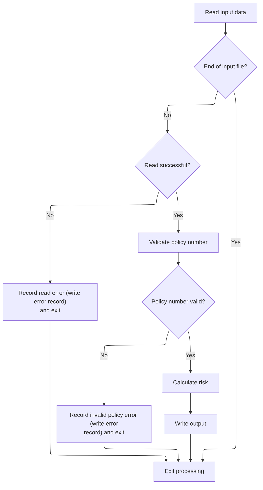
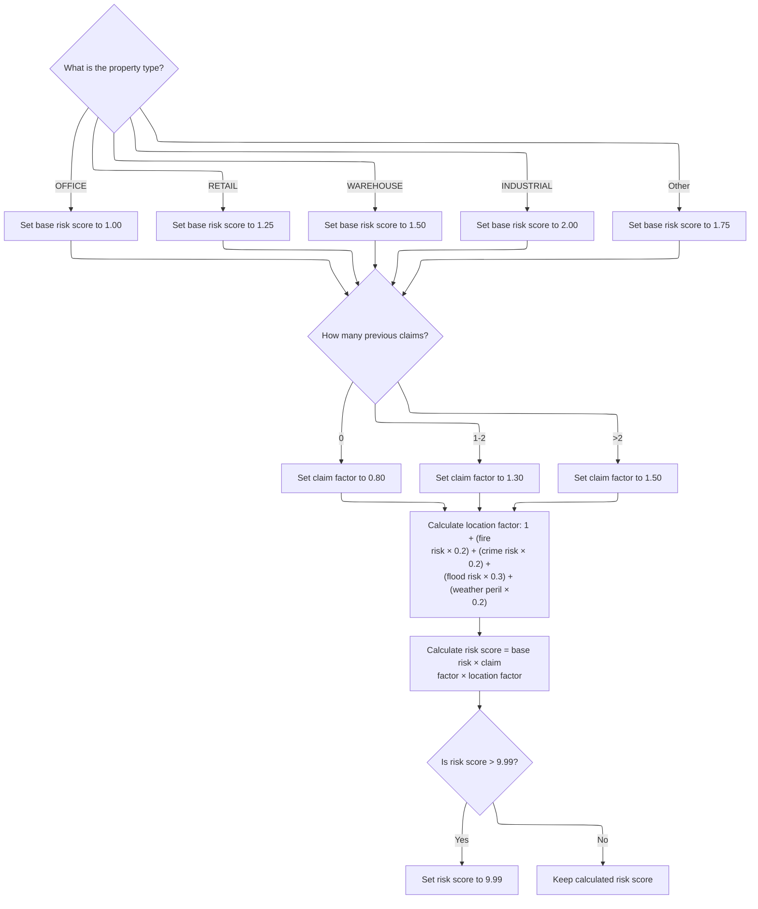

# Overview

This document explains the batch flow for processing property insurance policy records. Each record is validated and, if valid, assigned a risk score based on property type, claim history, and peril risk factors. Invalid or unreadable records are logged with error messages.

## Dependencies

### Program

- RISKPROG (<SwmPath>[base/src/lgarsk01.cbl](base/src/lgarsk01.cbl)</SwmPath>)

## Input and Output Tables/Files used

### RISKPROG (<SwmPath>[base/src/lgarsk01.cbl](base/src/lgarsk01.cbl)</SwmPath>)

| Table / File Name                                                                                                                       | Type | Description                                                            | Usage Mode | Key Fields / Layout Highlights |
| --------------------------------------------------------------------------------------------------------------------------------------- | ---- | ---------------------------------------------------------------------- | ---------- | ------------------------------ |
| <SwmToken path="base/src/lgarsk01.cbl" pos="12:3:5" line-data="           SELECT ERROR-FILE ASSIGN TO ERRFILE">`ERROR-FILE`</SwmToken>  | File | Records of policies with validation or processing errors               | Output     | File resource                  |
| <SwmToken path="base/src/lgarsk01.cbl" pos="88:3:5" line-data="               WRITE ERROR-RECORD">`ERROR-RECORD`</SwmToken>             | File | Single error entry: policy number and error message                    | Output     | File resource                  |
| <SwmToken path="base/src/lgarsk01.cbl" pos="80:3:5" line-data="           READ INPUT-FILE">`INPUT-FILE`</SwmToken>                      | File | Insurance policy risk input records (policy, property, claims, perils) | Input      | File resource                  |
| <SwmToken path="base/src/lgarsk01.cbl" pos="9:3:5" line-data="           SELECT OUTPUT-FILE ASSIGN TO OUTFILE">`OUTPUT-FILE`</SwmToken> | File | Calculated risk scores and categories for each policy                  | Output     | File resource                  |
| <SwmToken path="base/src/lgarsk01.cbl" pos="36:3:5" line-data="       01  OUTPUT-RECORD.">`OUTPUT-RECORD`</SwmToken>                    | File | Single output entry: policy number, risk score, risk category          | Output     | File resource                  |

## Detailed View of the Program's Functionality

Main Program Control Flow

The program begins by initializing resources, which involves opening the input, output, and error files. If the input file fails to open, an error message is displayed, and the program sets a flag to indicate the end of processing.

Next, the program enters a loop that continues until the end-of-file flag is set. In each iteration of the loop, it processes a single input record. This involves reading the record, validating it, calculating the risk score, and writing the result to the output file. If any errors occur during reading or validation, the program writes an error record and skips further processing for that input.

Once all records have been processed (i.e., the end-of-file flag is set), the program closes all files and exits.

Processing and Validating Each Policy

For each iteration in the main loop, the program attempts to read the next record from the input file. If the end of the file is reached, it sets the end-of-file flag and exits the processing routine for this iteration.

If a read error occurs (other than end-of-file), the program copies the policy number from the input record to the error record, sets an error message indicating a read error, writes this error record to the error file, and exits the processing routine for this iteration.

If the record is read successfully, the program validates the policy number. If the policy number is missing (i.e., it contains only spaces), the program sets an error message indicating an invalid policy number, writes this error record to the error file, and exits the processing routine for this iteration.

If the policy number is valid, the program proceeds to calculate the risk score and write the output.

Risk Score Calculation Logic

The risk calculation routine starts by determining a base risk score according to the property type. Each property type (OFFICE, RETAIL, WAREHOUSE, INDUSTRIAL) is assigned a specific base risk value. Any other property type receives a default base risk value.

Next, the program adjusts for claim history by assigning a claim factor. If there are no previous claims, the claim factor is set to a lower value. If there are one or two claims, the claim factor is higher. If there are more than two claims, the claim factor is set to the highest value.

The program then calculates a location factor by combining several peril risk parameters (fire, crime, flood, and weather) using specific weights. The location factor is a weighted sum of these parameters added to a base value.

The final risk score is calculated by multiplying the base risk, claim factor, and location factor together. The result is rounded. If the calculated risk score exceeds a maximum threshold, it is capped at that threshold.

Writing Output

After calculating the risk score, the program prepares the output record. It copies the policy number and the calculated risk score into the output record.

The program then determines the risk category based on the risk score: scores below a certain threshold are categorized as LOW, scores in the middle range as MEDIUM, and higher scores as HIGH.

Finally, the program writes the output record to the output file.

Resource Cleanup

After all records have been processed, the program closes the input, output, and error files to ensure all resources are properly released before exiting.

# Rule Definition

| Paragraph Name                                                                                                                                                                                                                                                                              | Rule ID | Category          | Description                                                                                                                                                                                                                                                                                                                                                                                                                                                                      | Conditions                                                                                       | Remarks                                                                                                                                                                                                                                                                                                                                                                                                                                                                                                                                                                                                                                                                                                                                                             |
| ------------------------------------------------------------------------------------------------------------------------------------------------------------------------------------------------------------------------------------------------------------------------------------------- | ------- | ----------------- | -------------------------------------------------------------------------------------------------------------------------------------------------------------------------------------------------------------------------------------------------------------------------------------------------------------------------------------------------------------------------------------------------------------------------------------------------------------------------------- | ------------------------------------------------------------------------------------------------ | ------------------------------------------------------------------------------------------------------------------------------------------------------------------------------------------------------------------------------------------------------------------------------------------------------------------------------------------------------------------------------------------------------------------------------------------------------------------------------------------------------------------------------------------------------------------------------------------------------------------------------------------------------------------------------------------------------------------------------------------------------------------- |
| <SwmToken path="base/src/lgarsk01.cbl" pos="66:3:5" line-data="           PERFORM 2000-PROCESS UNTIL WS-EOF = &#39;Y&#39;">`2000-PROCESS`</SwmToken>                                                                                                                                        | RL-001  | Conditional Logic | The program reads each input record from the input file and checks for end-of-file. If the end is reached, it sets a flag to stop further processing.                                                                                                                                                                                                                                                                                                                            | Each time a record is read from the input file.                                                  | Input records are fixed-width, 400 characters. End-of-file is indicated by the AT END clause in the READ statement.                                                                                                                                                                                                                                                                                                                                                                                                                                                                                                                                                                                                                                                 |
| <SwmToken path="base/src/lgarsk01.cbl" pos="66:3:5" line-data="           PERFORM 2000-PROCESS UNTIL WS-EOF = &#39;Y&#39;">`2000-PROCESS`</SwmToken>                                                                                                                                        | RL-002  | Conditional Logic | If a record cannot be read (file status not '00'), the program writes an error record to the error file with the policy number and a fixed error message, then skips further processing for that record.                                                                                                                                                                                                                                                                         | File status after reading is not '00'.                                                           | Error record format: Policy number (1-10, left-justified, space-padded), Error message (11-100, left-justified, space-padded to 90 characters). Output record is 100 characters.                                                                                                                                                                                                                                                                                                                                                                                                                                                                                                                                                                                    |
| <SwmToken path="base/src/lgarsk01.cbl" pos="92:3:7" line-data="           PERFORM 2100-VALIDATE-DATA">`2100-VALIDATE-DATA`</SwmToken>                                                                                                                                                       | RL-003  | Conditional Logic | The program checks that the policy number field is not missing or blank (all spaces). If it is, it writes an error record and skips further processing for that record.                                                                                                                                                                                                                                                                                                          | Policy number field is all spaces.                                                               | Error record format: Policy number (1-10, left-justified, space-padded), Error message (11-100, left-justified, space-padded to 90 characters). Output record is 100 characters.                                                                                                                                                                                                                                                                                                                                                                                                                                                                                                                                                                                    |
| <SwmToken path="base/src/lgarsk01.cbl" pos="93:3:7" line-data="           PERFORM 2200-CALCULATE-RISK">`2200-CALCULATE-RISK`</SwmToken>                                                                                                                                                     | RL-004  | Data Assignment   | Assigns a base risk score depending on the property type field. Only exact, case-sensitive matches are recognized.                                                                                                                                                                                                                                                                                                                                                               | Property type field is one of 'OFFICE', 'RETAIL', 'WAREHOUSE', 'INDUSTRIAL', or any other value. | Base risk scores: OFFICE=<SwmToken path="base/src/lgarsk01.cbl" pos="110:3:5" line-data="                   MOVE 1.00 TO WS-BS-RS">`1.00`</SwmToken>, RETAIL=<SwmToken path="base/src/lgarsk01.cbl" pos="112:3:5" line-data="                   MOVE 1.25 TO WS-BS-RS">`1.25`</SwmToken>, WAREHOUSE=<SwmToken path="base/src/lgarsk01.cbl" pos="114:3:5" line-data="                   MOVE 1.50 TO WS-BS-RS">`1.50`</SwmToken>, INDUSTRIAL=<SwmToken path="base/src/lgarsk01.cbl" pos="116:3:5" line-data="                   MOVE 2.00 TO WS-BS-RS">`2.00`</SwmToken>, other=<SwmToken path="base/src/lgarsk01.cbl" pos="118:3:5" line-data="                   MOVE 1.75 TO WS-BS-RS">`1.75`</SwmToken>. Property type is case-sensitive and must match exactly. |
| <SwmToken path="base/src/lgarsk01.cbl" pos="93:3:7" line-data="           PERFORM 2200-CALCULATE-RISK">`2200-CALCULATE-RISK`</SwmToken>                                                                                                                                                     | RL-005  | Data Assignment   | Assigns a claim factor based on the claim count field. 0 claims gets <SwmToken path="base/src/lgarsk01.cbl" pos="122:3:5" line-data="               MOVE 0.80 TO WS-CL-F">`0.80`</SwmToken>, 1-2 claims gets <SwmToken path="base/src/lgarsk01.cbl" pos="124:3:5" line-data="               MOVE 1.30 TO WS-CL-F">`1.30`</SwmToken>, 3 or more gets <SwmToken path="base/src/lgarsk01.cbl" pos="114:3:5" line-data="                   MOVE 1.50 TO WS-BS-RS">`1.50`</SwmToken>. | Claim count is 0, 1-2, or 3 or more.                                                             | Claim factor: 0=<SwmToken path="base/src/lgarsk01.cbl" pos="122:3:5" line-data="               MOVE 0.80 TO WS-CL-F">`0.80`</SwmToken>, 1-2=<SwmToken path="base/src/lgarsk01.cbl" pos="124:3:5" line-data="               MOVE 1.30 TO WS-CL-F">`1.30`</SwmToken>, 3+=<SwmToken path="base/src/lgarsk01.cbl" pos="114:3:5" line-data="                   MOVE 1.50 TO WS-BS-RS">`1.50`</SwmToken>. Claim count is a 3-digit numeric field, zero-padded.                                                                                                                                                                                                                                                                                                            |
| <SwmToken path="base/src/lgarsk01.cbl" pos="93:3:7" line-data="           PERFORM 2200-CALCULATE-RISK">`2200-CALCULATE-RISK`</SwmToken>                                                                                                                                                     | RL-006  | Computation       | Calculates the location factor using fire risk, crime risk, flood risk, and weather peril fields, according to a weighted formula.                                                                                                                                                                                                                                                                                                                                               | All four risk fields are present and numeric.                                                    | Location factor = 1 + (fire risk × <SwmToken path="base/src/lgarsk01.cbl" pos="130:10:12" line-data="               (IN-FR-PR * 0.2) +">`0.2`</SwmToken>) + (crime risk × <SwmToken path="base/src/lgarsk01.cbl" pos="130:10:12" line-data="               (IN-FR-PR * 0.2) +">`0.2`</SwmToken>) + (flood risk × <SwmToken path="base/src/lgarsk01.cbl" pos="132:10:12" line-data="               (IN-FL-PR * 0.3) +">`0.3`</SwmToken>) + (weather peril × <SwmToken path="base/src/lgarsk01.cbl" pos="130:10:12" line-data="               (IN-FR-PR * 0.2) +">`0.2`</SwmToken>). Each risk field is a 2-digit numeric field.                                                                                                                                      |
| <SwmToken path="base/src/lgarsk01.cbl" pos="93:3:7" line-data="           PERFORM 2200-CALCULATE-RISK">`2200-CALCULATE-RISK`</SwmToken>                                                                                                                                                     | RL-007  | Computation       | Calculates the risk score as base risk × claim factor × location factor, rounds to two decimals, and caps at <SwmToken path="base/src/lgarsk01.cbl" pos="138:11:13" line-data="           IF WS-F-RSK &gt; 9.99">`9.99`</SwmToken> if higher.                                                                                                                                                                                                                                    | Base risk, claim factor, and location factor have been computed.                                 | Risk score is a decimal, rounded to two decimals, capped at <SwmToken path="base/src/lgarsk01.cbl" pos="138:11:13" line-data="           IF WS-F-RSK &gt; 9.99">`9.99`</SwmToken>.                                                                                                                                                                                                                                                                                                                                                                                                                                                                                                                                                                                  |
| <SwmToken path="base/src/lgarsk01.cbl" pos="94:3:7" line-data="           PERFORM 2300-WRITE-OUTPUT">`2300-WRITE-OUTPUT`</SwmToken>                                                                                                                                                         | RL-008  | Conditional Logic | Assigns a risk category of 'LOW', 'MEDIUM', or 'HIGH' based on the final risk score.                                                                                                                                                                                                                                                                                                                                                                                             | Risk score is available.                                                                         | Risk category: 'LOW' if <<SwmToken path="base/src/lgarsk01.cbl" pos="147:11:13" line-data="               WHEN WS-F-RSK &lt; 3.00">`3.00`</SwmToken>, 'MEDIUM' if >=<SwmToken path="base/src/lgarsk01.cbl" pos="147:11:13" line-data="               WHEN WS-F-RSK &lt; 3.00">`3.00`</SwmToken> and <<SwmToken path="base/src/lgarsk01.cbl" pos="149:11:13" line-data="               WHEN WS-F-RSK &lt; 6.00">`6.00`</SwmToken>, 'HIGH' if >=<SwmToken path="base/src/lgarsk01.cbl" pos="149:11:13" line-data="               WHEN WS-F-RSK &lt; 6.00">`6.00`</SwmToken>. Output field is left-justified, space-padded to 10 characters.                                                                                                                           |
| <SwmToken path="base/src/lgarsk01.cbl" pos="94:3:7" line-data="           PERFORM 2300-WRITE-OUTPUT">`2300-WRITE-OUTPUT`</SwmToken>                                                                                                                                                         | RL-009  | Data Assignment   | Writes a processed output record with policy number, risk score, risk category, and filler, all formatted as specified.                                                                                                                                                                                                                                                                                                                                                          | Record is valid and risk score/category have been computed.                                      | Output record: Policy number (1-10, left-justified, space-padded), Risk score (11-15, 5 digits, zero-padded, implied decimal after third digit), Risk category (16-25, left-justified, space-padded to 10), Filler (26-100, spaces). Record is 100 characters.                                                                                                                                                                                                                                                                                                                                                                                                                                                                                                      |
| <SwmToken path="base/src/lgarsk01.cbl" pos="66:3:5" line-data="           PERFORM 2000-PROCESS UNTIL WS-EOF = &#39;Y&#39;">`2000-PROCESS`</SwmToken>, <SwmToken path="base/src/lgarsk01.cbl" pos="92:3:7" line-data="           PERFORM 2100-VALIDATE-DATA">`2100-VALIDATE-DATA`</SwmToken> | RL-010  | Data Assignment   | Writes an error record to the error file with the policy number and error message, formatted as specified.                                                                                                                                                                                                                                                                                                                                                                       | A record read or validation error occurs.                                                        | Error record: Policy number (1-10, left-justified, space-padded), Error message (11-100, left-justified, space-padded to 90). Record is 100 characters.                                                                                                                                                                                                                                                                                                                                                                                                                                                                                                                                                                                                             |

# User Stories

## User Story 1: Read input records and handle read errors

---

### Story Description:

As a system, I want to read each input record from the input file, detect end-of-file, and write an error record if a record cannot be read so that only valid records are processed and errors are logged appropriately.

---

### Business Rule Mapping:

| Rule ID | Paragraph Name                                                                                                                                       | Rule Description                                                                                                                                                                                         |
| ------- | ---------------------------------------------------------------------------------------------------------------------------------------------------- | -------------------------------------------------------------------------------------------------------------------------------------------------------------------------------------------------------- |
| RL-001  | <SwmToken path="base/src/lgarsk01.cbl" pos="66:3:5" line-data="           PERFORM 2000-PROCESS UNTIL WS-EOF = &#39;Y&#39;">`2000-PROCESS`</SwmToken> | The program reads each input record from the input file and checks for end-of-file. If the end is reached, it sets a flag to stop further processing.                                                    |
| RL-002  | <SwmToken path="base/src/lgarsk01.cbl" pos="66:3:5" line-data="           PERFORM 2000-PROCESS UNTIL WS-EOF = &#39;Y&#39;">`2000-PROCESS`</SwmToken> | If a record cannot be read (file status not '00'), the program writes an error record to the error file with the policy number and a fixed error message, then skips further processing for that record. |

---

### Relevant Functionality:

- <SwmToken path="base/src/lgarsk01.cbl" pos="66:3:5" line-data="           PERFORM 2000-PROCESS UNTIL WS-EOF = &#39;Y&#39;">`2000-PROCESS`</SwmToken>
  1. **RL-001:**
     - Read a record from the input file
     - If end-of-file is reached, set the EOF flag
     - If not, continue processing
  2. **RL-002:**
     - If file status is not '00' after reading:
       - Move policy number to error record
       - Move 'ERROR READING RECORD' to error message
       - Write error record
       - Skip further processing for this record

## User Story 2: Validate policy number and handle missing/blank values

---

### Story Description:

As a system, I want to validate that the policy number field is not missing or blank, and write an error record if it is invalid so that only records with valid policy numbers are processed.

---

### Business Rule Mapping:

| Rule ID | Paragraph Name                                                                                                                                                                                                                                                                              | Rule Description                                                                                                                                                        |
| ------- | ------------------------------------------------------------------------------------------------------------------------------------------------------------------------------------------------------------------------------------------------------------------------------------------- | ----------------------------------------------------------------------------------------------------------------------------------------------------------------------- |
| RL-010  | <SwmToken path="base/src/lgarsk01.cbl" pos="66:3:5" line-data="           PERFORM 2000-PROCESS UNTIL WS-EOF = &#39;Y&#39;">`2000-PROCESS`</SwmToken>, <SwmToken path="base/src/lgarsk01.cbl" pos="92:3:7" line-data="           PERFORM 2100-VALIDATE-DATA">`2100-VALIDATE-DATA`</SwmToken> | Writes an error record to the error file with the policy number and error message, formatted as specified.                                                              |
| RL-003  | <SwmToken path="base/src/lgarsk01.cbl" pos="92:3:7" line-data="           PERFORM 2100-VALIDATE-DATA">`2100-VALIDATE-DATA`</SwmToken>                                                                                                                                                       | The program checks that the policy number field is not missing or blank (all spaces). If it is, it writes an error record and skips further processing for that record. |

---

### Relevant Functionality:

- <SwmToken path="base/src/lgarsk01.cbl" pos="66:3:5" line-data="           PERFORM 2000-PROCESS UNTIL WS-EOF = &#39;Y&#39;">`2000-PROCESS`</SwmToken>
  1. **RL-010:**
     - Move policy number to error field (left-justified, space-padded)
     - Move error message to error field (left-justified, space-padded to 90)
     - Write error record
- <SwmToken path="base/src/lgarsk01.cbl" pos="92:3:7" line-data="           PERFORM 2100-VALIDATE-DATA">`2100-VALIDATE-DATA`</SwmToken>
  1. **RL-003:**
     - If policy number is blank or all spaces:
       - Move 'INVALID POLICY NUMBER' to error message
       - Write error record
       - Skip further processing for this record

## User Story 3: Calculate risk score and assign risk category for valid records

---

### Story Description:

As a system, I want to calculate the risk score for each valid record using property type, claim count, and location risk factors, and assign a risk category based on the final score so that each policy is accurately assessed.

---

### Business Rule Mapping:

| Rule ID | Paragraph Name                                                                                                                          | Rule Description                                                                                                                                                                                                                                                                                                                                                                                                                                                                 |
| ------- | --------------------------------------------------------------------------------------------------------------------------------------- | -------------------------------------------------------------------------------------------------------------------------------------------------------------------------------------------------------------------------------------------------------------------------------------------------------------------------------------------------------------------------------------------------------------------------------------------------------------------------------- |
| RL-004  | <SwmToken path="base/src/lgarsk01.cbl" pos="93:3:7" line-data="           PERFORM 2200-CALCULATE-RISK">`2200-CALCULATE-RISK`</SwmToken> | Assigns a base risk score depending on the property type field. Only exact, case-sensitive matches are recognized.                                                                                                                                                                                                                                                                                                                                                               |
| RL-005  | <SwmToken path="base/src/lgarsk01.cbl" pos="93:3:7" line-data="           PERFORM 2200-CALCULATE-RISK">`2200-CALCULATE-RISK`</SwmToken> | Assigns a claim factor based on the claim count field. 0 claims gets <SwmToken path="base/src/lgarsk01.cbl" pos="122:3:5" line-data="               MOVE 0.80 TO WS-CL-F">`0.80`</SwmToken>, 1-2 claims gets <SwmToken path="base/src/lgarsk01.cbl" pos="124:3:5" line-data="               MOVE 1.30 TO WS-CL-F">`1.30`</SwmToken>, 3 or more gets <SwmToken path="base/src/lgarsk01.cbl" pos="114:3:5" line-data="                   MOVE 1.50 TO WS-BS-RS">`1.50`</SwmToken>. |
| RL-006  | <SwmToken path="base/src/lgarsk01.cbl" pos="93:3:7" line-data="           PERFORM 2200-CALCULATE-RISK">`2200-CALCULATE-RISK`</SwmToken> | Calculates the location factor using fire risk, crime risk, flood risk, and weather peril fields, according to a weighted formula.                                                                                                                                                                                                                                                                                                                                               |
| RL-007  | <SwmToken path="base/src/lgarsk01.cbl" pos="93:3:7" line-data="           PERFORM 2200-CALCULATE-RISK">`2200-CALCULATE-RISK`</SwmToken> | Calculates the risk score as base risk × claim factor × location factor, rounds to two decimals, and caps at <SwmToken path="base/src/lgarsk01.cbl" pos="138:11:13" line-data="           IF WS-F-RSK &gt; 9.99">`9.99`</SwmToken> if higher.                                                                                                                                                                                                                                    |
| RL-008  | <SwmToken path="base/src/lgarsk01.cbl" pos="94:3:7" line-data="           PERFORM 2300-WRITE-OUTPUT">`2300-WRITE-OUTPUT`</SwmToken>     | Assigns a risk category of 'LOW', 'MEDIUM', or 'HIGH' based on the final risk score.                                                                                                                                                                                                                                                                                                                                                                                             |

---

### Relevant Functionality:

- <SwmToken path="base/src/lgarsk01.cbl" pos="93:3:7" line-data="           PERFORM 2200-CALCULATE-RISK">`2200-CALCULATE-RISK`</SwmToken>
  1. **RL-004:**
     - If property type is 'OFFICE', set base risk to <SwmToken path="base/src/lgarsk01.cbl" pos="110:3:5" line-data="                   MOVE 1.00 TO WS-BS-RS">`1.00`</SwmToken>
     - Else if 'RETAIL', set to <SwmToken path="base/src/lgarsk01.cbl" pos="112:3:5" line-data="                   MOVE 1.25 TO WS-BS-RS">`1.25`</SwmToken>
     - Else if 'WAREHOUSE', set to <SwmToken path="base/src/lgarsk01.cbl" pos="114:3:5" line-data="                   MOVE 1.50 TO WS-BS-RS">`1.50`</SwmToken>
     - Else if 'INDUSTRIAL', set to <SwmToken path="base/src/lgarsk01.cbl" pos="116:3:5" line-data="                   MOVE 2.00 TO WS-BS-RS">`2.00`</SwmToken>
     - Else set to <SwmToken path="base/src/lgarsk01.cbl" pos="118:3:5" line-data="                   MOVE 1.75 TO WS-BS-RS">`1.75`</SwmToken>
  2. **RL-005:**
     - If claim count is 0, set claim factor to <SwmToken path="base/src/lgarsk01.cbl" pos="122:3:5" line-data="               MOVE 0.80 TO WS-CL-F">`0.80`</SwmToken>
     - Else if claim count is 1 or 2, set to <SwmToken path="base/src/lgarsk01.cbl" pos="124:3:5" line-data="               MOVE 1.30 TO WS-CL-F">`1.30`</SwmToken>
     - Else set to <SwmToken path="base/src/lgarsk01.cbl" pos="114:3:5" line-data="                   MOVE 1.50 TO WS-BS-RS">`1.50`</SwmToken>
  3. **RL-006:**
     - Compute location factor as:
       - 1 + (fire risk × <SwmToken path="base/src/lgarsk01.cbl" pos="130:10:12" line-data="               (IN-FR-PR * 0.2) +">`0.2`</SwmToken>) + (crime risk × <SwmToken path="base/src/lgarsk01.cbl" pos="130:10:12" line-data="               (IN-FR-PR * 0.2) +">`0.2`</SwmToken>) + (flood risk × <SwmToken path="base/src/lgarsk01.cbl" pos="132:10:12" line-data="               (IN-FL-PR * 0.3) +">`0.3`</SwmToken>) + (weather peril × <SwmToken path="base/src/lgarsk01.cbl" pos="130:10:12" line-data="               (IN-FR-PR * 0.2) +">`0.2`</SwmToken>)
  4. **RL-007:**
     - Compute risk score = base risk × claim factor × location factor
     - Round to two decimals
     - If risk score > <SwmToken path="base/src/lgarsk01.cbl" pos="138:11:13" line-data="           IF WS-F-RSK &gt; 9.99">`9.99`</SwmToken>, set to <SwmToken path="base/src/lgarsk01.cbl" pos="138:11:13" line-data="           IF WS-F-RSK &gt; 9.99">`9.99`</SwmToken>
- <SwmToken path="base/src/lgarsk01.cbl" pos="94:3:7" line-data="           PERFORM 2300-WRITE-OUTPUT">`2300-WRITE-OUTPUT`</SwmToken>
  1. **RL-008:**
     - If risk score < <SwmToken path="base/src/lgarsk01.cbl" pos="147:11:13" line-data="               WHEN WS-F-RSK &lt; 3.00">`3.00`</SwmToken>, set category to 'LOW'
     - Else if < <SwmToken path="base/src/lgarsk01.cbl" pos="149:11:13" line-data="               WHEN WS-F-RSK &lt; 6.00">`6.00`</SwmToken>, set to 'MEDIUM'
     - Else set to 'HIGH'

## User Story 4: Write output records for both valid and error cases in required format

---

### Story Description:

As a system, I want to write both processed output records for valid policies and error records for invalid or unreadable records, ensuring all output files are formatted as specified so that downstream systems can reliably process the results.

---

### Business Rule Mapping:

| Rule ID | Paragraph Name                                                                                                                                                                                                                                                                              | Rule Description                                                                                                        |
| ------- | ------------------------------------------------------------------------------------------------------------------------------------------------------------------------------------------------------------------------------------------------------------------------------------------- | ----------------------------------------------------------------------------------------------------------------------- |
| RL-010  | <SwmToken path="base/src/lgarsk01.cbl" pos="66:3:5" line-data="           PERFORM 2000-PROCESS UNTIL WS-EOF = &#39;Y&#39;">`2000-PROCESS`</SwmToken>, <SwmToken path="base/src/lgarsk01.cbl" pos="92:3:7" line-data="           PERFORM 2100-VALIDATE-DATA">`2100-VALIDATE-DATA`</SwmToken> | Writes an error record to the error file with the policy number and error message, formatted as specified.              |
| RL-009  | <SwmToken path="base/src/lgarsk01.cbl" pos="94:3:7" line-data="           PERFORM 2300-WRITE-OUTPUT">`2300-WRITE-OUTPUT`</SwmToken>                                                                                                                                                         | Writes a processed output record with policy number, risk score, risk category, and filler, all formatted as specified. |

---

### Relevant Functionality:

- <SwmToken path="base/src/lgarsk01.cbl" pos="66:3:5" line-data="           PERFORM 2000-PROCESS UNTIL WS-EOF = &#39;Y&#39;">`2000-PROCESS`</SwmToken>
  1. **RL-010:**
     - Move policy number to error field (left-justified, space-padded)
     - Move error message to error field (left-justified, space-padded to 90)
     - Write error record
- <SwmToken path="base/src/lgarsk01.cbl" pos="94:3:7" line-data="           PERFORM 2300-WRITE-OUTPUT">`2300-WRITE-OUTPUT`</SwmToken>
  1. **RL-009:**
     - Move policy number to output field (left-justified, space-padded)
     - Move risk score to output field (5 digits, zero-padded, implied decimal after third digit)
     - Move risk category to output field (left-justified, space-padded to 10)
     - Fill remaining positions with spaces
     - Write output record

# Workflow

# Main Program Control Flow

```mermaid
%%{init: {"flowchart": {"defaultRenderer": "elk"}} }%%
flowchart TD
    node1["Initialize resources"]
    click node1 openCode "base/src/lgarsk01.cbl:65:65"
    node1 --> node2["Process record"]
    click node2 openCode "base/src/lgarsk01.cbl:66:66"
    subgraph loop1["Repeat until WS-EOF = 'Y'"]
        node2 --> node3{"WS-EOF = 'Y?'"}
        click node3 openCode "base/src/lgarsk01.cbl:66:66"
        node3 -->|"No"| node2
        node3 -->|"Yes"| node4["Close resources"]
        click node4 openCode "base/src/lgarsk01.cbl:67:67"
    end
    node4 --> node5["Exit"]
    click node5 openCode "base/src/lgarsk01.cbl:68:68"

classDef HeadingStyle fill:#777777,stroke:#333,stroke-width:2px;

%% Swimm:
%% %%{init: {"flowchart": {"defaultRenderer": "elk"}} }%%
%% flowchart TD
%%     node1["Initialize resources"]
%%     click node1 openCode "<SwmPath>[base/src/lgarsk01.cbl](base/src/lgarsk01.cbl)</SwmPath>:65:65"
%%     node1 --> node2["Process record"]
%%     click node2 openCode "<SwmPath>[base/src/lgarsk01.cbl](base/src/lgarsk01.cbl)</SwmPath>:66:66"
%%     subgraph loop1["Repeat until <SwmToken path="base/src/lgarsk01.cbl" pos="66:9:11" line-data="           PERFORM 2000-PROCESS UNTIL WS-EOF = &#39;Y&#39;">`WS-EOF`</SwmToken> = 'Y'"]
%%         node2 --> node3{"<SwmToken path="base/src/lgarsk01.cbl" pos="66:9:11" line-data="           PERFORM 2000-PROCESS UNTIL WS-EOF = &#39;Y&#39;">`WS-EOF`</SwmToken> = 'Y?'"}
%%         click node3 openCode "<SwmPath>[base/src/lgarsk01.cbl](base/src/lgarsk01.cbl)</SwmPath>:66:66"
%%         node3 -->|"No"| node2
%%         node3 -->|"Yes"| node4["Close resources"]
%%         click node4 openCode "<SwmPath>[base/src/lgarsk01.cbl](base/src/lgarsk01.cbl)</SwmPath>:67:67"
%%     end
%%     node4 --> node5["Exit"]
%%     click node5 openCode "<SwmPath>[base/src/lgarsk01.cbl](base/src/lgarsk01.cbl)</SwmPath>:68:68"
%% 
%% classDef HeadingStyle fill:#777777,stroke:#333,stroke-width:2px;
```



This section manages the high-level program flow, ensuring that initialization, record processing, and resource closure occur in the correct order. It acts as the entry and exit point for the main batch process.

| Rule ID | Category       | Rule Name               | Description                                                                                      | Implementation Details                                                                                                                                                                                                                                                                                                                                      |
| ------- | -------------- | ----------------------- | ------------------------------------------------------------------------------------------------ | ----------------------------------------------------------------------------------------------------------------------------------------------------------------------------------------------------------------------------------------------------------------------------------------------------------------------------------------------------------- |
| BR-001  | Technical Step | Resource Initialization | Initialization of resources is triggered at the start of the main program flow.                  | No business data or constants are involved. This is a technical sequencing rule.                                                                                                                                                                                                                                                                            |
| BR-002  | Technical Step | Record Processing Loop  | Record processing is repeated until the end-of-file condition is met.                            | The loop continues as long as <SwmToken path="base/src/lgarsk01.cbl" pos="66:9:11" line-data="           PERFORM 2000-PROCESS UNTIL WS-EOF = &#39;Y&#39;">`WS-EOF`</SwmToken> is not 'Y'. <SwmToken path="base/src/lgarsk01.cbl" pos="66:9:11" line-data="           PERFORM 2000-PROCESS UNTIL WS-EOF = &#39;Y&#39;">`WS-EOF`</SwmToken> is initially 'N'. |
| BR-003  | Technical Step | Resource Closure        | Resources are closed after all records have been processed and the end-of-file condition is met. | No business data or constants are involved. This is a technical sequencing rule.                                                                                                                                                                                                                                                                            |

<SwmSnippet path="/base/src/lgarsk01.cbl" line="64">

---

<SwmToken path="base/src/lgarsk01.cbl" pos="64:1:3" line-data="       0000-MAIN.">`0000-MAIN`</SwmToken> sets up the high-level flow: it opens files, loops through processing each input record by calling <SwmToken path="base/src/lgarsk01.cbl" pos="66:3:5" line-data="           PERFORM 2000-PROCESS UNTIL WS-EOF = &#39;Y&#39;">`2000-PROCESS`</SwmToken> until the end of the file, then closes everything. Calling <SwmToken path="base/src/lgarsk01.cbl" pos="66:3:5" line-data="           PERFORM 2000-PROCESS UNTIL WS-EOF = &#39;Y&#39;">`2000-PROCESS`</SwmToken> here is what actually handles reading, validating, scoring, and outputting each policy record.

```cobol
       0000-MAIN.
           PERFORM 1000-INIT
           PERFORM 2000-PROCESS UNTIL WS-EOF = 'Y'
           PERFORM 3000-CLOSE
           GOBACK.
```

---

</SwmSnippet>

# Processing and Validating Each Policy



This section governs the initial processing and validation of each policy record. It ensures only valid records proceed to risk calculation and output, and that errors are logged with appropriate messages and formats.

| Rule ID | Category        | Rule Name                        | Description                                                                                                                                                      | Implementation Details                                                                                                                                                                                                                                                                   |
| ------- | --------------- | -------------------------------- | ---------------------------------------------------------------------------------------------------------------------------------------------------------------- | ---------------------------------------------------------------------------------------------------------------------------------------------------------------------------------------------------------------------------------------------------------------------------------------- |
| BR-001  | Reading Input   | End of input detection           | When the end of the input file is detected, processing for further records is stopped.                                                                           | No further records are processed after end-of-file is detected. The end-of-file flag is set to 'Y'.                                                                                                                                                                                      |
| BR-002  | Data validation | File read error handling         | If a record cannot be read successfully, an error record is written with the policy number and a fixed error message, and processing for that record is stopped. | The error record contains the policy number from the input and the message 'ERROR READING RECORD'. The error record format is: policy number (string, 10 characters, left-aligned, space-padded if needed), error message (string, 90 characters, left-aligned, space-padded if needed). |
| BR-003  | Data validation | Missing policy number validation | If the policy number is missing (all spaces), an error record is written with a fixed message and processing for that record is stopped.                         | The error record contains the policy number (all spaces) and the message 'INVALID POLICY NUMBER'. The error record format is: policy number (string, 10 characters, left-aligned, space-padded if needed), error message (string, 90 characters, left-aligned, space-padded if needed).  |

<SwmSnippet path="/base/src/lgarsk01.cbl" line="79">

---

In <SwmToken path="base/src/lgarsk01.cbl" pos="79:1:3" line-data="       2000-PROCESS.">`2000-PROCESS`</SwmToken>, we read the next input record, check for end-of-file, and handle read errors by logging them and skipping further steps for that record. This sets up the rest of the processing for valid records only.

```cobol
       2000-PROCESS.
           READ INPUT-FILE
               AT END MOVE 'Y' TO WS-EOF
               GO TO 2000-EXIT
           END-READ

           IF WS-INPUT-STATUS NOT = '00'
               MOVE IN-POLICY-NUM TO ERR-POLICY-NUM
               MOVE 'ERROR READING RECORD' TO ERR-MESSAGE
               WRITE ERROR-RECORD
               GO TO 2000-EXIT
           END-IF
```

---

</SwmSnippet>

<SwmSnippet path="/base/src/lgarsk01.cbl" line="92">

---

After handling file read and error checks, we call <SwmToken path="base/src/lgarsk01.cbl" pos="92:3:7" line-data="           PERFORM 2100-VALIDATE-DATA">`2100-VALIDATE-DATA`</SwmToken> to make sure the input has a policy number before moving on. This prevents invalid records from going through risk calculation and output steps.

```cobol
           PERFORM 2100-VALIDATE-DATA
           PERFORM 2200-CALCULATE-RISK
           PERFORM 2300-WRITE-OUTPUT
```

---

</SwmSnippet>

<SwmSnippet path="/base/src/lgarsk01.cbl" line="100">

---

<SwmToken path="base/src/lgarsk01.cbl" pos="100:1:5" line-data="       2100-VALIDATE-DATA.">`2100-VALIDATE-DATA`</SwmToken> checks if the policy number is missing (just spaces). If so, it sets a fixed error message, writes an error record, and exits to skip further processing for that record.

```cobol
       2100-VALIDATE-DATA.
           IF IN-POLICY-NUM = SPACES
               MOVE 'INVALID POLICY NUMBER' TO ERR-MESSAGE
               WRITE ERROR-RECORD
               GO TO 2000-EXIT
           END-IF.
```

---

</SwmSnippet>

# Risk Score Calculation Logic



This section calculates a risk score for a property insurance policy based on property type, claim history, and peril risk factors. The score is used to assess the overall risk associated with insuring the property.

| Rule ID | Category        | Rule Name                    | Description                                                                                                                                                                                                                                                                                                                                                                                                                                                                                                                                                                                                                                                                                                                                                                                        | Implementation Details                                                                                                                                                                                                                                                                                                                                                                                                                                                                                                                                                                                                                                                                                                          |
| ------- | --------------- | ---------------------------- | -------------------------------------------------------------------------------------------------------------------------------------------------------------------------------------------------------------------------------------------------------------------------------------------------------------------------------------------------------------------------------------------------------------------------------------------------------------------------------------------------------------------------------------------------------------------------------------------------------------------------------------------------------------------------------------------------------------------------------------------------------------------------------------------------- | ------------------------------------------------------------------------------------------------------------------------------------------------------------------------------------------------------------------------------------------------------------------------------------------------------------------------------------------------------------------------------------------------------------------------------------------------------------------------------------------------------------------------------------------------------------------------------------------------------------------------------------------------------------------------------------------------------------------------------- |
| BR-001  | Data validation | Risk score cap               | If the calculated risk score exceeds <SwmToken path="base/src/lgarsk01.cbl" pos="138:11:13" line-data="           IF WS-F-RSK &gt; 9.99">`9.99`</SwmToken>, set the risk score to <SwmToken path="base/src/lgarsk01.cbl" pos="138:11:13" line-data="           IF WS-F-RSK &gt; 9.99">`9.99`</SwmToken>.                                                                                                                                                                                                                                                                                                                                                                                                                                                                                           | The risk score output is capped at <SwmToken path="base/src/lgarsk01.cbl" pos="138:11:13" line-data="           IF WS-F-RSK &gt; 9.99">`9.99`</SwmToken>. If the calculated value is less than or equal to <SwmToken path="base/src/lgarsk01.cbl" pos="138:11:13" line-data="           IF WS-F-RSK &gt; 9.99">`9.99`</SwmToken>, it is not changed.                                                                                                                                                                                                                                                                                                                                                                            |
| BR-002  | Calculation     | Base risk by property type   | Assign a base risk score according to the property type. OFFICE properties use <SwmToken path="base/src/lgarsk01.cbl" pos="110:3:5" line-data="                   MOVE 1.00 TO WS-BS-RS">`1.00`</SwmToken>, RETAIL uses <SwmToken path="base/src/lgarsk01.cbl" pos="112:3:5" line-data="                   MOVE 1.25 TO WS-BS-RS">`1.25`</SwmToken>, WAREHOUSE uses <SwmToken path="base/src/lgarsk01.cbl" pos="114:3:5" line-data="                   MOVE 1.50 TO WS-BS-RS">`1.50`</SwmToken>, INDUSTRIAL uses <SwmToken path="base/src/lgarsk01.cbl" pos="116:3:5" line-data="                   MOVE 2.00 TO WS-BS-RS">`2.00`</SwmToken>, and all other types use <SwmToken path="base/src/lgarsk01.cbl" pos="118:3:5" line-data="                   MOVE 1.75 TO WS-BS-RS">`1.75`</SwmToken>. | The base risk score is a number. OFFICE: <SwmToken path="base/src/lgarsk01.cbl" pos="110:3:5" line-data="                   MOVE 1.00 TO WS-BS-RS">`1.00`</SwmToken>, RETAIL: <SwmToken path="base/src/lgarsk01.cbl" pos="112:3:5" line-data="                   MOVE 1.25 TO WS-BS-RS">`1.25`</SwmToken>, WAREHOUSE: <SwmToken path="base/src/lgarsk01.cbl" pos="114:3:5" line-data="                   MOVE 1.50 TO WS-BS-RS">`1.50`</SwmToken>, INDUSTRIAL: <SwmToken path="base/src/lgarsk01.cbl" pos="116:3:5" line-data="                   MOVE 2.00 TO WS-BS-RS">`2.00`</SwmToken>, Other: <SwmToken path="base/src/lgarsk01.cbl" pos="118:3:5" line-data="                   MOVE 1.75 TO WS-BS-RS">`1.75`</SwmToken>. |
| BR-003  | Calculation     | Claim factor by claim count  | Assign a claim factor based on the number of previous claims. 0 claims uses <SwmToken path="base/src/lgarsk01.cbl" pos="122:3:5" line-data="               MOVE 0.80 TO WS-CL-F">`0.80`</SwmToken>, 1-2 claims uses <SwmToken path="base/src/lgarsk01.cbl" pos="124:3:5" line-data="               MOVE 1.30 TO WS-CL-F">`1.30`</SwmToken>, more than 2 claims uses <SwmToken path="base/src/lgarsk01.cbl" pos="114:3:5" line-data="                   MOVE 1.50 TO WS-BS-RS">`1.50`</SwmToken>.                                                                                                                                                                                                                                                                                                   | The claim factor is a number. 0 claims: <SwmToken path="base/src/lgarsk01.cbl" pos="122:3:5" line-data="               MOVE 0.80 TO WS-CL-F">`0.80`</SwmToken>, 1-2 claims: <SwmToken path="base/src/lgarsk01.cbl" pos="124:3:5" line-data="               MOVE 1.30 TO WS-CL-F">`1.30`</SwmToken>, more than 2: <SwmToken path="base/src/lgarsk01.cbl" pos="114:3:5" line-data="                   MOVE 1.50 TO WS-BS-RS">`1.50`</SwmToken>.                                                                                                                                                                                                                                                                                   |
| BR-004  | Calculation     | Location factor calculation  | Calculate the location factor as 1 plus the weighted sum of fire risk (×<SwmToken path="base/src/lgarsk01.cbl" pos="130:10:12" line-data="               (IN-FR-PR * 0.2) +">`0.2`</SwmToken>), crime risk (×<SwmToken path="base/src/lgarsk01.cbl" pos="130:10:12" line-data="               (IN-FR-PR * 0.2) +">`0.2`</SwmToken>), flood risk (×<SwmToken path="base/src/lgarsk01.cbl" pos="132:10:12" line-data="               (IN-FL-PR * 0.3) +">`0.3`</SwmToken>), and weather peril (×<SwmToken path="base/src/lgarsk01.cbl" pos="130:10:12" line-data="               (IN-FR-PR * 0.2) +">`0.2`</SwmToken>).                                                                                                                                                                              | The location factor is a number calculated as: 1 + (fire risk × <SwmToken path="base/src/lgarsk01.cbl" pos="130:10:12" line-data="               (IN-FR-PR * 0.2) +">`0.2`</SwmToken>) + (crime risk × <SwmToken path="base/src/lgarsk01.cbl" pos="130:10:12" line-data="               (IN-FR-PR * 0.2) +">`0.2`</SwmToken>) + (flood risk × <SwmToken path="base/src/lgarsk01.cbl" pos="132:10:12" line-data="               (IN-FL-PR * 0.3) +">`0.3`</SwmToken>) + (weather peril × <SwmToken path="base/src/lgarsk01.cbl" pos="130:10:12" line-data="               (IN-FR-PR * 0.2) +">`0.2`</SwmToken>).                                                                                                                 |
| BR-005  | Calculation     | Final risk score calculation | Calculate the final risk score as the product of base risk, claim factor, and location factor, rounded to two decimal places.                                                                                                                                                                                                                                                                                                                                                                                                                                                                                                                                                                                                                                                                      | The risk score is a number, rounded to two decimal places.                                                                                                                                                                                                                                                                                                                                                                                                                                                                                                                                                                                                                                                                      |

<SwmSnippet path="/base/src/lgarsk01.cbl" line="107">

---

In <SwmToken path="base/src/lgarsk01.cbl" pos="107:1:5" line-data="       2200-CALCULATE-RISK.">`2200-CALCULATE-RISK`</SwmToken>, we start by assigning a base risk score based on the property type. Each type has a fixed weight, and anything else gets a default value. This sets the baseline for the risk calculation.

```cobol
       2200-CALCULATE-RISK.
           EVALUATE IN-PROPERTY-TYPE
               WHEN 'OFFICE'
                   MOVE 1.00 TO WS-BS-RS
               WHEN 'RETAIL'
                   MOVE 1.25 TO WS-BS-RS
               WHEN 'WAREHOUSE'
                   MOVE 1.50 TO WS-BS-RS
               WHEN 'INDUSTRIAL'
                   MOVE 2.00 TO WS-BS-RS
               WHEN OTHER
                   MOVE 1.75 TO WS-BS-RS
           END-EVALUATE
```

---

</SwmSnippet>

<SwmSnippet path="/base/src/lgarsk01.cbl" line="121">

---

After setting the base risk, we adjust for claim history by assigning a claim factor based on how many claims there are. More claims means a higher multiplier, which bumps up the risk score.

```cobol
           IF IN-CLAIM-COUNT = 0
               MOVE 0.80 TO WS-CL-F
           ELSE IF IN-CLAIM-COUNT <= 2
               MOVE 1.30 TO WS-CL-F
           ELSE
               MOVE 1.50 TO WS-CL-F
           END-IF
```

---

</SwmSnippet>

<SwmSnippet path="/base/src/lgarsk01.cbl" line="129">

---

Finally, we combine the peril risk parameters into a weighted sum for the location factor, multiply everything together for the final risk score, round it, and cap it at <SwmToken path="base/src/lgarsk01.cbl" pos="138:11:13" line-data="           IF WS-F-RSK &gt; 9.99">`9.99`</SwmToken> if needed. This gives us a bounded risk score for output.

```cobol
           COMPUTE WS-LOC-F = 1 +
               (IN-FR-PR * 0.2) +
               (IN-CR-PR * 0.2) +
               (IN-FL-PR * 0.3) +
               (IN-WE-PR * 0.2)

           COMPUTE WS-F-RSK ROUNDED =
               WS-BS-RS * WS-CL-F * WS-LOC-F

           IF WS-F-RSK > 9.99
               MOVE 9.99 TO WS-F-RSK
           END-IF.
```

---

</SwmSnippet>

&nbsp;

*This is an auto-generated document by Swimm 🌊 and has not yet been verified by a human*

<SwmMeta version="3.0.0" repo-id="Z2l0aHViJTNBJTNBU3dpbW1pby1nZW5hcHAtaG91c2UlM0ElM0FHaXJpLVN3aW1t" repo-name="Swimmio-genapp-house"><sup>Powered by [Swimm](https://app.swimm.io/)</sup></SwmMeta>
