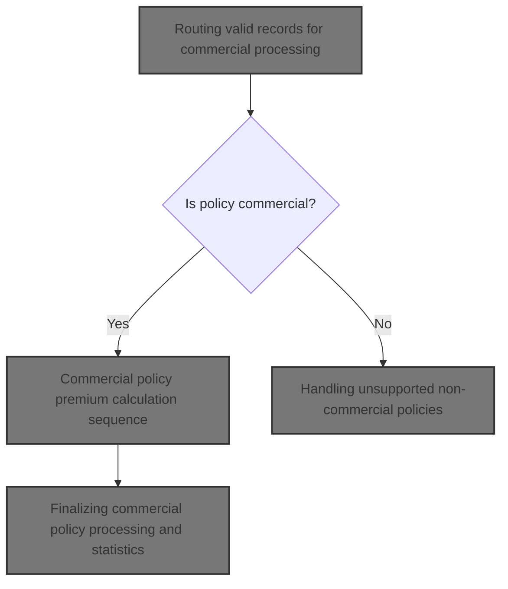
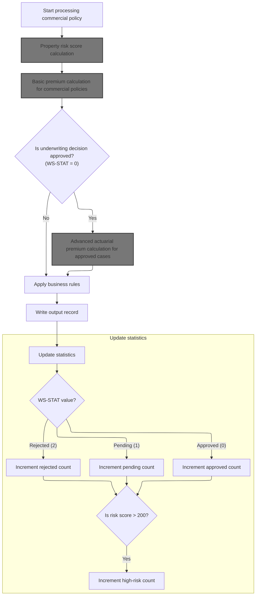
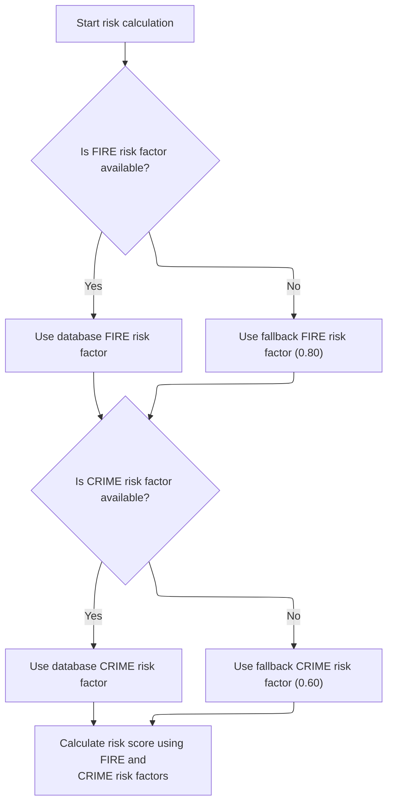
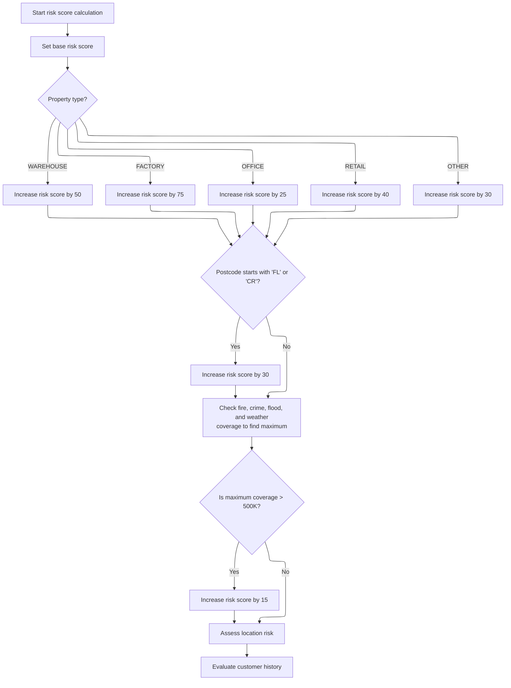
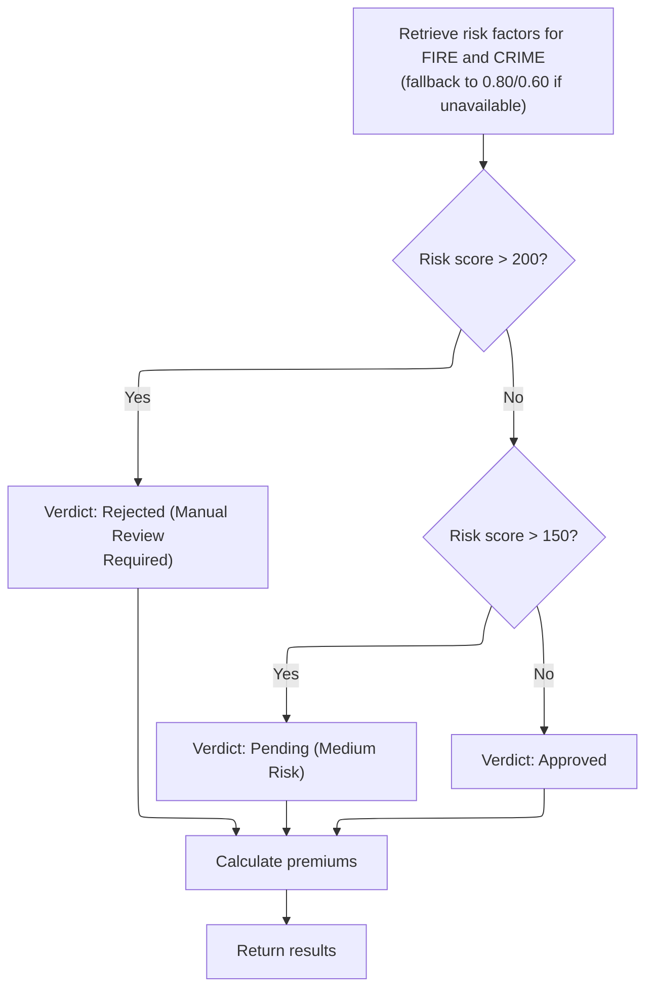
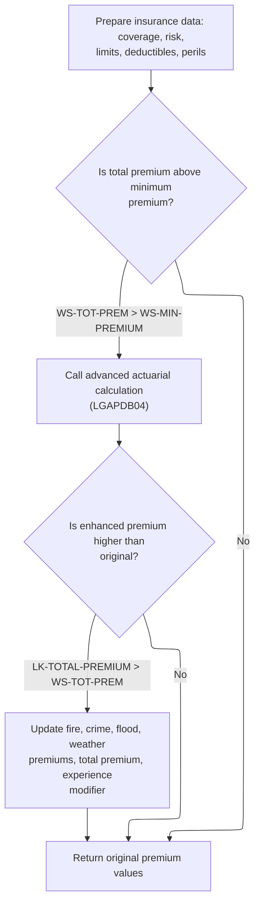
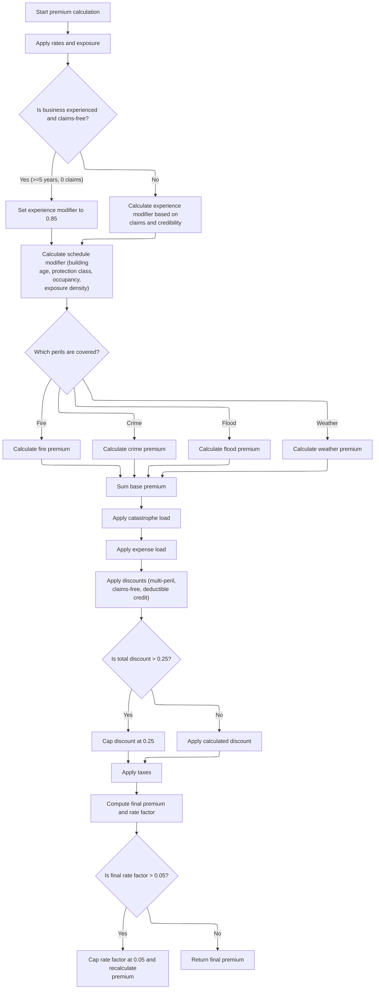
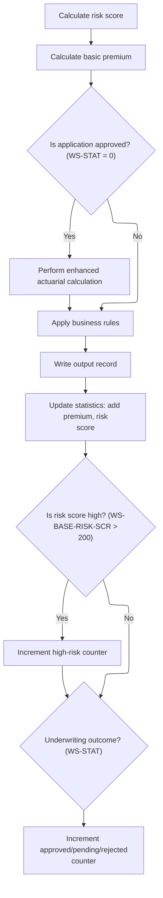

This document describes how valid policy records are routed for commercial processing. When a policy record is received, the flow checks if it is commercial. Commercial policies are processed through risk score calculation, premium computation, actuarial enhancements, business rule application, output writing, and statistics updating for reporting. Non-commercial policies are flagged as unsupported, with all premium and risk fields set to zero, and a reject reason provided.



# Spec

## Detailed View of the Program's Functionality

a. File Opening and Initialization

The main program begins by defining the files it will use for input, output, configuration, rates, and summary. It sets up the file formats and keys for indexed access. When execution starts, it initializes counters, risk analysis, actuarial data, premium breakdown, and decision data. It also accepts the processing date from the system.

b. Configuration Loading

The program attempts to open and read the configuration file. If unavailable, it loads default values for maximum risk score and minimum premium. If available, it reads these values from the file and stores them for later use.

c. File Opening and Header Writing

Input, output, and summary files are opened. If any file fails to open, the program displays an error and stops. Once files are open, it writes headers to the output file, labeling each column for customer, property type, postcode, risk score, premiums, status, and rejection reason.

d. Input Record Processing Loop

The program reads input records one by one. For each record, it increments the record count and validates the input. Validation checks include policy type, customer number, coverage limits, and total coverage against the maximum allowed. If validation passes, the record is processed as valid; otherwise, it is processed as an error.

e. Input Validation

Validation checks for:

- Unsupported policy types (must be commercial, personal, or farm).
- Missing customer number.
- Missing coverage limits (at least one must be present).
- Total coverage exceeding the maximum total insured value.

If any validation fails, an error is logged with a code, severity, field, and message.

f. Routing Valid Records

If the policy is commercial, the commercial processing routine is performed, and the processed count is incremented. If not, the non-commercial routine is performed, and the error count is incremented.

g. Commercial Policy Processing

For commercial policies:

1. The risk score is calculated by calling a dedicated risk scoring module.
2. Basic premium calculation is performed by calling a premium calculation module.
3. If the underwriting status is approved, an enhanced actuarial calculation is performed, preparing input and coverage data and calling an advanced actuarial module. If the enhanced premium is higher, premium fields are updated.
4. Business rules are applied to determine the final underwriting decision based on risk score and premium thresholds.
5. The output record is written with all relevant fields.
6. Statistics are updated, including totals for premium, risk score, and counters for approved, pending, rejected, and high-risk cases.

h. Risk Score Calculation (LGAPDB02)

The risk scoring module fetches risk factors for fire and crime from the database, falling back to default values if unavailable. The risk score is initialized and adjusted based on property type, postcode prefix, coverage amounts, location (latitude/longitude), and customer history. Each adjustment uses domain-specific constants and rules.

i. Basic Premium Calculation (LGAPDB03)

The premium calculation module fetches risk factors for fire and crime, falling back to defaults if needed. It assigns a verdict based on risk score: rejected for scores over 200, pending for scores over 150, approved otherwise. Premiums for each peril are calculated using risk score, peril values, and a discount factor if all perils are selected. The total premium is the sum of all peril premiums.

j. Enhanced Actuarial Calculation (LGAPDB04)

If the total premium exceeds the minimum, the advanced actuarial module is called. It prepares input and coverage data, loads base rates, calculates exposures, experience and schedule modifiers, base premiums, catastrophe and expense loadings, discounts, taxes, and final premium. Modifiers and discounts are calculated based on business age, claims history, building age, protection class, occupancy, exposure density, peril combinations, and deductible sizes. The final premium is capped if the rate factor exceeds a threshold.

k. Business Rule Application

Business rules are applied to determine the underwriting outcome:

- If risk score exceeds the maximum, the record is rejected.
- If total premium is below the minimum, the record is marked pending.
- If risk score is high but not above the maximum, the record is pending.
- Otherwise, the record is approved.

l. Output Record Writing

The output record is populated with customer, property, postcode, risk score, premiums, status, and rejection reason, then written to the output file.

m. Statistics Update

Premium and risk score are added to control totals. Counters for approved, pending, rejected, and high-risk cases are incremented based on underwriting status and risk score.

n. Non-Commercial Policy Handling

For unsupported policies, customer and property info are copied to the output. All premium and risk score fields are set to zero. The status is marked as 'UNSUPPORTED', and a rejection reason is provided. The record is written to the output file.

o. File Closing and Summary Generation

All files are closed. If the summary file is available, a summary is written with processing date, total records processed, counts for approved, pending, rejected, total premium, and average risk score if applicable.

p. Final Statistics Display

The program displays final statistics, including total records read, processed, approved, pending, rejected, error records, high-risk count, total premium generated, and average risk score if available.

# Rule Definition

| Paragraph Name                                                                     | Rule ID | Category          | Description                                                                                                                                                                                                                                                                                                     | Conditions                                                                                    | Remarks                                                                                                                                                                                                                                                                                                                                             |
| ---------------------------------------------------------------------------------- | ------- | ----------------- | --------------------------------------------------------------------------------------------------------------------------------------------------------------------------------------------------------------------------------------------------------------------------------------------------------------- | --------------------------------------------------------------------------------------------- | --------------------------------------------------------------------------------------------------------------------------------------------------------------------------------------------------------------------------------------------------------------------------------------------------------------------------------------------------- |
| P008-VALIDATE-INPUT-RECORD, P009-PROCESS-VALID-RECORD, P012-PROCESS-NON-COMMERCIAL | RL-001  | Conditional Logic | The program checks if the policy type is 'COMMERCIAL'. Only these are processed as commercial; all others are marked as unsupported.                                                                                                                                                                            | IN-POLICY-TYPE must be exactly 'COMMERCIAL'.                                                  | For non-commercial policies, all premium and risk score fields are set to zero, OUT-STATUS is 'UNSUPPORTED', and OUT-REJECT-REASON is 'Only commercial policies are supported.' All output fields must be present and populated.                                                                                                                    |
| P011A-CALCULATE-RISK-SCORE (LGAPDB02)                                              | RL-002  | Computation       | For commercial policies, the property risk score is calculated using property, coverage, and customer history fields. FIRE and CRIME risk factors are retrieved from an external database, with fallback values if unavailable.                                                                                 | Policy is commercial; calculation uses all relevant fields.                                   | Fallback values: 0.80 for FIRE, 0.60 for CRIME. Risk score adjustments: +50 for 'WAREHOUSE', +75 for 'FACTORY', +25 for 'OFFICE', +40 for 'RETAIL', +30 for 'OTHER'. +30 if postcode starts with 'FL' or 'CR'. +15 if max coverage > 500,000. Customer history: +10 if 'N' or unknown, -5 if 'G', +25 if 'R'. Deductibles do not affect risk score. |
| P011B-BASIC-PREMIUM-CALC (LGAPDB03), P011D-APPLY-BUSINESS-RULES                    | RL-003  | Computation       | For each selected peril, calculate the basic premium using the risk score and peril selections. Assign underwriting status based on risk score: 'REJECTED' if >200, 'PENDING' if >150, 'APPROVED' otherwise. Set OUT-STATUS and OUT-REJECT-REASON accordingly.                                                  | Policy is commercial; peril selection value > 0.                                              | Premiums are calculated for each peril and summed. OUT-STATUS: 'REJECTED' (>200), 'PENDING' (>150), 'APPROVED' otherwise. OUT-REJECT-REASON set as per status. Output fields must be present and populated.                                                                                                                                         |
| P011B-BASIC-PREMIUM-CALC (LGAPDB03), P011C-ENHANCED-ACTUARIAL-CALC (LGAPDB04)      | RL-004  | Computation       | If all peril selections are active, apply a multi-peril discount. Apply deductible credits based on deductible amounts. Cap the total discount at 0.25 (25%). Subtract the total discount from the premium sum before taxes.                                                                                    | All peril selections active for multi-peril discount; deductible credits based on thresholds. | Multi-peril discount if all perils selected. Deductible credits: +0.025 if FIRE >= 10,000; +0.035 if WIND >= 25,000; +0.045 if FLOOD >= 50,000. Total discount capped at 0.25. Discount applied before taxes.                                                                                                                                       |
| P011C-ENHANCED-ACTUARIAL-CALC (LGAPDB04)                                           | RL-005  | Conditional Logic | If OUT-STATUS is 'APPROVED' and OUT-TOTAL-PREMIUM > minimum premium (500.00), perform advanced actuarial calculation. If the enhanced premium is higher, update all premium fields and experience modifier. Apply catastrophe and expense loads, and all discounts as above. Cap final rate factor at 0.050000. | OUT-STATUS is 'APPROVED' and OUT-TOTAL-PREMIUM > 500.00.                                      | Minimum premium is 500.00. Final rate factor capped at 0.050000. If enhanced premium is higher, update all premium fields and experience modifier.                                                                                                                                                                                                  |
| P011F-UPDATE-STATISTICS                                                            | RL-006  | Data Assignment   | After writing the output record for a commercial policy, update statistics counters: approved, pending, rejected, high-risk, total premium, total risk score. All counters are initialized to zero at the start.                                                                                                | Policy is commercial; after output record is written.                                         | Counters: approved, pending, rejected, high-risk (>200), total premium, total risk score. All initialized to zero at start.                                                                                                                                                                                                                         |
| P010-PROCESS-ERROR-RECORD, P012-PROCESS-NON-COMMERCIAL, P011E-WRITE-OUTPUT-RECORD  | RL-007  | Data Assignment   | Every output record, regardless of processing outcome, must include all output fields. For unsupported or error records, fields are zeroed as appropriate.                                                                                                                                                      | Any output record written.                                                                    | All output fields must be present and populated. For unsupported or error records, premium and risk score fields are zeroed.                                                                                                                                                                                                                        |

# User Stories

## User Story 1: Handle non-commercial and error records

---

### Story Description:

As a user, I want non-commercial policies and error records to be marked as unsupported with all premium and risk score fields set to zero, so that only commercial policies are processed and output records are always complete and consistent.

---

### Business Rule Mapping:

| Rule ID | Paragraph Name                                                                     | Rule Description                                                                                                                                           |
| ------- | ---------------------------------------------------------------------------------- | ---------------------------------------------------------------------------------------------------------------------------------------------------------- |
| RL-001  | P008-VALIDATE-INPUT-RECORD, P009-PROCESS-VALID-RECORD, P012-PROCESS-NON-COMMERCIAL | The program checks if the policy type is 'COMMERCIAL'. Only these are processed as commercial; all others are marked as unsupported.                       |
| RL-007  | P010-PROCESS-ERROR-RECORD, P012-PROCESS-NON-COMMERCIAL, P011E-WRITE-OUTPUT-RECORD  | Every output record, regardless of processing outcome, must include all output fields. For unsupported or error records, fields are zeroed as appropriate. |

---

### Relevant Functionality:

- **P008-VALIDATE-INPUT-RECORD**
  1. **RL-001:**
     - If policy type is not 'COMMERCIAL':
       - Set all premium and risk score fields to zero
       - Set OUT-STATUS to 'UNSUPPORTED'
       - Set OUT-REJECT-REASON to 'Only commercial policies are supported.'
       - Write output record with all fields present
- **P010-PROCESS-ERROR-RECORD**
  1. **RL-007:**
     - For every output record:
       - Populate all output fields
       - For unsupported or error records, set premium and risk score fields to zero

## User Story 2: Process commercial policy records, calculate premiums, and update statistics

---

### Story Description:

As a user, I want commercial policies to have their risk scores, premiums, discounts, underwriting status, and statistics counters calculated and updated according to all business rules, so that the correct premium, status, and statistics are assigned and all output fields are populated accurately.

---

### Business Rule Mapping:

| Rule ID | Paragraph Name                                                                | Rule Description                                                                                                                                                                                                                                                                                                |
| ------- | ----------------------------------------------------------------------------- | --------------------------------------------------------------------------------------------------------------------------------------------------------------------------------------------------------------------------------------------------------------------------------------------------------------- |
| RL-006  | P011F-UPDATE-STATISTICS                                                       | After writing the output record for a commercial policy, update statistics counters: approved, pending, rejected, high-risk, total premium, total risk score. All counters are initialized to zero at the start.                                                                                                |
| RL-002  | P011A-CALCULATE-RISK-SCORE (LGAPDB02)                                         | For commercial policies, the property risk score is calculated using property, coverage, and customer history fields. FIRE and CRIME risk factors are retrieved from an external database, with fallback values if unavailable.                                                                                 |
| RL-003  | P011B-BASIC-PREMIUM-CALC (LGAPDB03), P011D-APPLY-BUSINESS-RULES               | For each selected peril, calculate the basic premium using the risk score and peril selections. Assign underwriting status based on risk score: 'REJECTED' if >200, 'PENDING' if >150, 'APPROVED' otherwise. Set OUT-STATUS and OUT-REJECT-REASON accordingly.                                                  |
| RL-004  | P011B-BASIC-PREMIUM-CALC (LGAPDB03), P011C-ENHANCED-ACTUARIAL-CALC (LGAPDB04) | If all peril selections are active, apply a multi-peril discount. Apply deductible credits based on deductible amounts. Cap the total discount at 0.25 (25%). Subtract the total discount from the premium sum before taxes.                                                                                    |
| RL-005  | P011C-ENHANCED-ACTUARIAL-CALC (LGAPDB04)                                      | If OUT-STATUS is 'APPROVED' and OUT-TOTAL-PREMIUM > minimum premium (500.00), perform advanced actuarial calculation. If the enhanced premium is higher, update all premium fields and experience modifier. Apply catastrophe and expense loads, and all discounts as above. Cap final rate factor at 0.050000. |

---

### Relevant Functionality:

- **P011F-UPDATE-STATISTICS**
  1. **RL-006:**
     - After writing output record for commercial policy:
       - Increment status counter based on OUT-STATUS
       - Increment high-risk counter if OUT-RISK-SCORE > 200
       - Add OUT-TOTAL-PREMIUM and OUT-RISK-SCORE to totals
- **P011A-CALCULATE-RISK-SCORE (LGAPDB02)**
  1. **RL-002:**
     - Retrieve FIRE and CRIME risk factors from database
       - If not found, use fallback values
     - Start with base risk score
     - Adjust based on property type
     - Adjust if postcode starts with 'FL' or 'CR'
     - Add 15 if max coverage > 500,000
     - Adjust for customer history
     - Deductibles are ignored
- **P011B-BASIC-PREMIUM-CALC (LGAPDB03)**
  1. **RL-003:**
     - For each peril with value > 0, calculate premium
     - Sum premiums for OUT-TOTAL-PREMIUM
     - Assign status based on risk score:
       - &nbsp;

         > 200: 'REJECTED'

       - &nbsp;

         > 150: 'PENDING'

       - else: 'APPROVED'
     - Set OUT-STATUS and OUT-REJECT-REASON accordingly
  2. **RL-004:**
     - If all perils selected, apply multi-peril discount
     - Add deductible credits based on thresholds
     - Cap total discount at 0.25
     - Subtract discount from premium sum before taxes
- **P011C-ENHANCED-ACTUARIAL-CALC (LGAPDB04)**
  1. **RL-005:**
     - If OUT-STATUS is 'APPROVED' and OUT-TOTAL-PREMIUM > 500.00:
       - Prepare input and coverage data
       - Call advanced actuarial calculation
       - If enhanced premium > original, update premium fields and experience modifier
       - Apply catastrophe and expense loads, and all discounts
       - If final rate factor > 0.050000, cap and recalculate premium

# Code Walkthrough

## Routing valid records for commercial processing

<SwmSnippet path="/base/src/LGAPDB01.cbl" line="234">

---

`P009-PROCESS-VALID-RECORD` checks if the policy is commercial. If so, it calls P011-PROCESS-COMMERCIAL to start the commercial premium calculation flow and increments the processed count. Otherwise, it calls P012-PROCESS-NON-COMMERCIAL to mark the record as unsupported and increments the error count. This split ensures only commercial policies go through the full calculation logic.

```cobol
       P009-PROCESS-VALID-RECORD.
           IF COMMERCIAL-POLICY
               PERFORM P011-PROCESS-COMMERCIAL
               ADD 1 TO WS-PROC-CNT
           ELSE
               PERFORM P012-PROCESS-NON-COMMERCIAL
               ADD 1 TO WS-ERR-CNT
           END-IF.
```

---

</SwmSnippet>

### Commercial policy premium calculation sequence



<SwmSnippet path="/base/src/LGAPDB01.cbl" line="258">

---

In `P011-PROCESS-COMMERCIAL`, the flow starts by calculating the risk score, then the basic premium. If WS-STAT is 0 (approved), it runs the enhanced actuarial calculation. After that, it applies business rules, writes the output, and updates statistics. Calling P011A-CALCULATE-RISK-SCORE first is necessary because all downstream calculations depend on the risk score value.

```cobol
       P011-PROCESS-COMMERCIAL.
           PERFORM P011A-CALCULATE-RISK-SCORE
           PERFORM P011B-BASIC-PREMIUM-CALC
           IF WS-STAT = 0
               PERFORM P011C-ENHANCED-ACTUARIAL-CALC
           END-IF
           PERFORM P011D-APPLY-BUSINESS-RULES
           PERFORM P011E-WRITE-OUTPUT-RECORD
           PERFORM P011F-UPDATE-STATISTICS.
```

---

</SwmSnippet>

#### Property risk score calculation

<SwmSnippet path="/base/src/LGAPDB01.cbl" line="268">

---

`P011A-CALCULATE-RISK-SCORE` calls LGAPDB02, passing all relevant property and customer info. LGAPDB02 handles fetching risk factors and computing the risk score, which is then used for premium calculations. This keeps risk logic isolated and reusable.

```cobol
       P011A-CALCULATE-RISK-SCORE.
           CALL 'LGAPDB02' USING IN-PROPERTY-TYPE, IN-POSTCODE, 
                                IN-LATITUDE, IN-LONGITUDE,
                                IN-BUILDING-LIMIT, IN-CONTENTS-LIMIT,
                                IN-FLOOD-COVERAGE, IN-WEATHER-COVERAGE,
                                IN-CUSTOMER-HISTORY, WS-BASE-RISK-SCR.
```

---

</SwmSnippet>

#### Database risk factor retrieval and score computation



<SwmSnippet path="/base/src/LGAPDB02.cbl" line="39">

---

`MAIN-LOGIC` first fetches risk factors for fire and crime from the database, then calculates the risk score using those values and property/customer inputs. If the database query fails, it falls back to default values, so the risk score is always computed.

```cobol
       MAIN-LOGIC.
           PERFORM GET-RISK-FACTORS
           PERFORM CALCULATE-RISK-SCORE
           GOBACK.
```

---

</SwmSnippet>

<SwmSnippet path="/base/src/LGAPDB02.cbl" line="44">

---

`GET-RISK-FACTORS` fetches fire and crime risk factors from the database. If the query fails, it assigns default values (0.80 for fire, 0.60 for crime). This guarantees risk factors are always available for the score calculation, even if the database is missing entries.

```cobol
       GET-RISK-FACTORS.
           EXEC SQL
               SELECT FACTOR_VALUE INTO :WS-FIRE-FACTOR
               FROM RISK_FACTORS
               WHERE PERIL_TYPE = 'FIRE'
           END-EXEC.
           
           IF SQLCODE = 0
               CONTINUE
           ELSE
               MOVE 0.80 TO WS-FIRE-FACTOR
           END-IF.
           
           EXEC SQL
               SELECT FACTOR_VALUE INTO :WS-CRIME-FACTOR
               FROM RISK_FACTORS
               WHERE PERIL_TYPE = 'CRIME'
           END-EXEC.
           
           IF SQLCODE = 0
               CONTINUE
           ELSE
               MOVE 0.60 TO WS-CRIME-FACTOR
           END-IF.
```

---

</SwmSnippet>

#### Risk score adjustment based on property and coverage



<SwmSnippet path="/base/src/LGAPDB02.cbl" line="69">

---

`CALCULATE-RISK-SCORE` starts with a base score, then adjusts it using fixed values for property type and postcode prefix. It then calls procedures to further adjust the score based on coverage, location, and customer history. The constants used here are domain-specific and drive the risk logic.

```cobol
       CALCULATE-RISK-SCORE.
           MOVE 100 TO LK-RISK-SCORE

           EVALUATE LK-PROPERTY-TYPE
             WHEN 'WAREHOUSE'
               ADD 50 TO LK-RISK-SCORE
             WHEN 'FACTORY' 
               ADD 75 TO LK-RISK-SCORE
             WHEN 'OFFICE'
               ADD 25 TO LK-RISK-SCORE
             WHEN 'RETAIL'
               ADD 40 TO LK-RISK-SCORE
             WHEN OTHER
               ADD 30 TO LK-RISK-SCORE
           END-EVALUATE

           IF LK-POSTCODE(1:2) = 'FL' OR
              LK-POSTCODE(1:2) = 'CR'
             ADD 30 TO LK-RISK-SCORE
           END-IF

           PERFORM CHECK-COVERAGE-AMOUNTS
           PERFORM ASSESS-LOCATION-RISK  
           PERFORM EVALUATE-CUSTOMER-HISTORY.
```

---

</SwmSnippet>

<SwmSnippet path="/base/src/LGAPDB02.cbl" line="94">

---

`CHECK-COVERAGE-AMOUNTS` finds the highest coverage among fire, crime, flood, and weather. If it exceeds 500,000, it bumps the risk score by 15. The constants here are arbitrary and set the business rule for high coverage risk.

```cobol
       CHECK-COVERAGE-AMOUNTS.
           MOVE ZERO TO WS-MAX-COVERAGE
           
           IF LK-FIRE-COVERAGE > WS-MAX-COVERAGE
               MOVE LK-FIRE-COVERAGE TO WS-MAX-COVERAGE
           END-IF
           
           IF LK-CRIME-COVERAGE > WS-MAX-COVERAGE
               MOVE LK-CRIME-COVERAGE TO WS-MAX-COVERAGE
           END-IF
           
           IF LK-FLOOD-COVERAGE > WS-MAX-COVERAGE
               MOVE LK-FLOOD-COVERAGE TO WS-MAX-COVERAGE
           END-IF
           
           IF LK-WEATHER-COVERAGE > WS-MAX-COVERAGE
               MOVE LK-WEATHER-COVERAGE TO WS-MAX-COVERAGE
           END-IF
           
           IF WS-MAX-COVERAGE > WS-COVERAGE-500K
               ADD 15 TO LK-RISK-SCORE
           END-IF.
```

---

</SwmSnippet>

#### Basic premium calculation for commercial policies

<SwmSnippet path="/base/src/LGAPDB01.cbl" line="275">

---

`P011B-BASIC-PREMIUM-CALC` calls LGAPDB03, passing risk score, peril values, and other relevant fields. LGAPDB03 handles the actual premium calculation and verdict assignment, so this keeps premium logic separate from the main flow.

```cobol
       P011B-BASIC-PREMIUM-CALC.
           CALL 'LGAPDB03' USING WS-BASE-RISK-SCR, IN-FIRE-PERIL, 
                                IN-CRIME-PERIL, IN-FLOOD-PERIL, 
                                IN-WEATHER-PERIL, WS-STAT,
                                WS-STAT-DESC, WS-REJ-RSN, WS-FR-PREM,
                                WS-CR-PREM, WS-FL-PREM, WS-WE-PREM,
                                WS-TOT-PREM, WS-DISC-FACT.
```

---

</SwmSnippet>

#### Premium calculation and risk verdict assignment



<SwmSnippet path="/base/src/LGAPDB03.cbl" line="42">

---

`MAIN-LOGIC` in LGAPDB03 fetches risk factors, determines the risk verdict based on the risk score, and calculates premiums for each peril. It also applies discounts if all coverages are selected. This keeps premium and verdict logic centralized.

```cobol
       MAIN-LOGIC.
           PERFORM GET-RISK-FACTORS
           PERFORM CALCULATE-VERDICT
           PERFORM CALCULATE-PREMIUMS
           GOBACK.
```

---

</SwmSnippet>

<SwmSnippet path="/base/src/LGAPDB03.cbl" line="48">

---

`GET-RISK-FACTORS` in LGAPDB03 fetches fire and crime risk factors from the database. If the query fails, it uses default values (0.80 for fire, 0.60 for crime). This fallback ensures premium calculations always have risk factors.

```cobol
       GET-RISK-FACTORS.
           EXEC SQL
               SELECT FACTOR_VALUE INTO :WS-FIRE-FACTOR
               FROM RISK_FACTORS
               WHERE PERIL_TYPE = 'FIRE'
           END-EXEC.
           
           IF SQLCODE = 0
               CONTINUE
           ELSE
               MOVE 0.80 TO WS-FIRE-FACTOR
           END-IF.
           
           EXEC SQL
               SELECT FACTOR_VALUE INTO :WS-CRIME-FACTOR
               FROM RISK_FACTORS
               WHERE PERIL_TYPE = 'CRIME'
           END-EXEC.
           
           IF SQLCODE = 0
               CONTINUE
           ELSE
               MOVE 0.60 TO WS-CRIME-FACTOR
           END-IF.
```

---

</SwmSnippet>

<SwmSnippet path="/base/src/LGAPDB03.cbl" line="73">

---

`CALCULATE-VERDICT` checks the risk score and assigns a status: rejected for scores over 200, pending for scores over 150, and approved otherwise. It sets the status description and rejection reason accordingly. The thresholds are hardcoded and drive the underwriting outcome.

```cobol
       CALCULATE-VERDICT.
           IF LK-RISK-SCORE > 200
             MOVE 2 TO LK-STAT
             MOVE 'REJECTED' TO LK-STAT-DESC
             MOVE 'High Risk Score - Manual Review Required' 
               TO LK-REJ-RSN
           ELSE
             IF LK-RISK-SCORE > 150
               MOVE 1 TO LK-STAT
               MOVE 'PENDING' TO LK-STAT-DESC
               MOVE 'Medium Risk - Pending Review'
                 TO LK-REJ-RSN
             ELSE
               MOVE 0 TO LK-STAT
               MOVE 'APPROVED' TO LK-STAT-DESC
               MOVE SPACES TO LK-REJ-RSN
             END-IF
           END-IF.
```

---

</SwmSnippet>

#### Advanced actuarial premium calculation for approved cases



<SwmSnippet path="/base/src/LGAPDB01.cbl" line="283">

---

`P011C-ENHANCED-ACTUARIAL-CALC` prepares all input and coverage data, then calls LGAPDB04 for advanced premium calculation if the total premium is above the minimum. If the enhanced premium is higher, it updates the premium fields with the new values. This step is only run for approved cases.

```cobol
       P011C-ENHANCED-ACTUARIAL-CALC.
      *    Prepare input structure for actuarial calculation
           MOVE IN-CUSTOMER-NUM TO LK-CUSTOMER-NUM
           MOVE WS-BASE-RISK-SCR TO LK-RISK-SCORE
           MOVE IN-PROPERTY-TYPE TO LK-PROPERTY-TYPE
           MOVE IN-TERRITORY-CODE TO LK-TERRITORY
           MOVE IN-CONSTRUCTION-TYPE TO LK-CONSTRUCTION-TYPE
           MOVE IN-OCCUPANCY-CODE TO LK-OCCUPANCY-CODE
           MOVE IN-SPRINKLER-IND TO LK-PROTECTION-CLASS
           MOVE IN-YEAR-BUILT TO LK-YEAR-BUILT
           MOVE IN-SQUARE-FOOTAGE TO LK-SQUARE-FOOTAGE
           MOVE IN-YEARS-IN-BUSINESS TO LK-YEARS-IN-BUSINESS
           MOVE IN-CLAIMS-COUNT-3YR TO LK-CLAIMS-COUNT-5YR
           MOVE IN-CLAIMS-AMOUNT-3YR TO LK-CLAIMS-AMOUNT-5YR
           
      *    Set coverage data
           MOVE IN-BUILDING-LIMIT TO LK-BUILDING-LIMIT
           MOVE IN-CONTENTS-LIMIT TO LK-CONTENTS-LIMIT
           MOVE IN-BI-LIMIT TO LK-BI-LIMIT
           MOVE IN-FIRE-DEDUCTIBLE TO LK-FIRE-DEDUCTIBLE
           MOVE IN-WIND-DEDUCTIBLE TO LK-WIND-DEDUCTIBLE
           MOVE IN-FLOOD-DEDUCTIBLE TO LK-FLOOD-DEDUCTIBLE
           MOVE IN-OTHER-DEDUCTIBLE TO LK-OTHER-DEDUCTIBLE
           MOVE IN-FIRE-PERIL TO LK-FIRE-PERIL
           MOVE IN-CRIME-PERIL TO LK-CRIME-PERIL
           MOVE IN-FLOOD-PERIL TO LK-FLOOD-PERIL
           MOVE IN-WEATHER-PERIL TO LK-WEATHER-PERIL
           
      *    Call advanced actuarial calculation program (only for approved cases)
           IF WS-TOT-PREM > WS-MIN-PREMIUM
               CALL 'LGAPDB04' USING LK-INPUT-DATA, LK-COVERAGE-DATA, 
                                    LK-OUTPUT-RESULTS
               
      *        Update with enhanced calculations if successful
               IF LK-TOTAL-PREMIUM > WS-TOT-PREM
                   MOVE LK-FIRE-PREMIUM TO WS-FR-PREM
                   MOVE LK-CRIME-PREMIUM TO WS-CR-PREM
                   MOVE LK-FLOOD-PREMIUM TO WS-FL-PREM
                   MOVE LK-WEATHER-PREMIUM TO WS-WE-PREM
                   MOVE LK-TOTAL-PREMIUM TO WS-TOT-PREM
                   MOVE LK-EXPERIENCE-MOD TO WS-EXPERIENCE-MOD
               END-IF
           END-IF.
```

---

</SwmSnippet>

#### Stepwise actuarial premium computation



<SwmSnippet path="/base/src/LGAPDB04.cbl" line="138">

---

`P100-MAIN` runs through a sequence of steps: initializing exposures, loading rates, calculating modifiers, base premium, catastrophe loading, expenses, discounts, taxes, and finally the capped premium. Each step is a separate procedure, making the actuarial logic modular and maintainable.

```cobol
       P100-MAIN.
           PERFORM P200-INIT
           PERFORM P300-RATES
           PERFORM P350-EXPOSURE
           PERFORM P400-EXP-MOD
           PERFORM P500-SCHED-MOD
           PERFORM P600-BASE-PREM
           PERFORM P700-CAT-LOAD
           PERFORM P800-EXPENSE
           PERFORM P900-DISC
           PERFORM P950-TAXES
           PERFORM P999-FINAL
           GOBACK.
```

---

</SwmSnippet>

<SwmSnippet path="/base/src/LGAPDB04.cbl" line="234">

---

`P400-EXP-MOD` calculates the experience modifier using years in business and claims history. It uses constants like 0.8500, 1.1000, 0.5000, and 2.0000 to set or cap the modifier. The logic rewards claims-free history and penalizes high claims, but the constants are domain-specific and not explained.

```cobol
       P400-EXP-MOD.
           MOVE 1.0000 TO WS-EXPERIENCE-MOD
           
           IF LK-YEARS-IN-BUSINESS >= 5
               IF LK-CLAIMS-COUNT-5YR = ZERO
                   MOVE 0.8500 TO WS-EXPERIENCE-MOD
               ELSE
                   COMPUTE WS-EXPERIENCE-MOD = 
                       1.0000 + 
                       ((LK-CLAIMS-AMOUNT-5YR / WS-TOTAL-INSURED-VAL) * 
                        WS-CREDIBILITY-FACTOR * 0.50)
                   
                   IF WS-EXPERIENCE-MOD > 2.0000
                       MOVE 2.0000 TO WS-EXPERIENCE-MOD
                   END-IF
                   
                   IF WS-EXPERIENCE-MOD < 0.5000
                       MOVE 0.5000 TO WS-EXPERIENCE-MOD
                   END-IF
               END-IF
           ELSE
               MOVE 1.1000 TO WS-EXPERIENCE-MOD
           END-IF
           
           MOVE WS-EXPERIENCE-MOD TO LK-EXPERIENCE-MOD.
```

---

</SwmSnippet>

<SwmSnippet path="/base/src/LGAPDB04.cbl" line="260">

---

`P500-SCHED-MOD` adjusts the schedule modifier based on building age, protection class, occupancy code, and exposure density. It uses domain-specific ranges and constants, then clamps the value between -0.200 and +0.400. The result is stored for later premium calculations.

```cobol
       P500-SCHED-MOD.
           MOVE +0.000 TO WS-SCHEDULE-MOD
           
      *    Building age factor
           EVALUATE TRUE
               WHEN LK-YEAR-BUILT >= 2010
                   SUBTRACT 0.050 FROM WS-SCHEDULE-MOD
               WHEN LK-YEAR-BUILT >= 1990
                   CONTINUE
               WHEN LK-YEAR-BUILT >= 1970
                   ADD 0.100 TO WS-SCHEDULE-MOD
               WHEN OTHER
                   ADD 0.200 TO WS-SCHEDULE-MOD
           END-EVALUATE
           
      *    Protection class factor
           EVALUATE LK-PROTECTION-CLASS
               WHEN '01' THRU '03'
                   SUBTRACT 0.100 FROM WS-SCHEDULE-MOD
               WHEN '04' THRU '06'
                   SUBTRACT 0.050 FROM WS-SCHEDULE-MOD
               WHEN '07' THRU '09'
                   CONTINUE
               WHEN OTHER
                   ADD 0.150 TO WS-SCHEDULE-MOD
           END-EVALUATE
           
      *    Occupancy hazard factor
           EVALUATE LK-OCCUPANCY-CODE
               WHEN 'OFF01' THRU 'OFF05'
                   SUBTRACT 0.025 FROM WS-SCHEDULE-MOD
               WHEN 'MFG01' THRU 'MFG10'
                   ADD 0.075 TO WS-SCHEDULE-MOD
               WHEN 'WHS01' THRU 'WHS05'
                   ADD 0.125 TO WS-SCHEDULE-MOD
               WHEN OTHER
                   CONTINUE
           END-EVALUATE
           
      *    Exposure density factor
           IF WS-EXPOSURE-DENSITY > 500.00
               ADD 0.100 TO WS-SCHEDULE-MOD
           ELSE
               IF WS-EXPOSURE-DENSITY < 50.00
                   SUBTRACT 0.050 FROM WS-SCHEDULE-MOD
               END-IF
           END-IF
           
           IF WS-SCHEDULE-MOD > +0.400
               MOVE +0.400 TO WS-SCHEDULE-MOD
           END-IF
           
           IF WS-SCHEDULE-MOD < -0.200
               MOVE -0.200 TO WS-SCHEDULE-MOD
           END-IF
           
           MOVE WS-SCHEDULE-MOD TO LK-SCHEDULE-MOD.
```

---

</SwmSnippet>

<SwmSnippet path="/base/src/LGAPDB04.cbl" line="318">

---

`P600-BASE-PREM` calculates the base premium for each peril. It uses constants like 0.80 for crime and 1.25 for flood, multiplies exposures by base rates, modifiers, and trend factors, then sums up the premiums. The logic assumes all peril and exposure variables are valid and numeric.

```cobol
       P600-BASE-PREM.
           MOVE ZERO TO LK-BASE-AMOUNT
           
      * FIRE PREMIUM
           IF LK-FIRE-PERIL > ZERO
               COMPUTE LK-FIRE-PREMIUM = 
                   (WS-BUILDING-EXPOSURE + WS-CONTENTS-EXPOSURE) *
                   WS-BASE-RATE (1, 1, 1, 1) * 
                   WS-EXPERIENCE-MOD *
                   (1 + WS-SCHEDULE-MOD) *
                   WS-TREND-FACTOR
                   
               ADD LK-FIRE-PREMIUM TO LK-BASE-AMOUNT
           END-IF
           
      * CRIME PREMIUM
           IF LK-CRIME-PERIL > ZERO
               COMPUTE LK-CRIME-PREMIUM = 
                   (WS-CONTENTS-EXPOSURE * 0.80) *
                   WS-BASE-RATE (2, 1, 1, 1) * 
                   WS-EXPERIENCE-MOD *
                   (1 + WS-SCHEDULE-MOD) *
                   WS-TREND-FACTOR
                   
               ADD LK-CRIME-PREMIUM TO LK-BASE-AMOUNT
           END-IF
           
      * FLOOD PREMIUM
           IF LK-FLOOD-PERIL > ZERO
               COMPUTE LK-FLOOD-PREMIUM = 
                   WS-BUILDING-EXPOSURE *
                   WS-BASE-RATE (3, 1, 1, 1) * 
                   WS-EXPERIENCE-MOD *
                   (1 + WS-SCHEDULE-MOD) *
                   WS-TREND-FACTOR * 1.25
                   
               ADD LK-FLOOD-PREMIUM TO LK-BASE-AMOUNT
           END-IF
           
      * WEATHER PREMIUM
           IF LK-WEATHER-PERIL > ZERO
               COMPUTE LK-WEATHER-PREMIUM = 
                   (WS-BUILDING-EXPOSURE + WS-CONTENTS-EXPOSURE) *
                   WS-BASE-RATE (4, 1, 1, 1) * 
                   WS-EXPERIENCE-MOD *
                   (1 + WS-SCHEDULE-MOD) *
                   WS-TREND-FACTOR
                   
               ADD LK-WEATHER-PREMIUM TO LK-BASE-AMOUNT
           END-IF.
```

---

</SwmSnippet>

<SwmSnippet path="/base/src/LGAPDB04.cbl" line="407">

---

`P900-DISC` calculates discounts based on peril combinations, claims history, and deductible sizes. It applies tiered discounts, adds credits for high deductibles, and caps the total discount at 25%. The final discount is applied to the sum of base, catastrophe, expense, and profit loadings.

```cobol
       P900-DISC.
           MOVE ZERO TO WS-TOTAL-DISCOUNT
           
      * Multi-peril discount
           MOVE ZERO TO WS-MULTI-PERIL-DISC
           IF LK-FIRE-PERIL > ZERO AND
              LK-CRIME-PERIL > ZERO AND
              LK-FLOOD-PERIL > ZERO AND
              LK-WEATHER-PERIL > ZERO
               MOVE 0.100 TO WS-MULTI-PERIL-DISC
           ELSE
               IF LK-FIRE-PERIL > ZERO AND
                  LK-WEATHER-PERIL > ZERO AND
                  (LK-CRIME-PERIL > ZERO OR LK-FLOOD-PERIL > ZERO)
                   MOVE 0.050 TO WS-MULTI-PERIL-DISC
               END-IF
           END-IF
           
      * Claims-free discount  
           MOVE ZERO TO WS-CLAIMS-FREE-DISC
           IF LK-CLAIMS-COUNT-5YR = ZERO AND LK-YEARS-IN-BUSINESS >= 5
               MOVE 0.075 TO WS-CLAIMS-FREE-DISC
           END-IF
           
      * Deductible credit
           MOVE ZERO TO WS-DEDUCTIBLE-CREDIT
           IF LK-FIRE-DEDUCTIBLE >= 10000
               ADD 0.025 TO WS-DEDUCTIBLE-CREDIT
           END-IF
           IF LK-WIND-DEDUCTIBLE >= 25000  
               ADD 0.035 TO WS-DEDUCTIBLE-CREDIT
           END-IF
           IF LK-FLOOD-DEDUCTIBLE >= 50000
               ADD 0.045 TO WS-DEDUCTIBLE-CREDIT
           END-IF
           
           COMPUTE WS-TOTAL-DISCOUNT = 
               WS-MULTI-PERIL-DISC + WS-CLAIMS-FREE-DISC + 
               WS-DEDUCTIBLE-CREDIT
               
           IF WS-TOTAL-DISCOUNT > 0.250
               MOVE 0.250 TO WS-TOTAL-DISCOUNT
           END-IF
           
           COMPUTE LK-DISCOUNT-AMT = 
               (LK-BASE-AMOUNT + LK-CAT-LOAD-AMT + 
                LK-EXPENSE-LOAD-AMT + LK-PROFIT-LOAD-AMT) *
               WS-TOTAL-DISCOUNT.
```

---

</SwmSnippet>

<SwmSnippet path="/base/src/LGAPDB04.cbl" line="464">

---

`P999-FINAL` sums up all premium components, subtracts the discount, and adds taxes. It calculates the final rate factor as total premium divided by total insured value, then caps the rate factor at 0.050000 if needed and recalculates the premium. This enforces a business rule on maximum rates.

```cobol
       P999-FINAL.
           COMPUTE LK-TOTAL-PREMIUM = 
               LK-BASE-AMOUNT + LK-CAT-LOAD-AMT + 
               LK-EXPENSE-LOAD-AMT + LK-PROFIT-LOAD-AMT -
               LK-DISCOUNT-AMT + LK-TAX-AMT
               
           COMPUTE LK-FINAL-RATE-FACTOR = 
               LK-TOTAL-PREMIUM / WS-TOTAL-INSURED-VAL
               
           IF LK-FINAL-RATE-FACTOR > 0.050000
               MOVE 0.050000 TO LK-FINAL-RATE-FACTOR
               COMPUTE LK-TOTAL-PREMIUM = 
                   WS-TOTAL-INSURED-VAL * LK-FINAL-RATE-FACTOR
           END-IF.
```

---

</SwmSnippet>

#### Finalizing commercial policy processing and statistics



<SwmSnippet path="/base/src/LGAPDB01.cbl" line="258">

---

Back in `P011-PROCESS-COMMERCIAL`, after all calculations and output writing, the flow finishes by updating statistics. This step tracks totals and counts for approved, pending, rejected, and high-risk cases, using WS-STAT to decide which counters to increment. This is essential for reporting and monitoring.

```cobol
       P011-PROCESS-COMMERCIAL.
           PERFORM P011A-CALCULATE-RISK-SCORE
           PERFORM P011B-BASIC-PREMIUM-CALC
           IF WS-STAT = 0
               PERFORM P011C-ENHANCED-ACTUARIAL-CALC
           END-IF
           PERFORM P011D-APPLY-BUSINESS-RULES
           PERFORM P011E-WRITE-OUTPUT-RECORD
           PERFORM P011F-UPDATE-STATISTICS.
```

---

</SwmSnippet>

<SwmSnippet path="/base/src/LGAPDB01.cbl" line="365">

---

`P011F-UPDATE-STATISTICS` adds the total premium and risk score to control totals, then increments counters for approved, pending, rejected, and high-risk cases based on WS-STAT and a risk score threshold of 200. The constants and status values are domain-specific and drive reporting logic.

```cobol
       P011F-UPDATE-STATISTICS.
           ADD WS-TOT-PREM TO WS-TOTAL-PREMIUM-AMT
           ADD WS-BASE-RISK-SCR TO WS-CONTROL-TOTALS
           
           EVALUATE WS-STAT
               WHEN 0 ADD 1 TO WS-APPROVED-CNT
               WHEN 1 ADD 1 TO WS-PENDING-CNT
               WHEN 2 ADD 1 TO WS-REJECTED-CNT
           END-EVALUATE
           
           IF WS-BASE-RISK-SCR > 200
               ADD 1 TO WS-HIGH-RISK-CNT
           END-IF.
```

---

</SwmSnippet>

### Handling unsupported non-commercial policies

<SwmSnippet path="/base/src/LGAPDB01.cbl" line="379">

---

`P012-PROCESS-NON-COMMERCIAL` copies customer and property info to the output, sets all premium and risk score fields to zero, marks the status as 'UNSUPPORTED', and writes a reject reason stating only commercial policies are supported. This flags unsupported records for downstream processes.

```cobol
       P012-PROCESS-NON-COMMERCIAL.
           MOVE IN-CUSTOMER-NUM TO OUT-CUSTOMER-NUM
           MOVE IN-PROPERTY-TYPE TO OUT-PROPERTY-TYPE
           MOVE IN-POSTCODE TO OUT-POSTCODE
           MOVE ZERO TO OUT-RISK-SCORE
           MOVE ZERO TO OUT-FIRE-PREMIUM
           MOVE ZERO TO OUT-CRIME-PREMIUM
           MOVE ZERO TO OUT-FLOOD-PREMIUM
           MOVE ZERO TO OUT-WEATHER-PREMIUM
           MOVE ZERO TO OUT-TOTAL-PREMIUM
           MOVE 'UNSUPPORTED' TO OUT-STATUS
           MOVE 'Only Commercial policies supported in this version' 
                TO OUT-REJECT-REASON
           WRITE OUTPUT-RECORD.
```

---

</SwmSnippet>

&nbsp;

*This is an auto-generated document by Swimm 🌊 and has not yet been verified by a human*

<SwmMeta version="3.0.0" repo-id="Z2l0aHViJTNBJTNBU3dpbW1pby1nZW5hcHAtaG91c2UlM0ElM0FHaXJpLVN3aW1t" repo-name="Swimmio-genapp-house"><sup>Powered by [Swimm](https://app.swimm.io/)</sup></SwmMeta>
