# Overview

This document explains the flow of updating insurance policy details. The process validates requests, updates policy records in both <SwmToken path="base/src/lgupdb01.cbl" pos="175:5:5" line-data="      * initialize DB2 host variables">`DB2`</SwmToken> and VSAM databases, and logs transaction outcomes for monitoring and auditing.


## Dependencies

### Programs

- <SwmToken path="base/src/lgupdb01.cbl" pos="10:6:6" line-data="       PROGRAM-ID. LGUPDB01.">`LGUPDB01`</SwmToken> (<SwmPath>[base/src/lgupdb01.cbl](base/src/lgupdb01.cbl)</SwmPath>)
- <SwmToken path="base/src/lgupdb01.cbl" pos="209:9:9" line-data="           EXEC CICS LINK Program(LGUPVS01)">`LGUPVS01`</SwmToken> (<SwmPath>[base/src/lgupvs01.cbl](base/src/lgupvs01.cbl)</SwmPath>)
- LGSTSQ (<SwmPath>[base/src/lgstsq.cbl](base/src/lgstsq.cbl)</SwmPath>)

### Copybooks

- LGCMAREA (<SwmPath>[base/src/lgcmarea.cpy](base/src/lgcmarea.cpy)</SwmPath>)
- LGPOLICY (<SwmPath>[base/src/lgpolicy.cpy](base/src/lgpolicy.cpy)</SwmPath>)
- SQLCA

# Where is this program used?

This program is used once, as represented in the following diagram:


## Input and Output Tables/Files used in the Program

| Table / File Name | Type                                                                                                                    | Description                                             | Usage Mode   | Key Fields / Layout Highlights                                                                                                                                                                                                                                                                                                                                                                                                                                                                                                                                                                                                                                                                                                                                                                                                                                                                                                                                                                                                                                                                                                                                                                                                                                                                                         |
| ----------------- | ----------------------------------------------------------------------------------------------------------------------- | ------------------------------------------------------- | ------------ | ---------------------------------------------------------------------------------------------------------------------------------------------------------------------------------------------------------------------------------------------------------------------------------------------------------------------------------------------------------------------------------------------------------------------------------------------------------------------------------------------------------------------------------------------------------------------------------------------------------------------------------------------------------------------------------------------------------------------------------------------------------------------------------------------------------------------------------------------------------------------------------------------------------------------------------------------------------------------------------------------------------------------------------------------------------------------------------------------------------------------------------------------------------------------------------------------------------------------------------------------------------------------------------------------------------------------- |
| ENDOWMENT         | <SwmToken path="base/src/lgupdb01.cbl" pos="175:5:5" line-data="      * initialize DB2 host variables">`DB2`</SwmToken> | Endowment policy terms, fund, and life assured          | Output       | <SwmToken path="base/src/lgupdb01.cbl" pos="397:1:1" line-data="                 WITHPROFITS   = :CA-E-WITH-PROFITS,">`WITHPROFITS`</SwmToken>, <SwmToken path="base/src/lgupdb01.cbl" pos="398:1:1" line-data="                   EQUITIES    = :CA-E-EQUITIES,">`EQUITIES`</SwmToken>, <SwmToken path="base/src/lgupdb01.cbl" pos="399:1:1" line-data="                   MANAGEDFUND = :CA-E-MANAGED-FUND,">`MANAGEDFUND`</SwmToken>, <SwmToken path="base/src/lgupdb01.cbl" pos="400:1:1" line-data="                   FUNDNAME    = :CA-E-FUND-NAME,">`FUNDNAME`</SwmToken>, <SwmToken path="base/src/lgupdb01.cbl" pos="390:7:7" line-data="           MOVE CA-E-TERM        TO DB2-E-TERM-SINT">`TERM`</SwmToken>, <SwmToken path="base/src/lgupdb01.cbl" pos="391:17:17" line-data="           MOVE CA-E-SUM-ASSURED TO DB2-E-SUMASSURED-INT">`SUMASSURED`</SwmToken>, <SwmToken path="base/src/lgupdb01.cbl" pos="403:1:1" line-data="                   LIFEASSURED = :CA-E-LIFE-ASSURED">`LIFEASSURED`</SwmToken>                                                                                                                                                                                                                                                                                          |
| HOUSE             | <SwmToken path="base/src/lgupdb01.cbl" pos="175:5:5" line-data="      * initialize DB2 host variables">`DB2`</SwmToken> | House policy property type, value, and address          | Output       | <SwmToken path="base/src/lgupdb01.cbl" pos="434:1:1" line-data="                    PROPERTYTYPE = :CA-H-PROPERTY-TYPE,">`PROPERTYTYPE`</SwmToken>, <SwmToken path="base/src/lgupdb01.cbl" pos="427:7:7" line-data="           MOVE CA-H-BEDROOMS    TO DB2-H-BEDROOMS-SINT">`BEDROOMS`</SwmToken>, <SwmToken path="base/src/lgupdb01.cbl" pos="428:7:7" line-data="           MOVE CA-H-VALUE       TO DB2-H-VALUE-INT">`VALUE`</SwmToken>, <SwmToken path="base/src/lgupdb01.cbl" pos="437:1:1" line-data="                    HOUSENAME    = :CA-H-HOUSE-NAME,">`HOUSENAME`</SwmToken>, <SwmToken path="base/src/lgupdb01.cbl" pos="438:1:1" line-data="                    HOUSENUMBER  = :CA-H-HOUSE-NUMBER,">`HOUSENUMBER`</SwmToken>, <SwmToken path="base/src/lgupdb01.cbl" pos="439:1:1" line-data="                    POSTCODE     = :CA-H-POSTCODE">`POSTCODE`</SwmToken>                                                                                                                                                                                                                                                                                                                                                                                                                                  |
| MOTOR             | <SwmToken path="base/src/lgupdb01.cbl" pos="175:5:5" line-data="      * initialize DB2 host variables">`DB2`</SwmToken> | Motor policy vehicle specs, premium, and accident count | Output       | <SwmToken path="base/src/lgupdb01.cbl" pos="472:1:1" line-data="                    MAKE              = :CA-M-MAKE,">`MAKE`</SwmToken>, <SwmToken path="base/src/lgupdb01.cbl" pos="473:1:1" line-data="                    MODEL             = :CA-M-MODEL,">`MODEL`</SwmToken>, <SwmToken path="base/src/lgupdb01.cbl" pos="428:7:7" line-data="           MOVE CA-H-VALUE       TO DB2-H-VALUE-INT">`VALUE`</SwmToken>, <SwmToken path="base/src/lgupdb01.cbl" pos="475:1:1" line-data="                    REGNUMBER         = :CA-M-REGNUMBER,">`REGNUMBER`</SwmToken>, <SwmToken path="base/src/lgupdb01.cbl" pos="476:1:1" line-data="                    COLOUR            = :CA-M-COLOUR,">`COLOUR`</SwmToken>, <SwmToken path="base/src/lgupdb01.cbl" pos="463:7:7" line-data="           MOVE CA-M-CC          TO DB2-M-CC-SINT">`CC`</SwmToken>, <SwmToken path="base/src/lgupdb01.cbl" pos="478:1:1" line-data="                    YEAROFMANUFACTURE = :CA-M-MANUFACTURED,">`YEAROFMANUFACTURE`</SwmToken>, <SwmToken path="base/src/lgupdb01.cbl" pos="465:7:7" line-data="           MOVE CA-M-PREMIUM     TO DB2-M-PREMIUM-INT">`PREMIUM`</SwmToken>, <SwmToken path="base/src/lgupdb01.cbl" pos="466:7:7" line-data="           MOVE CA-M-ACCIDENTS   TO DB2-M-ACCIDENTS-INT">`ACCIDENTS`</SwmToken> |
| POLICY            | <SwmToken path="base/src/lgupdb01.cbl" pos="175:5:5" line-data="      * initialize DB2 host variables">`DB2`</SwmToken> | Insurance policy core details and lifecycle dates       | Input/Output | <SwmToken path="base/src/lgupdb01.cbl" pos="232:6:6" line-data="             INTO  :DB2-ISSUEDATE,">`ISSUEDATE`</SwmToken>, <SwmToken path="base/src/lgupdb01.cbl" pos="233:4:4" line-data="                   :DB2-EXPIRYDATE,">`EXPIRYDATE`</SwmToken>, <SwmToken path="base/src/lgupdb01.cbl" pos="234:4:4" line-data="                   :DB2-LASTCHANGED,">`LASTCHANGED`</SwmToken>, <SwmToken path="base/src/lgupdb01.cbl" pos="235:4:4" line-data="                   :DB2-BROKERID-INT INDICATOR :IND-BROKERID,">`BROKERID`</SwmToken>, <SwmToken path="base/src/lgupdb01.cbl" pos="324:1:1" line-data="                       BROKERSREFERENCE = :CA-BROKERSREF">`BROKERSREFERENCE`</SwmToken>, <SwmToken path="base/src/lgupdb01.cbl" pos="278:3:5" line-data="             IF CA-LASTCHANGED EQUAL TO DB2-LASTCHANGED">`CA-LASTCHANGED`</SwmToken>                                                                                                                                                                                                                                                                                                                                                                                                                                                          |

&nbsp;

## Detailed View of the Program's Functionality

# LGSTSQ: Writing Error and Status Messages to Queues

## Initialization and Setup

- The program starts by clearing out its working storage areas for the message and receive buffers.
- It retrieves the system ID and the name of the invoking program using CICS system calls. This helps determine how the program was called and what context it’s running in.

## Determining Invocation Mode and Preparing the Message

- If the program was invoked by another program (not via a RECEIVE command), it marks the invocation as a "call" and copies the incoming commarea data into the message buffer. It also sets the message length to match the incoming data.
- If the program was invoked via RECEIVE (i.e., as a terminal transaction), it reads the input into a local buffer, marks the invocation as "receive," and copies the relevant data into the message buffer. It adjusts the message length to exclude the transaction ID portion.

## Queue Name Handling

- By default, the message is destined for a queue named "GENAERRS."
- If the message starts with "Q=", the program extracts a four-character extension from the message and changes the queue name to "GENAxxxx" (where "xxxx" is the extracted extension). It also strips the "Q=xxxx" prefix from the message and adjusts the message length accordingly.

## Final Message Length Adjustment

- The program adds five bytes to the message length to account for system overhead or formatting requirements.

## Writing to Queues

- The message is written to two places:
  - A temporary queue named "CSMT" (for system monitoring and debugging).
  - A transient data queue (TSQ) named either "GENAERRS" or "GENAxxxx" (for application-level error tracking).
- The TSQ write is performed with the NOSUSPEND option, meaning if the queue is full, the program does not wait for space—it simply ignores the request.

## Terminal Response (for RECEIVE Invocations)

- If the program was invoked via RECEIVE, it sends a minimal response (one blank character) back to the terminal, erasing the screen and freeing the keyboard.

## Program Termination

- The program ends by returning control to CICS and exiting.

---

# <SwmToken path="base/src/lgupdb01.cbl" pos="10:6:6" line-data="       PROGRAM-ID. LGUPDB01.">`LGUPDB01`</SwmToken>: <SwmToken path="base/src/lgupdb01.cbl" pos="175:5:5" line-data="      * initialize DB2 host variables">`DB2`</SwmToken> Policy Update and Error Logging

## Initialization and Commarea Validation

- The program initializes all working storage and <SwmToken path="base/src/lgupdb01.cbl" pos="175:5:5" line-data="      * initialize DB2 host variables">`DB2`</SwmToken> host variables.
- It sets up transaction context (IDs, task numbers, etc.).
- If no commarea is present, it logs an error message and abends the transaction to prevent further processing.

## Preparing Policy Update Inputs

- The commarea return code is set to zero.
- The program extracts customer and policy numbers from the commarea, converts them to <SwmToken path="base/src/lgupdb01.cbl" pos="175:5:5" line-data="      * initialize DB2 host variables">`DB2`</SwmToken> integer format, and stores them for error reporting.

## Main Update Flow

- The main update logic is triggered:
  - The program calls a routine to update <SwmToken path="base/src/lgupdb01.cbl" pos="175:5:5" line-data="      * initialize DB2 host variables">`DB2`</SwmToken> policy information.
  - After <SwmToken path="base/src/lgupdb01.cbl" pos="175:5:5" line-data="      * initialize DB2 host variables">`DB2`</SwmToken> updates, it links to <SwmToken path="base/src/lgupdb01.cbl" pos="209:9:9" line-data="           EXEC CICS LINK Program(LGUPVS01)">`LGUPVS01`</SwmToken> to update the corresponding VSAM file record, keeping both database and file-based data in sync.

## <SwmToken path="base/src/lgupdb01.cbl" pos="175:5:5" line-data="      * initialize DB2 host variables">`DB2`</SwmToken> Policy Update Coordination

### Opening the Cursor

- The program opens a <SwmToken path="base/src/lgupdb01.cbl" pos="175:5:5" line-data="      * initialize DB2 host variables">`DB2`</SwmToken> cursor to select the policy row for update.
- If the cursor fails to open (timeout or error), it logs the error and returns.

### Fetching the Policy Row

- The program fetches the policy row using the cursor.
- If the fetch fails, it sets the return code to indicate not found or error, logs the error, and returns.

### Timestamp Concurrency Check

- If the fetch is successful, the program compares the timestamp in the commarea with the one in the database.
- If they match, it proceeds to update the policy-specific table (endowment, house, or motor) based on the request type.
- If they do not match, it sets a return code to indicate a concurrency conflict and skips the update.

### Policy Type-Specific Updates

#### Endowment Policy

- Converts relevant commarea fields to <SwmToken path="base/src/lgupdb01.cbl" pos="175:5:5" line-data="      * initialize DB2 host variables">`DB2`</SwmToken> integer types.
- Updates the ENDOWMENT table with new values.
- If the update fails or the record is not found, sets the return code and logs the error.

#### House Policy

- Converts relevant commarea fields to <SwmToken path="base/src/lgupdb01.cbl" pos="175:5:5" line-data="      * initialize DB2 host variables">`DB2`</SwmToken> integer types.
- Updates the HOUSE table with new property details.
- If the update fails or the record is not found, sets the return code and logs the error.

#### Motor Policy

- Converts relevant commarea fields to <SwmToken path="base/src/lgupdb01.cbl" pos="175:5:5" line-data="      * initialize DB2 host variables">`DB2`</SwmToken> integer types.
- Updates the MOTOR table with new vehicle details.
- If the update fails or the record is not found, sets the return code and logs the error.

### Updating Common Policy Fields

- After a successful type-specific update, the program updates common policy fields (issued date, expiry date, broker info, timestamp).
- It fetches the new timestamp and updates the commarea.
- If the update fails, it rolls back the transaction and logs the error.

### Closing the Cursor

- The cursor is closed at the end of the update process.
- If closing fails with anything other than "already closed," the program logs the error and returns.

## Error Logging

- The program logs errors by:
  - Saving the SQLCODE and formatting the current time and date.
  - Preparing a structured error message with customer/policy numbers and context.
  - Writing the error message to the queue via LGSTSQ.
  - If commarea data is present, it writes up to 90 bytes of it to the queue for raw error tracking.

---

# <SwmToken path="base/src/lgupdb01.cbl" pos="209:9:9" line-data="           EXEC CICS LINK Program(LGUPVS01)">`LGUPVS01`</SwmToken>: VSAM Policy Record Update

## Initialization and Data Preparation

- The program sets up the commarea length and extracts the request type, policy number, and customer number.
- Based on the request type (customer, endowment, house, motor), it moves the relevant commarea fields into the VSAM policy record structure.
- If the request type is unknown, it clears the policy data.

## VSAM File Operations

### Reading the Policy Record

- The program reads the policy record from the VSAM file using the policy key.
- If the read fails, it logs the error, sets a return code, abends the transaction, and returns.

### Rewriting the Policy Record

- If the read is successful, the program rewrites the policy record with the updated information.
- If the rewrite fails, it logs the error, sets a return code, abends the transaction, and returns.

## Error Logging

- The program logs errors by:
  - Fetching and formatting the current time and date.
  - Preparing a structured error message with customer and response codes.
  - Writing the error message to the queue via LGSTSQ.
  - If commarea data is present, it writes up to 90 bytes of it to the queue for raw error tracking.

---

# Summary of Interactions

- <SwmToken path="base/src/lgupdb01.cbl" pos="10:6:6" line-data="       PROGRAM-ID. LGUPDB01.">`LGUPDB01`</SwmToken> coordinates <SwmToken path="base/src/lgupdb01.cbl" pos="175:5:5" line-data="      * initialize DB2 host variables">`DB2`</SwmToken> updates and error logging, calling LGSTSQ for error message queueing and <SwmToken path="base/src/lgupdb01.cbl" pos="209:9:9" line-data="           EXEC CICS LINK Program(LGUPVS01)">`LGUPVS01`</SwmToken> for VSAM updates.
- <SwmToken path="base/src/lgupdb01.cbl" pos="209:9:9" line-data="           EXEC CICS LINK Program(LGUPVS01)">`LGUPVS01`</SwmToken> updates VSAM records and logs errors via LGSTSQ.
- LGSTSQ is the central utility for writing error/status messages to both system and application queues, handling queue naming and message formatting based on invocation context.

# Data Definitions

| Table / Record Name | Type                                                                                                                    | Short Description                                       | Usage Mode                              |
| ------------------- | ----------------------------------------------------------------------------------------------------------------------- | ------------------------------------------------------- | --------------------------------------- |
| ENDOWMENT           | <SwmToken path="base/src/lgupdb01.cbl" pos="175:5:5" line-data="      * initialize DB2 host variables">`DB2`</SwmToken> | Endowment policy terms, fund, and life assured          | Output (UPDATE)                         |
| HOUSE               | <SwmToken path="base/src/lgupdb01.cbl" pos="175:5:5" line-data="      * initialize DB2 host variables">`DB2`</SwmToken> | House policy property type, value, and address          | Output (UPDATE)                         |
| MOTOR               | <SwmToken path="base/src/lgupdb01.cbl" pos="175:5:5" line-data="      * initialize DB2 host variables">`DB2`</SwmToken> | Motor policy vehicle specs, premium, and accident count | Output (UPDATE)                         |
| POLICY              | <SwmToken path="base/src/lgupdb01.cbl" pos="175:5:5" line-data="      * initialize DB2 host variables">`DB2`</SwmToken> | Insurance policy core details and lifecycle dates       | Input (DECLARE/SELECT), Output (UPDATE) |

&nbsp;

# Rule Definition

| Paragraph Name                                                                                                                                                                                                                                                                                                                                                                                                              | Rule ID | Category          | Description                                                                                                                                                                                                                                                                                                                                                                                                                                                                                                                                                                                                                                                                                                                                                                                                                                                                                                                                                                                                                                                                                                                                                                                                                                                                                                                                                                                                                                                                                                                                                                          | Conditions                                                                                                                                                                                                                                                                                                                             | Remarks                                                                                                                                                                                                                                                                                                                                                                                                                                                                                                                                                   |
| --------------------------------------------------------------------------------------------------------------------------------------------------------------------------------------------------------------------------------------------------------------------------------------------------------------------------------------------------------------------------------------------------------------------------- | ------- | ----------------- | ------------------------------------------------------------------------------------------------------------------------------------------------------------------------------------------------------------------------------------------------------------------------------------------------------------------------------------------------------------------------------------------------------------------------------------------------------------------------------------------------------------------------------------------------------------------------------------------------------------------------------------------------------------------------------------------------------------------------------------------------------------------------------------------------------------------------------------------------------------------------------------------------------------------------------------------------------------------------------------------------------------------------------------------------------------------------------------------------------------------------------------------------------------------------------------------------------------------------------------------------------------------------------------------------------------------------------------------------------------------------------------------------------------------------------------------------------------------------------------------------------------------------------------------------------------------------------------ | -------------------------------------------------------------------------------------------------------------------------------------------------------------------------------------------------------------------------------------------------------------------------------------------------------------------------------------- | --------------------------------------------------------------------------------------------------------------------------------------------------------------------------------------------------------------------------------------------------------------------------------------------------------------------------------------------------------------------------------------------------------------------------------------------------------------------------------------------------------------------------------------------------------- |
| MAINLINE SECTION (<SwmToken path="base/src/lgupdb01.cbl" pos="10:6:6" line-data="       PROGRAM-ID. LGUPDB01.">`LGUPDB01`</SwmToken>), MAINLINE SECTION (<SwmToken path="base/src/lgupdb01.cbl" pos="209:9:9" line-data="           EXEC CICS LINK Program(LGUPVS01)">`LGUPVS01`</SwmToken>)                                                                                                                                | RL-001  | Data Assignment   | The system must accept a policy update request via the commarea, containing all relevant fields for customer, endowment, house, and motor policy types.                                                                                                                                                                                                                                                                                                                                                                                                                                                                                                                                                                                                                                                                                                                                                                                                                                                                                                                                                                                                                                                                                                                                                                                                                                                                                                                                                                                                                              | A commarea is received with EIBCALEN > 0.                                                                                                                                                                                                                                                                                              | Commarea must contain all required fields for the relevant policy type. The length of the commarea is checked.                                                                                                                                                                                                                                                                                                                                                                                                                                            |
| MAINLINE SECTION (<SwmToken path="base/src/lgupdb01.cbl" pos="10:6:6" line-data="       PROGRAM-ID. LGUPDB01.">`LGUPDB01`</SwmToken>), MAINLINE SECTION (<SwmToken path="base/src/lgupdb01.cbl" pos="209:9:9" line-data="           EXEC CICS LINK Program(LGUPVS01)">`LGUPVS01`</SwmToken>)                                                                                                                                | RL-002  | Conditional Logic | The system must identify the policy type and request type using the <SwmToken path="base/src/lgupdb01.cbl" pos="283:3:7" line-data="             EVALUATE CA-REQUEST-ID">`CA-REQUEST-ID`</SwmToken> field in the commarea.                                                                                                                                                                                                                                                                                                                                                                                                                                                                                                                                                                                                                                                                                                                                                                                                                                                                                                                                                                                                                                                                                                                                                                                                                                                                                                                                                           | <SwmToken path="base/src/lgupdb01.cbl" pos="283:3:7" line-data="             EVALUATE CA-REQUEST-ID">`CA-REQUEST-ID`</SwmToken> is present in the commarea.                                                                                                                                                                            | <SwmToken path="base/src/lgupdb01.cbl" pos="283:3:7" line-data="             EVALUATE CA-REQUEST-ID">`CA-REQUEST-ID`</SwmToken> values: <SwmToken path="base/src/lgupdb01.cbl" pos="286:4:4" line-data="               WHEN &#39;01UEND&#39;">`01UEND`</SwmToken> (endowment), <SwmToken path="base/src/lgupdb01.cbl" pos="291:4:4" line-data="               WHEN &#39;01UHOU&#39;">`01UHOU`</SwmToken> (house), <SwmToken path="base/src/lgupdb01.cbl" pos="296:4:4" line-data="               WHEN &#39;01UMOT&#39;">`01UMOT`</SwmToken> (motor), etc. |
| MAINLINE SECTION (<SwmToken path="base/src/lgupdb01.cbl" pos="10:6:6" line-data="       PROGRAM-ID. LGUPDB01.">`LGUPDB01`</SwmToken>)                                                                                                                                                                                                                                                                                       | RL-003  | Data Assignment   | The system must extract and convert customer and policy numbers from the commarea to integer format for <SwmToken path="base/src/lgupdb01.cbl" pos="175:5:5" line-data="      * initialize DB2 host variables">`DB2`</SwmToken> operations.                                                                                                                                                                                                                                                                                                                                                                                                                                                                                                                                                                                                                                                                                                                                                                                                                                                                                                                                                                                                                                                                                                                                                                                                                                                                                                                                          | <SwmToken path="base/src/lgupdb01.cbl" pos="195:3:7" line-data="           MOVE CA-CUSTOMER-NUM TO DB2-CUSTOMERNUM-INT">`CA-CUSTOMER-NUM`</SwmToken> and <SwmToken path="base/src/lgupdb01.cbl" pos="196:3:7" line-data="           MOVE CA-POLICY-NUM   TO DB2-POLICYNUM-INT">`CA-POLICY-NUM`</SwmToken> are present in the commarea. | Customer and policy numbers are converted to <SwmToken path="base/src/lgupdb01.cbl" pos="30:9:9" line-data="           03 WS-CALEN                 PIC S9(4) COMP.">`S9`</SwmToken>(9) COMP for <SwmToken path="base/src/lgupdb01.cbl" pos="175:5:5" line-data="      * initialize DB2 host variables">`DB2`</SwmToken>.                                                                                                                                                                                                                                  |
| <SwmToken path="base/src/lgupdb01.cbl" pos="207:3:9" line-data="           PERFORM UPDATE-POLICY-DB2-INFO.">`UPDATE-POLICY-DB2-INFO`</SwmToken> (<SwmToken path="base/src/lgupdb01.cbl" pos="10:6:6" line-data="       PROGRAM-ID. LGUPDB01.">`LGUPDB01`</SwmToken>)                                                                                                                                                        | RL-004  | Computation       | The system must update the POLICY table with fields from the commarea: <SwmToken path="base/src/lgupdb01.cbl" pos="195:3:7" line-data="           MOVE CA-CUSTOMER-NUM TO DB2-CUSTOMERNUM-INT">`CA-CUSTOMER-NUM`</SwmToken>, <SwmToken path="base/src/lgupdb01.cbl" pos="196:3:7" line-data="           MOVE CA-POLICY-NUM   TO DB2-POLICYNUM-INT">`CA-POLICY-NUM`</SwmToken>, <SwmToken path="base/src/lgupdb01.cbl" pos="320:8:12" line-data="                   SET ISSUEDATE        = :CA-ISSUE-DATE,">`CA-ISSUE-DATE`</SwmToken>, <SwmToken path="base/src/lgupdb01.cbl" pos="321:6:10" line-data="                       EXPIRYDATE       = :CA-EXPIRY-DATE,">`CA-EXPIRY-DATE`</SwmToken>, <SwmToken path="base/src/lgupdb01.cbl" pos="278:3:5" line-data="             IF CA-LASTCHANGED EQUAL TO DB2-LASTCHANGED">`CA-LASTCHANGED`</SwmToken>, <SwmToken path="base/src/lgupdb01.cbl" pos="313:3:5" line-data="               MOVE CA-BROKERID      TO DB2-BROKERID-INT">`CA-BROKERID`</SwmToken>, <SwmToken path="base/src/lgupdb01.cbl" pos="324:6:8" line-data="                       BROKERSREFERENCE = :CA-BROKERSREF">`CA-BROKERSREF`</SwmToken>.                                                                                                                                                                                                                                                                                                                                                                                                                     | Policy row is found and concurrency check passes.                                                                                                                                                                                                                                                                                      | Fields are mapped directly from commarea to <SwmToken path="base/src/lgupdb01.cbl" pos="175:5:5" line-data="      * initialize DB2 host variables">`DB2`</SwmToken> columns. LASTCHANGED is set to CURRENT TIMESTAMP.                                                                                                                                                                                                                                                                                                                                     |
| <SwmToken path="base/src/lgupdb01.cbl" pos="288:3:9" line-data="                 PERFORM UPDATE-ENDOW-DB2-INFO">`UPDATE-ENDOW-DB2-INFO`</SwmToken> (<SwmToken path="base/src/lgupdb01.cbl" pos="10:6:6" line-data="       PROGRAM-ID. LGUPDB01.">`LGUPDB01`</SwmToken>)                                                                                                                                                     | RL-005  | Computation       | For endowment policy updates, update the ENDOWMENT table with fields: <SwmToken path="base/src/lgupdb01.cbl" pos="196:3:7" line-data="           MOVE CA-POLICY-NUM   TO DB2-POLICYNUM-INT">`CA-POLICY-NUM`</SwmToken>, <SwmToken path="base/src/lgupdb01.cbl" pos="397:6:12" line-data="                 WITHPROFITS   = :CA-E-WITH-PROFITS,">`CA-E-WITH-PROFITS`</SwmToken>, <SwmToken path="base/src/lgupdb01.cbl" pos="398:6:10" line-data="                   EQUITIES    = :CA-E-EQUITIES,">`CA-E-EQUITIES`</SwmToken>, <SwmToken path="base/src/lgupdb01.cbl" pos="399:6:12" line-data="                   MANAGEDFUND = :CA-E-MANAGED-FUND,">`CA-E-MANAGED-FUND`</SwmToken>, <SwmToken path="base/src/lgupdb01.cbl" pos="400:6:12" line-data="                   FUNDNAME    = :CA-E-FUND-NAME,">`CA-E-FUND-NAME`</SwmToken>, <SwmToken path="base/src/lgupdb01.cbl" pos="390:3:7" line-data="           MOVE CA-E-TERM        TO DB2-E-TERM-SINT">`CA-E-TERM`</SwmToken>, <SwmToken path="base/src/lgupdb01.cbl" pos="391:3:9" line-data="           MOVE CA-E-SUM-ASSURED TO DB2-E-SUMASSURED-INT">`CA-E-SUM-ASSURED`</SwmToken>, <SwmToken path="base/src/lgupdb01.cbl" pos="403:6:12" line-data="                   LIFEASSURED = :CA-E-LIFE-ASSURED">`CA-E-LIFE-ASSURED`</SwmToken>.                                                                                                                                                                                                                                                                                    | <SwmToken path="base/src/lgupdb01.cbl" pos="283:3:7" line-data="             EVALUATE CA-REQUEST-ID">`CA-REQUEST-ID`</SwmToken> indicates endowment policy.                                                                                                                                                                            | Relevant fields are mapped from commarea to <SwmToken path="base/src/lgupdb01.cbl" pos="175:5:5" line-data="      * initialize DB2 host variables">`DB2`</SwmToken> columns. Numeric fields are converted as needed.                                                                                                                                                                                                                                                                                                                                      |
| <SwmToken path="base/src/lgupdb01.cbl" pos="293:3:9" line-data="                 PERFORM UPDATE-HOUSE-DB2-INFO">`UPDATE-HOUSE-DB2-INFO`</SwmToken> (<SwmToken path="base/src/lgupdb01.cbl" pos="10:6:6" line-data="       PROGRAM-ID. LGUPDB01.">`LGUPDB01`</SwmToken>)                                                                                                                                                     | RL-006  | Computation       | For house policy updates, update the HOUSE table with fields: <SwmToken path="base/src/lgupdb01.cbl" pos="196:3:7" line-data="           MOVE CA-POLICY-NUM   TO DB2-POLICYNUM-INT">`CA-POLICY-NUM`</SwmToken>, <SwmToken path="base/src/lgupdb01.cbl" pos="434:6:12" line-data="                    PROPERTYTYPE = :CA-H-PROPERTY-TYPE,">`CA-H-PROPERTY-TYPE`</SwmToken>, <SwmToken path="base/src/lgupdb01.cbl" pos="427:3:7" line-data="           MOVE CA-H-BEDROOMS    TO DB2-H-BEDROOMS-SINT">`CA-H-BEDROOMS`</SwmToken>, <SwmToken path="base/src/lgupdb01.cbl" pos="428:3:7" line-data="           MOVE CA-H-VALUE       TO DB2-H-VALUE-INT">`CA-H-VALUE`</SwmToken>, <SwmToken path="base/src/lgupdb01.cbl" pos="437:6:12" line-data="                    HOUSENAME    = :CA-H-HOUSE-NAME,">`CA-H-HOUSE-NAME`</SwmToken>, <SwmToken path="base/src/lgupdb01.cbl" pos="438:6:12" line-data="                    HOUSENUMBER  = :CA-H-HOUSE-NUMBER,">`CA-H-HOUSE-NUMBER`</SwmToken>, <SwmToken path="base/src/lgupdb01.cbl" pos="439:6:10" line-data="                    POSTCODE     = :CA-H-POSTCODE">`CA-H-POSTCODE`</SwmToken>.                                                                                                                                                                                                                                                                                                                                                                                                                                          | <SwmToken path="base/src/lgupdb01.cbl" pos="283:3:7" line-data="             EVALUATE CA-REQUEST-ID">`CA-REQUEST-ID`</SwmToken> indicates house policy.                                                                                                                                                                                | Relevant fields are mapped from commarea to <SwmToken path="base/src/lgupdb01.cbl" pos="175:5:5" line-data="      * initialize DB2 host variables">`DB2`</SwmToken> columns. Numeric fields are converted as needed.                                                                                                                                                                                                                                                                                                                                      |
| <SwmToken path="base/src/lgupdb01.cbl" pos="298:3:9" line-data="                 PERFORM UPDATE-MOTOR-DB2-INFO">`UPDATE-MOTOR-DB2-INFO`</SwmToken> (<SwmToken path="base/src/lgupdb01.cbl" pos="10:6:6" line-data="       PROGRAM-ID. LGUPDB01.">`LGUPDB01`</SwmToken>)                                                                                                                                                     | RL-007  | Computation       | For motor policy updates, update the MOTOR table with fields: <SwmToken path="base/src/lgupdb01.cbl" pos="196:3:7" line-data="           MOVE CA-POLICY-NUM   TO DB2-POLICYNUM-INT">`CA-POLICY-NUM`</SwmToken>, <SwmToken path="base/src/lgupdb01.cbl" pos="472:6:10" line-data="                    MAKE              = :CA-M-MAKE,">`CA-M-MAKE`</SwmToken>, <SwmToken path="base/src/lgupdb01.cbl" pos="473:6:10" line-data="                    MODEL             = :CA-M-MODEL,">`CA-M-MODEL`</SwmToken>, <SwmToken path="base/src/lgupdb01.cbl" pos="464:3:7" line-data="           MOVE CA-M-VALUE       TO DB2-M-VALUE-INT">`CA-M-VALUE`</SwmToken>, <SwmToken path="base/src/lgupdb01.cbl" pos="475:6:10" line-data="                    REGNUMBER         = :CA-M-REGNUMBER,">`CA-M-REGNUMBER`</SwmToken>, <SwmToken path="base/src/lgupdb01.cbl" pos="476:6:10" line-data="                    COLOUR            = :CA-M-COLOUR,">`CA-M-COLOUR`</SwmToken>, <SwmToken path="base/src/lgupdb01.cbl" pos="463:3:7" line-data="           MOVE CA-M-CC          TO DB2-M-CC-SINT">`CA-M-CC`</SwmToken>, <SwmToken path="base/src/lgupdb01.cbl" pos="478:6:10" line-data="                    YEAROFMANUFACTURE = :CA-M-MANUFACTURED,">`CA-M-MANUFACTURED`</SwmToken>, <SwmToken path="base/src/lgupdb01.cbl" pos="465:3:7" line-data="           MOVE CA-M-PREMIUM     TO DB2-M-PREMIUM-INT">`CA-M-PREMIUM`</SwmToken>, <SwmToken path="base/src/lgupdb01.cbl" pos="466:3:7" line-data="           MOVE CA-M-ACCIDENTS   TO DB2-M-ACCIDENTS-INT">`CA-M-ACCIDENTS`</SwmToken>. | <SwmToken path="base/src/lgupdb01.cbl" pos="283:3:7" line-data="             EVALUATE CA-REQUEST-ID">`CA-REQUEST-ID`</SwmToken> indicates motor policy.                                                                                                                                                                                | Relevant fields are mapped from commarea to <SwmToken path="base/src/lgupdb01.cbl" pos="175:5:5" line-data="      * initialize DB2 host variables">`DB2`</SwmToken> columns. Numeric fields are converted as needed.                                                                                                                                                                                                                                                                                                                                      |
| <SwmToken path="base/src/lgupdb01.cbl" pos="207:3:9" line-data="           PERFORM UPDATE-POLICY-DB2-INFO.">`UPDATE-POLICY-DB2-INFO`</SwmToken> (<SwmToken path="base/src/lgupdb01.cbl" pos="10:6:6" line-data="       PROGRAM-ID. LGUPDB01.">`LGUPDB01`</SwmToken>)                                                                                                                                                        | RL-008  | Conditional Logic | The system must perform concurrency control by comparing the <SwmToken path="base/src/lgupdb01.cbl" pos="278:3:5" line-data="             IF CA-LASTCHANGED EQUAL TO DB2-LASTCHANGED">`CA-LASTCHANGED`</SwmToken> value from the commarea with the LASTCHANGED value in the POLICY table before updating.                                                                                                                                                                                                                                                                                                                                                                                                                                                                                                                                                                                                                                                                                                                                                                                                                                                                                                                                                                                                                                                                                                                                                                                                                                                                            | Policy row is found in POLICY table.                                                                                                                                                                                                                                                                                                   | LASTCHANGED is a timestamp field. If values do not match, update is not performed.                                                                                                                                                                                                                                                                                                                                                                                                                                                                        |
| <SwmToken path="base/src/lgupdb01.cbl" pos="207:3:9" line-data="           PERFORM UPDATE-POLICY-DB2-INFO.">`UPDATE-POLICY-DB2-INFO`</SwmToken> (<SwmToken path="base/src/lgupdb01.cbl" pos="10:6:6" line-data="       PROGRAM-ID. LGUPDB01.">`LGUPDB01`</SwmToken>)                                                                                                                                                        | RL-009  | Data Assignment   | If the LASTCHANGED values do not match, the system must not update the policy and must set the return code to indicate a concurrency conflict.                                                                                                                                                                                                                                                                                                                                                                                                                                                                                                                                                                                                                                                                                                                                                                                                                                                                                                                                                                                                                                                                                                                                                                                                                                                                                                                                                                                                                                       | <SwmToken path="base/src/lgupdb01.cbl" pos="278:3:5" line-data="             IF CA-LASTCHANGED EQUAL TO DB2-LASTCHANGED">`CA-LASTCHANGED`</SwmToken> does not match <SwmToken path="base/src/lgupdb01.cbl" pos="234:2:4" line-data="                   :DB2-LASTCHANGED,">`DB2-LASTCHANGED`</SwmToken>.                                | Return code for concurrency conflict is '02'.                                                                                                                                                                                                                                                                                                                                                                                                                                                                                                             |
| MAINLINE SECTION (<SwmToken path="base/src/lgupdb01.cbl" pos="209:9:9" line-data="           EXEC CICS LINK Program(LGUPVS01)">`LGUPVS01`</SwmToken>)                                                                                                                                                                                                                                                                       | RL-010  | Computation       | The system must update the VSAM policy file (<SwmToken path="base/src/lgupvs01.cbl" pos="156:3:7" line-data="                     From(WF-Policy-Info)">`WF-Policy-Info`</SwmToken>) with the relevant fields for the policy type, using the commarea as the source.                                                                                                                                                                                                                                                                                                                                                                                                                                                                                                                                                                                                                                                                                                                                                                                                                                                                                                                                                                                                                                                                                                                                                                                                                                                                                                                 | Policy update request is processed.                                                                                                                                                                                                                                                                                                    | Only fields relevant to the policy type are present in the VSAM record. Other fields are left blank.                                                                                                                                                                                                                                                                                                                                                                                                                                                      |
| MAINLINE SECTION (<SwmToken path="base/src/lgupdb01.cbl" pos="209:9:9" line-data="           EXEC CICS LINK Program(LGUPVS01)">`LGUPVS01`</SwmToken>)                                                                                                                                                                                                                                                                       | RL-011  | Conditional Logic | Only the fields relevant to the policy type must be present in the VSAM record; other fields must be omitted or left blank.                                                                                                                                                                                                                                                                                                                                                                                                                                                                                                                                                                                                                                                                                                                                                                                                                                                                                                                                                                                                                                                                                                                                                                                                                                                                                                                                                                                                                                                          | VSAM record is being built for update.                                                                                                                                                                                                                                                                                                 | VSAM record format varies by policy type. Irrelevant fields are set to spaces.                                                                                                                                                                                                                                                                                                                                                                                                                                                                            |
| <SwmToken path="base/src/lgupdb01.cbl" pos="207:3:9" line-data="           PERFORM UPDATE-POLICY-DB2-INFO.">`UPDATE-POLICY-DB2-INFO`</SwmToken> (<SwmToken path="base/src/lgupdb01.cbl" pos="10:6:6" line-data="       PROGRAM-ID. LGUPDB01.">`LGUPDB01`</SwmToken>), MAINLINE SECTION (<SwmToken path="base/src/lgupdb01.cbl" pos="209:9:9" line-data="           EXEC CICS LINK Program(LGUPVS01)">`LGUPVS01`</SwmToken>) | RL-012  | Data Assignment   | The system must set the return code in the commarea (<SwmToken path="base/src/lgupdb01.cbl" pos="190:9:13" line-data="           MOVE &#39;00&#39; TO CA-RETURN-CODE">`CA-RETURN-CODE`</SwmToken>) to indicate the outcome of the operation: success, not found, concurrency conflict, or error.                                                                                                                                                                                                                                                                                                                                                                                                                                                                                                                                                                                                                                                                                                                                                                                                                                                                                                                                                                                                                                                                                                                                                                                                                                                                                     | After each major operation (DB2/VSAM update, error, etc).                                                                                                                                                                                                                                                                              | Return codes: '00' (success), '01' (not found), '02' (concurrency conflict), '90' (error), '81'/'82' (VSAM errors).                                                                                                                                                                                                                                                                                                                                                                                                                                       |
| <SwmToken path="base/src/lgupdb01.cbl" pos="185:3:7" line-data="               PERFORM WRITE-ERROR-MESSAGE">`WRITE-ERROR-MESSAGE`</SwmToken> (<SwmToken path="base/src/lgupdb01.cbl" pos="10:6:6" line-data="       PROGRAM-ID. LGUPDB01.">`LGUPDB01`</SwmToken>, <SwmToken path="base/src/lgupdb01.cbl" pos="209:9:9" line-data="           EXEC CICS LINK Program(LGUPVS01)">`LGUPVS01`</SwmToken>), LGSTSQ               | RL-013  | Computation       | The system must log error details, including SQL error code, date, and time, and send error messages to a queue for monitoring.                                                                                                                                                                                                                                                                                                                                                                                                                                                                                                                                                                                                                                                                                                                                                                                                                                                                                                                                                                                                                                                                                                                                                                                                                                                                                                                                                                                                                                                      | An error occurs during processing.                                                                                                                                                                                                                                                                                                     | Error message includes date, time, program name, customer number, policy number, SQLCODE/RESP, etc.                                                                                                                                                                                                                                                                                                                                                                                                                                                       |
| <SwmToken path="base/src/lgupdb01.cbl" pos="185:3:7" line-data="               PERFORM WRITE-ERROR-MESSAGE">`WRITE-ERROR-MESSAGE`</SwmToken> (<SwmToken path="base/src/lgupdb01.cbl" pos="10:6:6" line-data="       PROGRAM-ID. LGUPDB01.">`LGUPDB01`</SwmToken>, <SwmToken path="base/src/lgupdb01.cbl" pos="209:9:9" line-data="           EXEC CICS LINK Program(LGUPVS01)">`LGUPVS01`</SwmToken>), LGSTSQ               | RL-014  | Computation       | If transaction data is present in the commarea, the system must log up to the first 90 bytes of the commarea data to the error queue.                                                                                                                                                                                                                                                                                                                                                                                                                                                                                                                                                                                                                                                                                                                                                                                                                                                                                                                                                                                                                                                                                                                                                                                                                                                                                                                                                                                                                                                | EIBCALEN > 0 during error handling.                                                                                                                                                                                                                                                                                                    | If EIBCALEN < 91, log all; else, log first 90 bytes.                                                                                                                                                                                                                                                                                                                                                                                                                                                                                                      |
| <SwmToken path="base/src/lgupdb01.cbl" pos="305:3:5" line-data="                PERFORM CLOSE-PCURSOR">`CLOSE-PCURSOR`</SwmToken> (<SwmToken path="base/src/lgupdb01.cbl" pos="10:6:6" line-data="       PROGRAM-ID. LGUPDB01.">`LGUPDB01`</SwmToken>)                                                                                                                                                                      | RL-015  | Computation       | The system must always close the <SwmToken path="base/src/lgupdb01.cbl" pos="175:5:5" line-data="      * initialize DB2 host variables">`DB2`</SwmToken> cursor after completing the update or encountering an error.                                                                                                                                                                                                                                                                                                                                                                                                                                                                                                                                                                                                                                                                                                                                                                                                                                                                                                                                                                                                                                                                                                                                                                                                                                                                                                                                                                | After update or error in <SwmToken path="base/src/lgupdb01.cbl" pos="175:5:5" line-data="      * initialize DB2 host variables">`DB2`</SwmToken> processing.                                                                                                                                                                           | Cursor is closed using CLOSE <SwmToken path="base/src/lgupdb01.cbl" pos="231:3:3" line-data="             FETCH POLICY_CURSOR">`POLICY_CURSOR`</SwmToken>.                                                                                                                                                                                                                                                                                                                                                                                                |
| MAINLINE SECTION (<SwmToken path="base/src/lgupdb01.cbl" pos="10:6:6" line-data="       PROGRAM-ID. LGUPDB01.">`LGUPDB01`</SwmToken>), MAINLINE SECTION (<SwmToken path="base/src/lgupdb01.cbl" pos="209:9:9" line-data="           EXEC CICS LINK Program(LGUPVS01)">`LGUPVS01`</SwmToken>)                                                                                                                                | RL-016  | Computation       | The system must ensure that both <SwmToken path="base/src/lgupdb01.cbl" pos="175:5:5" line-data="      * initialize DB2 host variables">`DB2`</SwmToken> and VSAM policy data are kept in sync for each update request.                                                                                                                                                                                                                                                                                                                                                                                                                                                                                                                                                                                                                                                                                                                                                                                                                                                                                                                                                                                                                                                                                                                                                                                                                                                                                                                                                              | Each policy update request.                                                                                                                                                                                                                                                                                                            | <SwmToken path="base/src/lgupdb01.cbl" pos="175:5:5" line-data="      * initialize DB2 host variables">`DB2`</SwmToken> update is performed first, then VSAM update is linked.                                                                                                                                                                                                                                                                                                                                                                            |

# User Stories

## User Story 1: Accept and parse policy update requests

---

### Story Description:

As a system, I want to accept a policy update request via the commarea, extract and convert all relevant fields, and identify the policy and request type so that the correct update logic can be applied for each policy type.

---

### Business Rule Mapping:

| Rule ID | Paragraph Name                                                                                                                                                                                                                                                                               | Rule Description                                                                                                                                                                                                                            |
| ------- | -------------------------------------------------------------------------------------------------------------------------------------------------------------------------------------------------------------------------------------------------------------------------------------------- | ------------------------------------------------------------------------------------------------------------------------------------------------------------------------------------------------------------------------------------------- |
| RL-001  | MAINLINE SECTION (<SwmToken path="base/src/lgupdb01.cbl" pos="10:6:6" line-data="       PROGRAM-ID. LGUPDB01.">`LGUPDB01`</SwmToken>), MAINLINE SECTION (<SwmToken path="base/src/lgupdb01.cbl" pos="209:9:9" line-data="           EXEC CICS LINK Program(LGUPVS01)">`LGUPVS01`</SwmToken>) | The system must accept a policy update request via the commarea, containing all relevant fields for customer, endowment, house, and motor policy types.                                                                                     |
| RL-002  | MAINLINE SECTION (<SwmToken path="base/src/lgupdb01.cbl" pos="10:6:6" line-data="       PROGRAM-ID. LGUPDB01.">`LGUPDB01`</SwmToken>), MAINLINE SECTION (<SwmToken path="base/src/lgupdb01.cbl" pos="209:9:9" line-data="           EXEC CICS LINK Program(LGUPVS01)">`LGUPVS01`</SwmToken>) | The system must identify the policy type and request type using the <SwmToken path="base/src/lgupdb01.cbl" pos="283:3:7" line-data="             EVALUATE CA-REQUEST-ID">`CA-REQUEST-ID`</SwmToken> field in the commarea.                  |
| RL-003  | MAINLINE SECTION (<SwmToken path="base/src/lgupdb01.cbl" pos="10:6:6" line-data="       PROGRAM-ID. LGUPDB01.">`LGUPDB01`</SwmToken>)                                                                                                                                                        | The system must extract and convert customer and policy numbers from the commarea to integer format for <SwmToken path="base/src/lgupdb01.cbl" pos="175:5:5" line-data="      * initialize DB2 host variables">`DB2`</SwmToken> operations. |

---

### Relevant Functionality:

- **MAINLINE SECTION (**<SwmToken path="base/src/lgupdb01.cbl" pos="10:6:6" line-data="       PROGRAM-ID. LGUPDB01.">`LGUPDB01`</SwmToken>**)**
  1. **RL-001:**
     - On program entry, check if commarea is present (EIBCALEN > 0)
     - If not present, log error and abend
     - If present, proceed to extract fields
  2. **RL-002:**
     - Read <SwmToken path="base/src/lgupdb01.cbl" pos="283:3:7" line-data="             EVALUATE CA-REQUEST-ID">`CA-REQUEST-ID`</SwmToken> from commarea
     - Use EVALUATE or IF to branch logic based on policy type
  3. **RL-003:**
     - Move <SwmToken path="base/src/lgupdb01.cbl" pos="195:3:7" line-data="           MOVE CA-CUSTOMER-NUM TO DB2-CUSTOMERNUM-INT">`CA-CUSTOMER-NUM`</SwmToken> to <SwmToken path="base/src/lgupdb01.cbl" pos="195:11:15" line-data="           MOVE CA-CUSTOMER-NUM TO DB2-CUSTOMERNUM-INT">`DB2-CUSTOMERNUM-INT`</SwmToken>
     - Move <SwmToken path="base/src/lgupdb01.cbl" pos="196:3:7" line-data="           MOVE CA-POLICY-NUM   TO DB2-POLICYNUM-INT">`CA-POLICY-NUM`</SwmToken> to <SwmToken path="base/src/lgupdb01.cbl" pos="196:11:15" line-data="           MOVE CA-POLICY-NUM   TO DB2-POLICYNUM-INT">`DB2-POLICYNUM-INT`</SwmToken>

## User Story 2: Update <SwmToken path="base/src/lgupdb01.cbl" pos="175:5:5" line-data="      * initialize DB2 host variables">`DB2`</SwmToken> policy tables with concurrency control

---

### Story Description:

As a system, I want to update the POLICY, ENDOWMENT, HOUSE, and MOTOR tables in <SwmToken path="base/src/lgupdb01.cbl" pos="175:5:5" line-data="      * initialize DB2 host variables">`DB2`</SwmToken> with the relevant fields from the commarea, performing concurrency control to prevent conflicting updates, and set the appropriate return code based on the outcome so that policy data is accurately maintained and conflicts are handled.

---

### Business Rule Mapping:

| Rule ID | Paragraph Name                                                                                                                                                                                                                                                                                                                                                                                                              | Rule Description                                                                                                                                                                                                                                                                                                                                                                                                                                                                                                                                                                                                                                                                                                                                                                                                                                                                                                                                                                                                                                                                                                                                                                                                                                                                                                                                                                                                                                                                                                                                                                     |
| ------- | --------------------------------------------------------------------------------------------------------------------------------------------------------------------------------------------------------------------------------------------------------------------------------------------------------------------------------------------------------------------------------------------------------------------------- | ------------------------------------------------------------------------------------------------------------------------------------------------------------------------------------------------------------------------------------------------------------------------------------------------------------------------------------------------------------------------------------------------------------------------------------------------------------------------------------------------------------------------------------------------------------------------------------------------------------------------------------------------------------------------------------------------------------------------------------------------------------------------------------------------------------------------------------------------------------------------------------------------------------------------------------------------------------------------------------------------------------------------------------------------------------------------------------------------------------------------------------------------------------------------------------------------------------------------------------------------------------------------------------------------------------------------------------------------------------------------------------------------------------------------------------------------------------------------------------------------------------------------------------------------------------------------------------ |
| RL-004  | <SwmToken path="base/src/lgupdb01.cbl" pos="207:3:9" line-data="           PERFORM UPDATE-POLICY-DB2-INFO.">`UPDATE-POLICY-DB2-INFO`</SwmToken> (<SwmToken path="base/src/lgupdb01.cbl" pos="10:6:6" line-data="       PROGRAM-ID. LGUPDB01.">`LGUPDB01`</SwmToken>)                                                                                                                                                        | The system must update the POLICY table with fields from the commarea: <SwmToken path="base/src/lgupdb01.cbl" pos="195:3:7" line-data="           MOVE CA-CUSTOMER-NUM TO DB2-CUSTOMERNUM-INT">`CA-CUSTOMER-NUM`</SwmToken>, <SwmToken path="base/src/lgupdb01.cbl" pos="196:3:7" line-data="           MOVE CA-POLICY-NUM   TO DB2-POLICYNUM-INT">`CA-POLICY-NUM`</SwmToken>, <SwmToken path="base/src/lgupdb01.cbl" pos="320:8:12" line-data="                   SET ISSUEDATE        = :CA-ISSUE-DATE,">`CA-ISSUE-DATE`</SwmToken>, <SwmToken path="base/src/lgupdb01.cbl" pos="321:6:10" line-data="                       EXPIRYDATE       = :CA-EXPIRY-DATE,">`CA-EXPIRY-DATE`</SwmToken>, <SwmToken path="base/src/lgupdb01.cbl" pos="278:3:5" line-data="             IF CA-LASTCHANGED EQUAL TO DB2-LASTCHANGED">`CA-LASTCHANGED`</SwmToken>, <SwmToken path="base/src/lgupdb01.cbl" pos="313:3:5" line-data="               MOVE CA-BROKERID      TO DB2-BROKERID-INT">`CA-BROKERID`</SwmToken>, <SwmToken path="base/src/lgupdb01.cbl" pos="324:6:8" line-data="                       BROKERSREFERENCE = :CA-BROKERSREF">`CA-BROKERSREF`</SwmToken>.                                                                                                                                                                                                                                                                                                                                                                                                                     |
| RL-008  | <SwmToken path="base/src/lgupdb01.cbl" pos="207:3:9" line-data="           PERFORM UPDATE-POLICY-DB2-INFO.">`UPDATE-POLICY-DB2-INFO`</SwmToken> (<SwmToken path="base/src/lgupdb01.cbl" pos="10:6:6" line-data="       PROGRAM-ID. LGUPDB01.">`LGUPDB01`</SwmToken>)                                                                                                                                                        | The system must perform concurrency control by comparing the <SwmToken path="base/src/lgupdb01.cbl" pos="278:3:5" line-data="             IF CA-LASTCHANGED EQUAL TO DB2-LASTCHANGED">`CA-LASTCHANGED`</SwmToken> value from the commarea with the LASTCHANGED value in the POLICY table before updating.                                                                                                                                                                                                                                                                                                                                                                                                                                                                                                                                                                                                                                                                                                                                                                                                                                                                                                                                                                                                                                                                                                                                                                                                                                                                            |
| RL-009  | <SwmToken path="base/src/lgupdb01.cbl" pos="207:3:9" line-data="           PERFORM UPDATE-POLICY-DB2-INFO.">`UPDATE-POLICY-DB2-INFO`</SwmToken> (<SwmToken path="base/src/lgupdb01.cbl" pos="10:6:6" line-data="       PROGRAM-ID. LGUPDB01.">`LGUPDB01`</SwmToken>)                                                                                                                                                        | If the LASTCHANGED values do not match, the system must not update the policy and must set the return code to indicate a concurrency conflict.                                                                                                                                                                                                                                                                                                                                                                                                                                                                                                                                                                                                                                                                                                                                                                                                                                                                                                                                                                                                                                                                                                                                                                                                                                                                                                                                                                                                                                       |
| RL-012  | <SwmToken path="base/src/lgupdb01.cbl" pos="207:3:9" line-data="           PERFORM UPDATE-POLICY-DB2-INFO.">`UPDATE-POLICY-DB2-INFO`</SwmToken> (<SwmToken path="base/src/lgupdb01.cbl" pos="10:6:6" line-data="       PROGRAM-ID. LGUPDB01.">`LGUPDB01`</SwmToken>), MAINLINE SECTION (<SwmToken path="base/src/lgupdb01.cbl" pos="209:9:9" line-data="           EXEC CICS LINK Program(LGUPVS01)">`LGUPVS01`</SwmToken>) | The system must set the return code in the commarea (<SwmToken path="base/src/lgupdb01.cbl" pos="190:9:13" line-data="           MOVE &#39;00&#39; TO CA-RETURN-CODE">`CA-RETURN-CODE`</SwmToken>) to indicate the outcome of the operation: success, not found, concurrency conflict, or error.                                                                                                                                                                                                                                                                                                                                                                                                                                                                                                                                                                                                                                                                                                                                                                                                                                                                                                                                                                                                                                                                                                                                                                                                                                                                                     |
| RL-005  | <SwmToken path="base/src/lgupdb01.cbl" pos="288:3:9" line-data="                 PERFORM UPDATE-ENDOW-DB2-INFO">`UPDATE-ENDOW-DB2-INFO`</SwmToken> (<SwmToken path="base/src/lgupdb01.cbl" pos="10:6:6" line-data="       PROGRAM-ID. LGUPDB01.">`LGUPDB01`</SwmToken>)                                                                                                                                                     | For endowment policy updates, update the ENDOWMENT table with fields: <SwmToken path="base/src/lgupdb01.cbl" pos="196:3:7" line-data="           MOVE CA-POLICY-NUM   TO DB2-POLICYNUM-INT">`CA-POLICY-NUM`</SwmToken>, <SwmToken path="base/src/lgupdb01.cbl" pos="397:6:12" line-data="                 WITHPROFITS   = :CA-E-WITH-PROFITS,">`CA-E-WITH-PROFITS`</SwmToken>, <SwmToken path="base/src/lgupdb01.cbl" pos="398:6:10" line-data="                   EQUITIES    = :CA-E-EQUITIES,">`CA-E-EQUITIES`</SwmToken>, <SwmToken path="base/src/lgupdb01.cbl" pos="399:6:12" line-data="                   MANAGEDFUND = :CA-E-MANAGED-FUND,">`CA-E-MANAGED-FUND`</SwmToken>, <SwmToken path="base/src/lgupdb01.cbl" pos="400:6:12" line-data="                   FUNDNAME    = :CA-E-FUND-NAME,">`CA-E-FUND-NAME`</SwmToken>, <SwmToken path="base/src/lgupdb01.cbl" pos="390:3:7" line-data="           MOVE CA-E-TERM        TO DB2-E-TERM-SINT">`CA-E-TERM`</SwmToken>, <SwmToken path="base/src/lgupdb01.cbl" pos="391:3:9" line-data="           MOVE CA-E-SUM-ASSURED TO DB2-E-SUMASSURED-INT">`CA-E-SUM-ASSURED`</SwmToken>, <SwmToken path="base/src/lgupdb01.cbl" pos="403:6:12" line-data="                   LIFEASSURED = :CA-E-LIFE-ASSURED">`CA-E-LIFE-ASSURED`</SwmToken>.                                                                                                                                                                                                                                                                                    |
| RL-006  | <SwmToken path="base/src/lgupdb01.cbl" pos="293:3:9" line-data="                 PERFORM UPDATE-HOUSE-DB2-INFO">`UPDATE-HOUSE-DB2-INFO`</SwmToken> (<SwmToken path="base/src/lgupdb01.cbl" pos="10:6:6" line-data="       PROGRAM-ID. LGUPDB01.">`LGUPDB01`</SwmToken>)                                                                                                                                                     | For house policy updates, update the HOUSE table with fields: <SwmToken path="base/src/lgupdb01.cbl" pos="196:3:7" line-data="           MOVE CA-POLICY-NUM   TO DB2-POLICYNUM-INT">`CA-POLICY-NUM`</SwmToken>, <SwmToken path="base/src/lgupdb01.cbl" pos="434:6:12" line-data="                    PROPERTYTYPE = :CA-H-PROPERTY-TYPE,">`CA-H-PROPERTY-TYPE`</SwmToken>, <SwmToken path="base/src/lgupdb01.cbl" pos="427:3:7" line-data="           MOVE CA-H-BEDROOMS    TO DB2-H-BEDROOMS-SINT">`CA-H-BEDROOMS`</SwmToken>, <SwmToken path="base/src/lgupdb01.cbl" pos="428:3:7" line-data="           MOVE CA-H-VALUE       TO DB2-H-VALUE-INT">`CA-H-VALUE`</SwmToken>, <SwmToken path="base/src/lgupdb01.cbl" pos="437:6:12" line-data="                    HOUSENAME    = :CA-H-HOUSE-NAME,">`CA-H-HOUSE-NAME`</SwmToken>, <SwmToken path="base/src/lgupdb01.cbl" pos="438:6:12" line-data="                    HOUSENUMBER  = :CA-H-HOUSE-NUMBER,">`CA-H-HOUSE-NUMBER`</SwmToken>, <SwmToken path="base/src/lgupdb01.cbl" pos="439:6:10" line-data="                    POSTCODE     = :CA-H-POSTCODE">`CA-H-POSTCODE`</SwmToken>.                                                                                                                                                                                                                                                                                                                                                                                                                                          |
| RL-007  | <SwmToken path="base/src/lgupdb01.cbl" pos="298:3:9" line-data="                 PERFORM UPDATE-MOTOR-DB2-INFO">`UPDATE-MOTOR-DB2-INFO`</SwmToken> (<SwmToken path="base/src/lgupdb01.cbl" pos="10:6:6" line-data="       PROGRAM-ID. LGUPDB01.">`LGUPDB01`</SwmToken>)                                                                                                                                                     | For motor policy updates, update the MOTOR table with fields: <SwmToken path="base/src/lgupdb01.cbl" pos="196:3:7" line-data="           MOVE CA-POLICY-NUM   TO DB2-POLICYNUM-INT">`CA-POLICY-NUM`</SwmToken>, <SwmToken path="base/src/lgupdb01.cbl" pos="472:6:10" line-data="                    MAKE              = :CA-M-MAKE,">`CA-M-MAKE`</SwmToken>, <SwmToken path="base/src/lgupdb01.cbl" pos="473:6:10" line-data="                    MODEL             = :CA-M-MODEL,">`CA-M-MODEL`</SwmToken>, <SwmToken path="base/src/lgupdb01.cbl" pos="464:3:7" line-data="           MOVE CA-M-VALUE       TO DB2-M-VALUE-INT">`CA-M-VALUE`</SwmToken>, <SwmToken path="base/src/lgupdb01.cbl" pos="475:6:10" line-data="                    REGNUMBER         = :CA-M-REGNUMBER,">`CA-M-REGNUMBER`</SwmToken>, <SwmToken path="base/src/lgupdb01.cbl" pos="476:6:10" line-data="                    COLOUR            = :CA-M-COLOUR,">`CA-M-COLOUR`</SwmToken>, <SwmToken path="base/src/lgupdb01.cbl" pos="463:3:7" line-data="           MOVE CA-M-CC          TO DB2-M-CC-SINT">`CA-M-CC`</SwmToken>, <SwmToken path="base/src/lgupdb01.cbl" pos="478:6:10" line-data="                    YEAROFMANUFACTURE = :CA-M-MANUFACTURED,">`CA-M-MANUFACTURED`</SwmToken>, <SwmToken path="base/src/lgupdb01.cbl" pos="465:3:7" line-data="           MOVE CA-M-PREMIUM     TO DB2-M-PREMIUM-INT">`CA-M-PREMIUM`</SwmToken>, <SwmToken path="base/src/lgupdb01.cbl" pos="466:3:7" line-data="           MOVE CA-M-ACCIDENTS   TO DB2-M-ACCIDENTS-INT">`CA-M-ACCIDENTS`</SwmToken>. |

---

### Relevant Functionality:

- <SwmToken path="base/src/lgupdb01.cbl" pos="207:3:9" line-data="           PERFORM UPDATE-POLICY-DB2-INFO.">`UPDATE-POLICY-DB2-INFO`</SwmToken> **(**<SwmToken path="base/src/lgupdb01.cbl" pos="10:6:6" line-data="       PROGRAM-ID. LGUPDB01.">`LGUPDB01`</SwmToken>**)**
  1. **RL-004:**
     - Use SELECT FOR UPDATE to lock the row
     - If found and timestamps match, update POLICY table fields
     - Set LASTCHANGED to CURRENT TIMESTAMP
  2. **RL-008:**
     - Fetch POLICY row
     - Compare <SwmToken path="base/src/lgupdb01.cbl" pos="278:3:5" line-data="             IF CA-LASTCHANGED EQUAL TO DB2-LASTCHANGED">`CA-LASTCHANGED`</SwmToken> with <SwmToken path="base/src/lgupdb01.cbl" pos="234:2:4" line-data="                   :DB2-LASTCHANGED,">`DB2-LASTCHANGED`</SwmToken>
     - If not equal, set return code to concurrency conflict and do not update
  3. **RL-009:**
     - If timestamps do not match, set <SwmToken path="base/src/lgupdb01.cbl" pos="190:9:13" line-data="           MOVE &#39;00&#39; TO CA-RETURN-CODE">`CA-RETURN-CODE`</SwmToken> to '02'
  4. **RL-012:**
     - Set <SwmToken path="base/src/lgupdb01.cbl" pos="190:9:13" line-data="           MOVE &#39;00&#39; TO CA-RETURN-CODE">`CA-RETURN-CODE`</SwmToken> based on result of each operation
- <SwmToken path="base/src/lgupdb01.cbl" pos="288:3:9" line-data="                 PERFORM UPDATE-ENDOW-DB2-INFO">`UPDATE-ENDOW-DB2-INFO`</SwmToken> **(**<SwmToken path="base/src/lgupdb01.cbl" pos="10:6:6" line-data="       PROGRAM-ID. LGUPDB01.">`LGUPDB01`</SwmToken>**)**
  1. **RL-005:**
     - If <SwmToken path="base/src/lgupdb01.cbl" pos="283:3:7" line-data="             EVALUATE CA-REQUEST-ID">`CA-REQUEST-ID`</SwmToken> = <SwmToken path="base/src/lgupdb01.cbl" pos="286:4:4" line-data="               WHEN &#39;01UEND&#39;">`01UEND`</SwmToken>, update ENDOWMENT table with relevant fields
- <SwmToken path="base/src/lgupdb01.cbl" pos="293:3:9" line-data="                 PERFORM UPDATE-HOUSE-DB2-INFO">`UPDATE-HOUSE-DB2-INFO`</SwmToken> **(**<SwmToken path="base/src/lgupdb01.cbl" pos="10:6:6" line-data="       PROGRAM-ID. LGUPDB01.">`LGUPDB01`</SwmToken>**)**
  1. **RL-006:**
     - If <SwmToken path="base/src/lgupdb01.cbl" pos="283:3:7" line-data="             EVALUATE CA-REQUEST-ID">`CA-REQUEST-ID`</SwmToken> = <SwmToken path="base/src/lgupdb01.cbl" pos="291:4:4" line-data="               WHEN &#39;01UHOU&#39;">`01UHOU`</SwmToken>, update HOUSE table with relevant fields
- <SwmToken path="base/src/lgupdb01.cbl" pos="298:3:9" line-data="                 PERFORM UPDATE-MOTOR-DB2-INFO">`UPDATE-MOTOR-DB2-INFO`</SwmToken> **(**<SwmToken path="base/src/lgupdb01.cbl" pos="10:6:6" line-data="       PROGRAM-ID. LGUPDB01.">`LGUPDB01`</SwmToken>**)**
  1. **RL-007:**
     - If <SwmToken path="base/src/lgupdb01.cbl" pos="283:3:7" line-data="             EVALUATE CA-REQUEST-ID">`CA-REQUEST-ID`</SwmToken> = <SwmToken path="base/src/lgupdb01.cbl" pos="296:4:4" line-data="               WHEN &#39;01UMOT&#39;">`01UMOT`</SwmToken>, update MOTOR table with relevant fields

## User Story 3: Update VSAM policy file with relevant fields

---

### Story Description:

As a system, I want to update the VSAM policy file with only the fields relevant to the policy type from the commarea, omitting or blanking out other fields, so that the VSAM data accurately reflects the current policy information.

---

### Business Rule Mapping:

| Rule ID | Paragraph Name                                                                                                                                                                                                                                                                                                                                                                                                              | Rule Description                                                                                                                                                                                                                                                                                 |
| ------- | --------------------------------------------------------------------------------------------------------------------------------------------------------------------------------------------------------------------------------------------------------------------------------------------------------------------------------------------------------------------------------------------------------------------------- | ------------------------------------------------------------------------------------------------------------------------------------------------------------------------------------------------------------------------------------------------------------------------------------------------ |
| RL-010  | MAINLINE SECTION (<SwmToken path="base/src/lgupdb01.cbl" pos="209:9:9" line-data="           EXEC CICS LINK Program(LGUPVS01)">`LGUPVS01`</SwmToken>)                                                                                                                                                                                                                                                                       | The system must update the VSAM policy file (<SwmToken path="base/src/lgupvs01.cbl" pos="156:3:7" line-data="                     From(WF-Policy-Info)">`WF-Policy-Info`</SwmToken>) with the relevant fields for the policy type, using the commarea as the source.                             |
| RL-011  | MAINLINE SECTION (<SwmToken path="base/src/lgupdb01.cbl" pos="209:9:9" line-data="           EXEC CICS LINK Program(LGUPVS01)">`LGUPVS01`</SwmToken>)                                                                                                                                                                                                                                                                       | Only the fields relevant to the policy type must be present in the VSAM record; other fields must be omitted or left blank.                                                                                                                                                                      |
| RL-012  | <SwmToken path="base/src/lgupdb01.cbl" pos="207:3:9" line-data="           PERFORM UPDATE-POLICY-DB2-INFO.">`UPDATE-POLICY-DB2-INFO`</SwmToken> (<SwmToken path="base/src/lgupdb01.cbl" pos="10:6:6" line-data="       PROGRAM-ID. LGUPDB01.">`LGUPDB01`</SwmToken>), MAINLINE SECTION (<SwmToken path="base/src/lgupdb01.cbl" pos="209:9:9" line-data="           EXEC CICS LINK Program(LGUPVS01)">`LGUPVS01`</SwmToken>) | The system must set the return code in the commarea (<SwmToken path="base/src/lgupdb01.cbl" pos="190:9:13" line-data="           MOVE &#39;00&#39; TO CA-RETURN-CODE">`CA-RETURN-CODE`</SwmToken>) to indicate the outcome of the operation: success, not found, concurrency conflict, or error. |

---

### Relevant Functionality:

- **MAINLINE SECTION (**<SwmToken path="base/src/lgupdb01.cbl" pos="209:9:9" line-data="           EXEC CICS LINK Program(LGUPVS01)">`LGUPVS01`</SwmToken>**)**
  1. **RL-010:**
     - Build <SwmToken path="base/src/lgupvs01.cbl" pos="156:3:7" line-data="                     From(WF-Policy-Info)">`WF-Policy-Info`</SwmToken> from commarea fields based on policy type
     - Rewrite VSAM record using <SwmToken path="base/src/lgupvs01.cbl" pos="142:3:7" line-data="                     Ridfld(WF-Policy-Key)">`WF-Policy-Key`</SwmToken>
  2. **RL-011:**
     - Use EVALUATE to select which fields to populate in <SwmToken path="base/src/lgupvs01.cbl" pos="156:3:7" line-data="                     From(WF-Policy-Info)">`WF-Policy-Info`</SwmToken>
     - Set other fields to spaces
- <SwmToken path="base/src/lgupdb01.cbl" pos="207:3:9" line-data="           PERFORM UPDATE-POLICY-DB2-INFO.">`UPDATE-POLICY-DB2-INFO`</SwmToken> **(**<SwmToken path="base/src/lgupdb01.cbl" pos="10:6:6" line-data="       PROGRAM-ID. LGUPDB01.">`LGUPDB01`</SwmToken>**)**
  1. **RL-012:**
     - Set <SwmToken path="base/src/lgupdb01.cbl" pos="190:9:13" line-data="           MOVE &#39;00&#39; TO CA-RETURN-CODE">`CA-RETURN-CODE`</SwmToken> based on result of each operation

## User Story 4: Handle errors and log details

---

### Story Description:

As a system, I want to log error details, including SQL error codes, date, and time, send error messages to a monitoring queue, and log up to the first 90 bytes of transaction data from the commarea when errors occur, so that issues can be monitored and diagnosed effectively.

---

### Business Rule Mapping:

| Rule ID | Paragraph Name                                                                                                                                                                                                                                                                                                                                                                                                | Rule Description                                                                                                                      |
| ------- | ------------------------------------------------------------------------------------------------------------------------------------------------------------------------------------------------------------------------------------------------------------------------------------------------------------------------------------------------------------------------------------------------------------- | ------------------------------------------------------------------------------------------------------------------------------------- |
| RL-013  | <SwmToken path="base/src/lgupdb01.cbl" pos="185:3:7" line-data="               PERFORM WRITE-ERROR-MESSAGE">`WRITE-ERROR-MESSAGE`</SwmToken> (<SwmToken path="base/src/lgupdb01.cbl" pos="10:6:6" line-data="       PROGRAM-ID. LGUPDB01.">`LGUPDB01`</SwmToken>, <SwmToken path="base/src/lgupdb01.cbl" pos="209:9:9" line-data="           EXEC CICS LINK Program(LGUPVS01)">`LGUPVS01`</SwmToken>), LGSTSQ | The system must log error details, including SQL error code, date, and time, and send error messages to a queue for monitoring.       |
| RL-014  | <SwmToken path="base/src/lgupdb01.cbl" pos="185:3:7" line-data="               PERFORM WRITE-ERROR-MESSAGE">`WRITE-ERROR-MESSAGE`</SwmToken> (<SwmToken path="base/src/lgupdb01.cbl" pos="10:6:6" line-data="       PROGRAM-ID. LGUPDB01.">`LGUPDB01`</SwmToken>, <SwmToken path="base/src/lgupdb01.cbl" pos="209:9:9" line-data="           EXEC CICS LINK Program(LGUPVS01)">`LGUPVS01`</SwmToken>), LGSTSQ | If transaction data is present in the commarea, the system must log up to the first 90 bytes of the commarea data to the error queue. |

---

### Relevant Functionality:

- <SwmToken path="base/src/lgupdb01.cbl" pos="185:3:7" line-data="               PERFORM WRITE-ERROR-MESSAGE">`WRITE-ERROR-MESSAGE`</SwmToken> **(**<SwmToken path="base/src/lgupdb01.cbl" pos="10:6:6" line-data="       PROGRAM-ID. LGUPDB01.">`LGUPDB01`</SwmToken>
  1. **RL-013:**
     - Build error message structure
     - Link to LGSTSQ to write message to queue
  2. **RL-014:**
     - If EIBCALEN > 0, move up to 90 bytes of commarea to error message
     - Link to LGSTSQ to write message

## User Story 5: Ensure data synchronization and resource cleanup

---

### Story Description:

As a system, I want to ensure that both <SwmToken path="base/src/lgupdb01.cbl" pos="175:5:5" line-data="      * initialize DB2 host variables">`DB2`</SwmToken> and VSAM policy data are kept in sync for each update request and that the <SwmToken path="base/src/lgupdb01.cbl" pos="175:5:5" line-data="      * initialize DB2 host variables">`DB2`</SwmToken> cursor is always closed after processing, so that data consistency is maintained and system resources are properly managed.

---

### Business Rule Mapping:

| Rule ID | Paragraph Name                                                                                                                                                                                                                                                                               | Rule Description                                                                                                                                                                                                        |
| ------- | -------------------------------------------------------------------------------------------------------------------------------------------------------------------------------------------------------------------------------------------------------------------------------------------- | ----------------------------------------------------------------------------------------------------------------------------------------------------------------------------------------------------------------------- |
| RL-015  | <SwmToken path="base/src/lgupdb01.cbl" pos="305:3:5" line-data="                PERFORM CLOSE-PCURSOR">`CLOSE-PCURSOR`</SwmToken> (<SwmToken path="base/src/lgupdb01.cbl" pos="10:6:6" line-data="       PROGRAM-ID. LGUPDB01.">`LGUPDB01`</SwmToken>)                                       | The system must always close the <SwmToken path="base/src/lgupdb01.cbl" pos="175:5:5" line-data="      * initialize DB2 host variables">`DB2`</SwmToken> cursor after completing the update or encountering an error.   |
| RL-016  | MAINLINE SECTION (<SwmToken path="base/src/lgupdb01.cbl" pos="10:6:6" line-data="       PROGRAM-ID. LGUPDB01.">`LGUPDB01`</SwmToken>), MAINLINE SECTION (<SwmToken path="base/src/lgupdb01.cbl" pos="209:9:9" line-data="           EXEC CICS LINK Program(LGUPVS01)">`LGUPVS01`</SwmToken>) | The system must ensure that both <SwmToken path="base/src/lgupdb01.cbl" pos="175:5:5" line-data="      * initialize DB2 host variables">`DB2`</SwmToken> and VSAM policy data are kept in sync for each update request. |

---

### Relevant Functionality:

- <SwmToken path="base/src/lgupdb01.cbl" pos="305:3:5" line-data="                PERFORM CLOSE-PCURSOR">`CLOSE-PCURSOR`</SwmToken> **(**<SwmToken path="base/src/lgupdb01.cbl" pos="10:6:6" line-data="       PROGRAM-ID. LGUPDB01.">`LGUPDB01`</SwmToken>**)**
  1. **RL-015:**
     - After update or error, perform <SwmToken path="base/src/lgupdb01.cbl" pos="305:3:5" line-data="                PERFORM CLOSE-PCURSOR">`CLOSE-PCURSOR`</SwmToken>
- **MAINLINE SECTION (**<SwmToken path="base/src/lgupdb01.cbl" pos="10:6:6" line-data="       PROGRAM-ID. LGUPDB01.">`LGUPDB01`</SwmToken>**)**
  1. **RL-016:**
     - After <SwmToken path="base/src/lgupdb01.cbl" pos="175:5:5" line-data="      * initialize DB2 host variables">`DB2`</SwmToken> update, link to <SwmToken path="base/src/lgupdb01.cbl" pos="209:9:9" line-data="           EXEC CICS LINK Program(LGUPVS01)">`LGUPVS01`</SwmToken> to update VSAM file

# Workflow

# Starting the update process

This section ensures that the update process starts with a valid environment and all required data, preventing incomplete or invalid requests from being processed.

| Category        | Rule Name                           | Description                                                                                                                                                                                                                                        |
| --------------- | ----------------------------------- | -------------------------------------------------------------------------------------------------------------------------------------------------------------------------------------------------------------------------------------------------- |
| Data validation | Commarea presence validation        | If the communication area (commarea) is not present (length is zero), the transaction must be aborted and an error message must be logged.                                                                                                         |
| Business logic  | Variable initialization requirement | All working storage and <SwmToken path="base/src/lgupdb01.cbl" pos="175:5:5" line-data="      * initialize DB2 host variables">`DB2`</SwmToken> host variables must be initialized before any business logic or database operations are performed. |

<SwmSnippet path="/base/src/lgupdb01.cbl" line="162">

---

In <SwmToken path="base/src/lgupdb01.cbl" pos="162:1:1" line-data="       MAINLINE SECTION.">`MAINLINE`</SwmToken>, we prep the environment by setting up context and <SwmToken path="base/src/lgupdb01.cbl" pos="175:5:5" line-data="      * initialize DB2 host variables">`DB2`</SwmToken> variables so later logic can run <SwmToken path="base/src/lgupdb01.cbl" pos="175:5:5" line-data="      * initialize DB2 host variables">`DB2`</SwmToken> operations and error handling cleanly.

```cobol
       MAINLINE SECTION.

      *----------------------------------------------------------------*
      * Common code                                                    *
      *----------------------------------------------------------------*
      * initialize working storage variables
           INITIALIZE WS-HEADER.
      * set up general variable
           MOVE EIBTRNID TO WS-TRANSID.
           MOVE EIBTRMID TO WS-TERMID.
           MOVE EIBTASKN TO WS-TASKNUM.
           MOVE SPACES   TO WS-RETRY.
      *----------------------------------------------------------------*
      * initialize DB2 host variables
           INITIALIZE DB2-POLICY.
           INITIALIZE DB2-IN-INTEGERS.
```

---

</SwmSnippet>

<SwmSnippet path="/base/src/lgupdb01.cbl" line="183">

---

If no commarea is present, we log the error and abort the transaction so we don't process incomplete requests.

```cobol
           IF EIBCALEN IS EQUAL TO ZERO
               MOVE ' NO COMMAREA RECEIVED' TO EM-VARIABLE
               PERFORM WRITE-ERROR-MESSAGE
               EXEC CICS ABEND ABCODE('LGCA') NODUMP END-EXEC
           END-IF
```

---

</SwmSnippet>

## Logging error details


The main product role of this section is to ensure that all SQL errors are logged with sufficient context (including error code, timestamp, and transaction data) so that issues can be monitored, audited, and diagnosed efficiently. The section guarantees that error messages are consistently formatted and reliably delivered to the appropriate monitoring queues.

| Category        | Rule Name                       | Description                                                                                                                                                                                            |
| --------------- | ------------------------------- | ------------------------------------------------------------------------------------------------------------------------------------------------------------------------------------------------------ |
| Data validation | Consistent error message format | Error messages must be formatted consistently, including all required fields (date, time, error code, and transaction data if present), to support automated monitoring and analysis.                  |
| Business logic  | Error context logging           | Every SQL error must be logged with the exact SQL error code, the current date, and the current time to ensure traceability and context for each error event.                                          |
| Business logic  | Transaction data truncation     | If transaction data (commarea) is present, up to 90 bytes of this data must be included in the error log message. If the transaction data is longer than 90 bytes, only the first 90 bytes are logged. |
| Business logic  | Dual queue delivery             | All error messages must be sent to both a temporary and a permanent queue to ensure redundancy and availability for monitoring and auditing.                                                           |

<SwmSnippet path="/base/src/lgupdb01.cbl" line="502">

---

In <SwmToken path="base/src/lgupdb01.cbl" pos="502:1:5" line-data="       WRITE-ERROR-MESSAGE.">`WRITE-ERROR-MESSAGE`</SwmToken>, we grab the SQLCODE, fetch and format the current time and date, and prep the error message with all this context so it's ready for logging.

```cobol
       WRITE-ERROR-MESSAGE.
      * Save SQLCODE in message
           MOVE SQLCODE TO EM-SQLRC
      * Obtain and format current time and date
           EXEC CICS ASKTIME ABSTIME(WS-ABSTIME)
           END-EXEC
           EXEC CICS FORMATTIME ABSTIME(WS-ABSTIME)
                     MMDDYYYY(WS-DATE)
                     TIME(WS-TIME)
           END-EXEC
```

---

</SwmSnippet>

<SwmSnippet path="/base/src/lgupdb01.cbl" line="512">

---

After prepping the error message, we call LGSTSQ to actually write it out to the queues. This makes sure the error gets logged in all the right places for later review.

```cobol
           MOVE WS-DATE TO EM-DATE
           MOVE WS-TIME TO EM-TIME
      * Write output message to TDQ
           EXEC CICS LINK PROGRAM('LGSTSQ')
                     COMMAREA(ERROR-MSG)
                     LENGTH(LENGTH OF ERROR-MSG)
           END-EXEC.
```

---

</SwmSnippet>

<SwmSnippet path="/base/src/lgstsq.cbl" line="55">

---

<SwmToken path="base/src/lgstsq.cbl" pos="55:1:1" line-data="       MAINLINE SECTION.">`MAINLINE`</SwmToken> in LGSTSQ handles incoming messages by checking if we're invoked by another program or via RECEIVE, then sets up the message and queue name accordingly. If the message starts with 'Q=', it extracts a queue extension and adjusts the message. It writes the message to both a temporary and permanent queue, and if received, sends a response and frees resources.

```cobol
       MAINLINE SECTION.

           MOVE SPACES TO WRITE-MSG.
           MOVE SPACES TO WS-RECV.

           EXEC CICS ASSIGN SYSID(WRITE-MSG-SYSID)
                RESP(WS-RESP)
           END-EXEC.

           EXEC CICS ASSIGN INVOKINGPROG(WS-INVOKEPROG)
                RESP(WS-RESP)
           END-EXEC.
           
           IF WS-INVOKEPROG NOT = SPACES
              MOVE 'C' To WS-FLAG
              MOVE COMMA-DATA  TO WRITE-MSG-MSG
              MOVE EIBCALEN    TO WS-RECV-LEN
           ELSE
              EXEC CICS RECEIVE INTO(WS-RECV)
                  LENGTH(WS-RECV-LEN)
                  RESP(WS-RESP)
              END-EXEC
              MOVE 'R' To WS-FLAG
              MOVE WS-RECV-DATA  TO WRITE-MSG-MSG
              SUBTRACT 5 FROM WS-RECV-LEN
           END-IF.

           MOVE 'GENAERRS' TO STSQ-NAME.
           IF WRITE-MSG-MSG(1:2) = 'Q=' THEN
              MOVE WRITE-MSG-MSG(3:4) TO STSQ-EXT
              MOVE WRITE-MSG-REST TO TEMPO
              MOVE TEMPO          TO WRITE-MSG-MSG
              SUBTRACT 7 FROM WS-RECV-LEN
           END-IF.

           ADD 5 TO WS-RECV-LEN.

      * Write output message to TDQ CSMT
      *
           EXEC CICS WRITEQ TD QUEUE(STDQ-NAME)
                     FROM(WRITE-MSG)
                     RESP(WS-RESP)
                     LENGTH(WS-RECV-LEN)

           END-EXEC.

      * Write output message to Genapp TSQ
      * If no space is available then the task will not wait for
      *  storage to become available but will ignore the request...
      *
           EXEC CICS WRITEQ TS QUEUE(STSQ-NAME)
                     FROM(WRITE-MSG)
                     RESP(WS-RESP)
                     NOSUSPEND
                     LENGTH(WS-RECV-LEN)

           END-EXEC.

           If WS-FLAG = 'R' Then
             EXEC CICS SEND TEXT FROM(FILLER-X)
              WAIT
              ERASE
              LENGTH(1)
              FREEKB
             END-EXEC.

           EXEC CICS RETURN
           END-EXEC.
```

---

</SwmSnippet>

<SwmSnippet path="/base/src/lgupdb01.cbl" line="520">

---

After returning from LGSTSQ, <SwmToken path="base/src/lgupdb01.cbl" pos="185:3:7" line-data="               PERFORM WRITE-ERROR-MESSAGE">`WRITE-ERROR-MESSAGE`</SwmToken> checks if there's commarea data and writes up to 90 bytes of it to the error queue via LGSTSQ. Anything longer gets cut off, so only the first 90 bytes are logged.

```cobol
           IF EIBCALEN > 0 THEN
             IF EIBCALEN < 91 THEN
               MOVE DFHCOMMAREA(1:EIBCALEN) TO CA-DATA
               EXEC CICS LINK PROGRAM('LGSTSQ')
                         COMMAREA(CA-ERROR-MSG)
                         LENGTH(LENGTH OF CA-ERROR-MSG)
               END-EXEC
             ELSE
               MOVE DFHCOMMAREA(1:90) TO CA-DATA
               EXEC CICS LINK PROGRAM('LGSTSQ')
                         COMMAREA(CA-ERROR-MSG)
                         LENGTH(LENGTH OF CA-ERROR-MSG)
               END-EXEC
             END-IF
           END-IF.
           EXIT.
```

---

</SwmSnippet>

## Preparing policy update inputs


<SwmSnippet path="/base/src/lgupdb01.cbl" line="190">

---

Back in MAINLINE after error handling, we prep the customer and policy numbers from the commarea, converting them to <SwmToken path="base/src/lgupdb01.cbl" pos="194:17:17" line-data="      * Convert commarea customer &amp; policy nums to DB2 integer format">`DB2`</SwmToken> integer formats for the upcoming <SwmToken path="base/src/lgupdb01.cbl" pos="194:17:17" line-data="      * Convert commarea customer &amp; policy nums to DB2 integer format">`DB2`</SwmToken> operations. We also stash these values in error message fields for later logging if needed.

```cobol
           MOVE '00' TO CA-RETURN-CODE
           MOVE EIBCALEN TO WS-CALEN.
           SET WS-ADDR-DFHCOMMAREA TO ADDRESS OF DFHCOMMAREA.

      * Convert commarea customer & policy nums to DB2 integer format
           MOVE CA-CUSTOMER-NUM TO DB2-CUSTOMERNUM-INT
           MOVE CA-POLICY-NUM   TO DB2-POLICYNUM-INT
      * and save in error msg field incase required
           MOVE CA-CUSTOMER-NUM TO EM-CUSNUM
           MOVE CA-POLICY-NUM   TO EM-POLNUM
```

---

</SwmSnippet>

<SwmSnippet path="/base/src/lgupdb01.cbl" line="207">

---

After prepping the <SwmToken path="base/src/lgupdb01.cbl" pos="207:7:7" line-data="           PERFORM UPDATE-POLICY-DB2-INFO.">`DB2`</SwmToken> input, we run <SwmToken path="base/src/lgupdb01.cbl" pos="207:3:9" line-data="           PERFORM UPDATE-POLICY-DB2-INFO.">`UPDATE-POLICY-DB2-INFO`</SwmToken> to update the database, then link to <SwmToken path="base/src/lgupdb01.cbl" pos="209:9:9" line-data="           EXEC CICS LINK Program(LGUPVS01)">`LGUPVS01`</SwmToken> to update the VSAM file record. This keeps both <SwmToken path="base/src/lgupdb01.cbl" pos="207:7:7" line-data="           PERFORM UPDATE-POLICY-DB2-INFO.">`DB2`</SwmToken> and file-based policy data in sync.

```cobol
           PERFORM UPDATE-POLICY-DB2-INFO.

           EXEC CICS LINK Program(LGUPVS01)
                Commarea(DFHCOMMAREA)
                LENGTH(225)
           END-EXEC.
```

---

</SwmSnippet>

# Coordinating <SwmToken path="base/src/lgupdb01.cbl" pos="175:5:5" line-data="      * initialize DB2 host variables">`DB2`</SwmToken> policy updates


This section ensures that policy updates in the <SwmToken path="base/src/lgupdb01.cbl" pos="175:5:5" line-data="      * initialize DB2 host variables">`DB2`</SwmToken> database are performed safely and accurately, with concurrency checks and type-specific update logic. It also ensures that errors are handled gracefully and logged for traceability.

| Category        | Rule Name                   | Description                                                                                                                                                                                                                                                                                                                                                                                                                                                                                                          |
| --------------- | --------------------------- | -------------------------------------------------------------------------------------------------------------------------------------------------------------------------------------------------------------------------------------------------------------------------------------------------------------------------------------------------------------------------------------------------------------------------------------------------------------------------------------------------------------------- |
| Data validation | Concurrency timestamp check | After fetching the policy row, the system must compare the timestamp in the request with the timestamp in the database. If they do not match, the update is aborted and a timestamp mismatch error is returned.                                                                                                                                                                                                                                                                                                      |
| Business logic  | Policy type routing         | Policy updates must be routed to the correct update routine based on the request ID: <SwmToken path="base/src/lgupdb01.cbl" pos="286:4:4" line-data="               WHEN &#39;01UEND&#39;">`01UEND`</SwmToken> for endowment, <SwmToken path="base/src/lgupdb01.cbl" pos="291:4:4" line-data="               WHEN &#39;01UHOU&#39;">`01UHOU`</SwmToken> for house, and <SwmToken path="base/src/lgupdb01.cbl" pos="296:4:4" line-data="               WHEN &#39;01UMOT&#39;">`01UMOT`</SwmToken> for motor policies. |

<SwmSnippet path="/base/src/lgupdb01.cbl" line="251">

---

In <SwmToken path="base/src/lgupdb01.cbl" pos="251:1:7" line-data="       UPDATE-POLICY-DB2-INFO.">`UPDATE-POLICY-DB2-INFO`</SwmToken>, we open a <SwmToken path="base/src/lgupdb01.cbl" pos="251:5:5" line-data="       UPDATE-POLICY-DB2-INFO.">`DB2`</SwmToken> cursor to fetch the policy row, setting up for concurrency checks and branching to type-specific update routines based on the request ID.

```cobol
       UPDATE-POLICY-DB2-INFO.

      *    Open the cursor.
           MOVE ' OPEN   PCURSOR ' TO EM-SQLREQ
           EXEC SQL
             OPEN POLICY_CURSOR
           END-EXEC
```

---

</SwmSnippet>

<SwmSnippet path="/base/src/lgupdb01.cbl" line="259">

---

If the <SwmToken path="base/src/lgupdb01.cbl" pos="175:5:5" line-data="      * initialize DB2 host variables">`DB2`</SwmToken> open cursor fails or times out, we log the error with <SwmToken path="base/src/lgupdb01.cbl" pos="264:3:7" line-data="               PERFORM WRITE-ERROR-MESSAGE">`WRITE-ERROR-MESSAGE`</SwmToken> and bail out of the transaction to avoid bad updates.

```cobol
           Evaluate SQLCODE
             When 0
               MOVE '00' TO CA-RETURN-CODE
             When -913
               MOVE '90' TO CA-RETURN-CODE
               PERFORM WRITE-ERROR-MESSAGE
               EXEC CICS RETURN END-EXEC
             When Other
               MOVE '90' TO CA-RETURN-CODE
               PERFORM WRITE-ERROR-MESSAGE
               EXEC CICS RETURN END-EXEC
           END-Evaluate.
```

---

</SwmSnippet>

<SwmSnippet path="/base/src/lgupdb01.cbl" line="273">

---

After logging any cursor open errors, <SwmToken path="base/src/lgupdb01.cbl" pos="207:3:9" line-data="           PERFORM UPDATE-POLICY-DB2-INFO.">`UPDATE-POLICY-DB2-INFO`</SwmToken> fetches the policy row to get the latest details for validation and update.

```cobol
           PERFORM FETCH-DB2-POLICY-ROW
```

---

</SwmSnippet>

<SwmSnippet path="/base/src/lgupdb01.cbl" line="228">

---

<SwmToken path="base/src/lgupdb01.cbl" pos="228:1:7" line-data="       FETCH-DB2-POLICY-ROW.">`FETCH-DB2-POLICY-ROW`</SwmToken> grabs the policy row fields using the open cursor, and tags the operation in <SwmToken path="base/src/lgupdb01.cbl" pos="229:13:15" line-data="           MOVE &#39; FETCH  ROW   &#39; TO EM-SQLREQ">`EM-SQLREQ`</SwmToken> for easier debugging if something goes wrong.

```cobol
       FETCH-DB2-POLICY-ROW.
           MOVE ' FETCH  ROW   ' TO EM-SQLREQ
           EXEC SQL
             FETCH POLICY_CURSOR
             INTO  :DB2-ISSUEDATE,
                   :DB2-EXPIRYDATE,
                   :DB2-LASTCHANGED,
                   :DB2-BROKERID-INT INDICATOR :IND-BROKERID,
                   :DB2-BROKERSREF INDICATOR :IND-BROKERSREF,
                   :DB2-PAYMENT-INT INDICATOR :IND-PAYMENT
           END-EXEC
           EXIT.
```

---

</SwmSnippet>

<SwmSnippet path="/base/src/lgupdb01.cbl" line="275">

---

After fetching the policy row, <SwmToken path="base/src/lgupdb01.cbl" pos="207:3:9" line-data="           PERFORM UPDATE-POLICY-DB2-INFO.">`UPDATE-POLICY-DB2-INFO`</SwmToken> checks the request ID to decide which policy type update routine to run—endowment, house, or motor—using hardcoded request IDs.

```cobol
           IF SQLCODE = 0
      *      Fetch was successful
      *      Compare timestamp in commarea with that in DB2
             IF CA-LASTCHANGED EQUAL TO DB2-LASTCHANGED

      *----------------------------------------------------------------*
      *      Select for Update and Update specific policy type table   *
      *----------------------------------------------------------------*
             EVALUATE CA-REQUEST-ID

      *** Endowment ***
               WHEN '01UEND'
      *          Call routine to update Endowment table
                 PERFORM UPDATE-ENDOW-DB2-INFO

      *** House ***
               WHEN '01UHOU'
      *          Call routine to update Housetable
                 PERFORM UPDATE-HOUSE-DB2-INFO

      *** Motor ***
               WHEN '01UMOT'
      *          Call routine to update Motor table
                 PERFORM UPDATE-MOTOR-DB2-INFO

             END-EVALUATE
```

---

</SwmSnippet>

## Updating endowment policy details


This section is responsible for updating the details of an existing endowment policy in the database. It ensures that the provided policy information is correctly stored, and communicates the outcome of the operation to the caller, including handling cases where the policy does not exist or an error occurs.

| Category       | Rule Name                 | Description                                                                                                                                                                                                                                   |
| -------------- | ------------------------- | --------------------------------------------------------------------------------------------------------------------------------------------------------------------------------------------------------------------------------------------- |
| Business logic | Update policy details     | The system must update the endowment policy details in the database using the provided policy number. Only the fields supplied in the request (term, sum assured, with profits, equities, managed fund, fund name, life assured) are updated. |
| Business logic | Successful update outcome | If the update operation is successful, the system must set the return code to indicate success and not log any error.                                                                                                                         |

<SwmSnippet path="/base/src/lgupdb01.cbl" line="387">

---

In <SwmToken path="base/src/lgupdb01.cbl" pos="387:1:7" line-data="       UPDATE-ENDOW-DB2-INFO.">`UPDATE-ENDOW-DB2-INFO`</SwmToken>, we convert commarea fields to <SwmToken path="base/src/lgupdb01.cbl" pos="387:5:5" line-data="       UPDATE-ENDOW-DB2-INFO.">`DB2`</SwmToken> integer types, set up the SQL update marker, and update the ENDOWMENT table with the new values.

```cobol
       UPDATE-ENDOW-DB2-INFO.

      *    Move numeric commarea fields to DB2 Integer formats
           MOVE CA-E-TERM        TO DB2-E-TERM-SINT
           MOVE CA-E-SUM-ASSURED TO DB2-E-SUMASSURED-INT

           MOVE ' UPDATE ENDOW ' TO EM-SQLREQ
           EXEC SQL
             UPDATE ENDOWMENT
               SET
                 WITHPROFITS   = :CA-E-WITH-PROFITS,
                   EQUITIES    = :CA-E-EQUITIES,
                   MANAGEDFUND = :CA-E-MANAGED-FUND,
                   FUNDNAME    = :CA-E-FUND-NAME,
                   TERM        = :DB2-E-TERM-SINT,
                   SUMASSURED  = :DB2-E-SUMASSURED-INT,
                   LIFEASSURED = :CA-E-LIFE-ASSURED
               WHERE
                   POLICYNUMBER = :DB2-POLICYNUM-INT
           END-EXEC
```

---

</SwmSnippet>

<SwmSnippet path="/base/src/lgupdb01.cbl" line="408">

---

If the update fails or the record isn't found, we set a return code and log the error with <SwmToken path="base/src/lgupdb01.cbl" pos="415:3:7" line-data="               PERFORM WRITE-ERROR-MESSAGE">`WRITE-ERROR-MESSAGE`</SwmToken> so it's tracked for later review.

```cobol
           IF SQLCODE NOT EQUAL 0
      *      Non-zero SQLCODE from UPDATE statement
             IF SQLCODE EQUAL 100
               MOVE '01' TO CA-RETURN-CODE
             ELSE
               MOVE '90' TO CA-RETURN-CODE
      *        Write error message to TD QUEUE(CSMT)
               PERFORM WRITE-ERROR-MESSAGE
             END-IF
           END-IF.
           EXIT.
```

---

</SwmSnippet>

## Updating house policy details


This section is responsible for updating house policy details in the <SwmToken path="base/src/lgupdb01.cbl" pos="175:5:5" line-data="      * initialize DB2 host variables">`DB2`</SwmToken> database. It ensures that the provided property details are reflected in the HOUSE table and communicates the outcome of the update operation to downstream processes.

| Category        | Rule Name                    | Description                                                                                                                                                                                 |
| --------------- | ---------------------------- | ------------------------------------------------------------------------------------------------------------------------------------------------------------------------------------------- |
| Data validation | No input validation          | All input fields for the update (bedrooms, value, property type, house name, house number, postcode, policy number) are accepted as provided, with no validation performed in this section. |
| Business logic  | Successful update completion | If the update to the HOUSE table is successful (SQLCODE = 0), the process completes with no error return code.                                                                              |
| Business logic  | Targeted record update       | The update operation only affects the HOUSE table record matching the provided policy number; other records are not impacted.                                                               |

<SwmSnippet path="/base/src/lgupdb01.cbl" line="424">

---

In <SwmToken path="base/src/lgupdb01.cbl" pos="424:1:7" line-data="       UPDATE-HOUSE-DB2-INFO.">`UPDATE-HOUSE-DB2-INFO`</SwmToken>, we convert commarea fields to <SwmToken path="base/src/lgupdb01.cbl" pos="424:5:5" line-data="       UPDATE-HOUSE-DB2-INFO.">`DB2`</SwmToken> integer types and update the HOUSE table with the new property details. There's no validation here, so we trust the input.

```cobol
       UPDATE-HOUSE-DB2-INFO.

      *    Move numeric commarea fields to DB2 Integer formats
           MOVE CA-H-BEDROOMS    TO DB2-H-BEDROOMS-SINT
           MOVE CA-H-VALUE       TO DB2-H-VALUE-INT

           MOVE ' UPDATE HOUSE ' TO EM-SQLREQ
           EXEC SQL
             UPDATE HOUSE
               SET
                    PROPERTYTYPE = :CA-H-PROPERTY-TYPE,
                    BEDROOMS     = :DB2-H-BEDROOMS-SINT,
                    VALUE        = :DB2-H-VALUE-INT,
                    HOUSENAME    = :CA-H-HOUSE-NAME,
                    HOUSENUMBER  = :CA-H-HOUSE-NUMBER,
                    POSTCODE     = :CA-H-POSTCODE
               WHERE
                    POLICYNUMBER = :DB2-POLICYNUM-INT
           END-EXEC
```

---

</SwmSnippet>

<SwmSnippet path="/base/src/lgupdb01.cbl" line="444">

---

If the update fails or the record isn't found, we set a specific return code ('01' or '90') and log the error with <SwmToken path="base/src/lgupdb01.cbl" pos="451:3:7" line-data="               PERFORM WRITE-ERROR-MESSAGE">`WRITE-ERROR-MESSAGE`</SwmToken> for tracking.

```cobol
           IF SQLCODE NOT EQUAL 0
      *      Non-zero SQLCODE from UPDATE statement
             IF SQLCODE = 100
               MOVE '01' TO CA-RETURN-CODE
             ELSE
               MOVE '90' TO CA-RETURN-CODE
      *        Write error message to TD QUEUE(CSMT)
               PERFORM WRITE-ERROR-MESSAGE
             END-IF
           END-IF.
           EXIT.
```

---

</SwmSnippet>

## Updating motor policy details


This section is responsible for updating motor policy details in the database and providing clear feedback on the outcome of the update operation, including handling cases where the policy is not found or an error occurs.

| Category       | Rule Name                     | Description                                                                                        |
| -------------- | ----------------------------- | -------------------------------------------------------------------------------------------------- |
| Business logic | Successful update return code | If the motor policy update is successful, the system must set the return code to indicate success. |

<SwmSnippet path="/base/src/lgupdb01.cbl" line="460">

---

In <SwmToken path="base/src/lgupdb01.cbl" pos="460:1:7" line-data="       UPDATE-MOTOR-DB2-INFO.">`UPDATE-MOTOR-DB2-INFO`</SwmToken>, we convert commarea fields to <SwmToken path="base/src/lgupdb01.cbl" pos="460:5:5" line-data="       UPDATE-MOTOR-DB2-INFO.">`DB2`</SwmToken> integer types and update the MOTOR table. If the policy number isn't found, we handle it with a special return code.

```cobol
       UPDATE-MOTOR-DB2-INFO.

      *    Move numeric commarea fields to DB2 Integer formats
           MOVE CA-M-CC          TO DB2-M-CC-SINT
           MOVE CA-M-VALUE       TO DB2-M-VALUE-INT
           MOVE CA-M-PREMIUM     TO DB2-M-PREMIUM-INT
           MOVE CA-M-ACCIDENTS   TO DB2-M-ACCIDENTS-INT

           MOVE ' UPDATE MOTOR ' TO EM-SQLREQ
           EXEC SQL
             UPDATE MOTOR
               SET
                    MAKE              = :CA-M-MAKE,
                    MODEL             = :CA-M-MODEL,
                    VALUE             = :DB2-M-VALUE-INT,
                    REGNUMBER         = :CA-M-REGNUMBER,
                    COLOUR            = :CA-M-COLOUR,
                    CC                = :DB2-M-CC-SINT,
                    YEAROFMANUFACTURE = :CA-M-MANUFACTURED,
                    PREMIUM           = :DB2-M-PREMIUM-INT,
                    ACCIDENTS         = :DB2-M-ACCIDENTS-INT
               WHERE
                    POLICYNUMBER      = :DB2-POLICYNUM-INT
           END-EXEC
```

---

</SwmSnippet>

<SwmSnippet path="/base/src/lgupdb01.cbl" line="485">

---

If the update fails or the record isn't found, we set a specific return code and log the error with <SwmToken path="base/src/lgupdb01.cbl" pos="492:3:7" line-data="               PERFORM WRITE-ERROR-MESSAGE">`WRITE-ERROR-MESSAGE`</SwmToken> for tracking.

```cobol
           IF SQLCODE NOT EQUAL 0
      *      Non-zero SQLCODE from UPDATE statement
             IF SQLCODE EQUAL 100
               MOVE '01' TO CA-RETURN-CODE
             ELSE
               MOVE '90' TO CA-RETURN-CODE
      *        Write error message to TD QUEUE(CSMT)
               PERFORM WRITE-ERROR-MESSAGE
             END-IF
           END-IF.
           EXIT.
```

---

</SwmSnippet>

## Finalizing <SwmToken path="base/src/lgupdb01.cbl" pos="175:5:5" line-data="      * initialize DB2 host variables">`DB2`</SwmToken> update and closing cursor

<SwmSnippet path="/base/src/lgupdb01.cbl" line="302">

---

After a failed update in <SwmToken path="base/src/lgupdb01.cbl" pos="298:3:9" line-data="                 PERFORM UPDATE-MOTOR-DB2-INFO">`UPDATE-MOTOR-DB2-INFO`</SwmToken>, we close the cursor to clean up <SwmToken path="base/src/lgupdb01.cbl" pos="175:5:5" line-data="      * initialize DB2 host variables">`DB2`</SwmToken> resources and exit the transaction to avoid leaving things hanging.

```cobol
              IF CA-RETURN-CODE NOT EQUAL '00'
      *         Update policy type specific table has failed
      *         So close cursor and return
                PERFORM CLOSE-PCURSOR
                EXEC CICS RETURN END-EXEC
              END-IF
```

---

</SwmSnippet>

## Closing the <SwmToken path="base/src/lgupdb01.cbl" pos="175:5:5" line-data="      * initialize DB2 host variables">`DB2`</SwmToken> policy cursor



This section ensures that the <SwmToken path="base/src/lgupdb01.cbl" pos="175:5:5" line-data="      * initialize DB2 host variables">`DB2`</SwmToken> policy cursor is closed safely and that any issues encountered during the close operation are handled according to business rules, maintaining data integrity and providing clear feedback on the operation's outcome.

```mermaid
%%{init: {"flowchart": {"defaultRenderer": "elk"}} }%%
flowchart TD
    node1["Request to close policy cursor"] --> node2["Close the cursor"]
    click node1 openCode "base/src/lgupdb01.cbl:362:363"
    click node2 openCode "base/src/lgupdb01.cbl:364:367"
    node2 --> node3{"What is the result?"}
    click node3 openCode "base/src/lgupdb01.cbl:369:370"
    node3 -->|"Success (SQLCODE=0)"| node4["Set outcome code to '00' (Success), exit"]
    click node4 openCode "base/src/lgupdb01.cbl:371:371"
    node3 -->|"Already closed (SQLCODE=-501)"| node5["Set outcome code to '00', update operation description, return"]
    click node5 openCode "base/src/lgupdb01.cbl:372:375"
    node3 -->|"Other error"| node6["Set outcome code to '90', write error message, return"]
    click node6 openCode "base/src/lgupdb01.cbl:376:379"
classDef HeadingStyle fill:#777777,stroke:#333,stroke-width:2px;

%% Swimm:
%% %%{init: {"flowchart": {"defaultRenderer": "elk"}} }%%
%% flowchart TD
%%     node1["Request to close policy cursor"] --> node2["Close the cursor"]
%%     click node1 openCode "<SwmPath>[base/src/lgupdb01.cbl](base/src/lgupdb01.cbl)</SwmPath>:362:363"
%%     click node2 openCode "<SwmPath>[base/src/lgupdb01.cbl](base/src/lgupdb01.cbl)</SwmPath>:364:367"
%%     node2 --> node3{"What is the result?"}
%%     click node3 openCode "<SwmPath>[base/src/lgupdb01.cbl](base/src/lgupdb01.cbl)</SwmPath>:369:370"
%%     node3 -->|"Success (SQLCODE=0)"| node4["Set outcome code to '00' (Success), exit"]
%%     click node4 openCode "<SwmPath>[base/src/lgupdb01.cbl](base/src/lgupdb01.cbl)</SwmPath>:371:371"
%%     node3 -->|"Already closed (SQLCODE=-501)"| node5["Set outcome code to '00', update operation description, return"]
%%     click node5 openCode "<SwmPath>[base/src/lgupdb01.cbl](base/src/lgupdb01.cbl)</SwmPath>:372:375"
%%     node3 -->|"Other error"| node6["Set outcome code to '90', write error message, return"]
%%     click node6 openCode "<SwmPath>[base/src/lgupdb01.cbl](base/src/lgupdb01.cbl)</SwmPath>:376:379"
%% classDef HeadingStyle fill:#777777,stroke:#333,stroke-width:2px;
```

| Category       | Rule Name                       | Description                                                                                                                                                                                                                                                                                                        |
| -------------- | ------------------------------- | ------------------------------------------------------------------------------------------------------------------------------------------------------------------------------------------------------------------------------------------------------------------------------------------------------------------ |
| Business logic | Successful cursor close outcome | If the <SwmToken path="base/src/lgupdb01.cbl" pos="175:5:5" line-data="      * initialize DB2 host variables">`DB2`</SwmToken> cursor is closed successfully (SQLCODE=0), the outcome code must be set to '00' to indicate success.                                                                                |
| Business logic | Already closed cursor handling  | If the <SwmToken path="base/src/lgupdb01.cbl" pos="175:5:5" line-data="      * initialize DB2 host variables">`DB2`</SwmToken> cursor is already closed (SQLCODE=-501), the outcome code must still be set to '00', and the operation description should be updated to reflect that the cursor was already closed. |
| Business logic | Operation description update    | The operation description (<SwmToken path="base/src/lgupdb01.cbl" pos="229:13:15" line-data="           MOVE &#39; FETCH  ROW   &#39; TO EM-SQLREQ">`EM-SQLREQ`</SwmToken>) must be updated to indicate the nature of the close operation, including when a cursor is already closed (-501).                       |

<SwmSnippet path="/base/src/lgupdb01.cbl" line="362">

---

In <SwmToken path="base/src/lgupdb01.cbl" pos="362:1:3" line-data="       CLOSE-PCURSOR.">`CLOSE-PCURSOR`</SwmToken>, we mark the close operation for debugging, close the <SwmToken path="base/src/lgupdb01.cbl" pos="175:5:5" line-data="      * initialize DB2 host variables">`DB2`</SwmToken> cursor, and prep for error handling if anything goes wrong.

```cobol
       CLOSE-PCURSOR.
      *    Now close the Cursor and we're done!
           MOVE ' CLOSE  PCURSOR' TO EM-SQLREQ
           EXEC SQL
             CLOSE POLICY_CURSOR
           END-EXEC.
```

---

</SwmSnippet>

<SwmSnippet path="/base/src/lgupdb01.cbl" line="369">

---

If closing the cursor fails with anything other than -501, we log the error with <SwmToken path="base/src/lgupdb01.cbl" pos="378:3:7" line-data="               PERFORM WRITE-ERROR-MESSAGE">`WRITE-ERROR-MESSAGE`</SwmToken> and exit the transaction to avoid leaving things in a bad state.

```cobol
           Evaluate SQLCODE
             When 0
               MOVE '00' TO CA-RETURN-CODE
             When -501
               MOVE '00' TO CA-RETURN-CODE
               MOVE '-501 detected c' TO EM-SQLREQ
               EXEC CICS RETURN END-EXEC
             When Other
               MOVE '90' TO CA-RETURN-CODE
               PERFORM WRITE-ERROR-MESSAGE
               EXEC CICS RETURN END-EXEC
           END-Evaluate.
           EXIT.
```

---

</SwmSnippet>

## Updating common policy fields


<SwmSnippet path="/base/src/lgupdb01.cbl" line="313">

---

After closing the cursor, <SwmToken path="base/src/lgupdb01.cbl" pos="207:3:9" line-data="           PERFORM UPDATE-POLICY-DB2-INFO.">`UPDATE-POLICY-DB2-INFO`</SwmToken> updates the common policy fields like issued date, expiry date, broker info, and assigns a new timestamp to the policy row.

```cobol
               MOVE CA-BROKERID      TO DB2-BROKERID-INT
               MOVE CA-PAYMENT       TO DB2-PAYMENT-INT

      *        Update policy table details
               MOVE ' UPDATE POLICY  ' TO EM-SQLREQ
               EXEC SQL
                 UPDATE POLICY
                   SET ISSUEDATE        = :CA-ISSUE-DATE,
                       EXPIRYDATE       = :CA-EXPIRY-DATE,
                       LASTCHANGED      = CURRENT TIMESTAMP ,
                       BROKERID         = :DB2-BROKERID-INT,
                       BROKERSREFERENCE = :CA-BROKERSREF
                   WHERE CURRENT OF POLICY_CURSOR
               END-EXEC
```

---

</SwmSnippet>

<SwmSnippet path="/base/src/lgupdb01.cbl" line="329">

---

After updating the policy, we grab the new LASTCHANGED timestamp so the commarea has the latest value for future concurrency checks.

```cobol
               EXEC SQL
                 SELECT LASTCHANGED
                   INTO :CA-LASTCHANGED
                   FROM POLICY
                   WHERE POLICYNUMBER = :DB2-POLICYNUM-INT
               END-EXEC
```

---

</SwmSnippet>

<SwmSnippet path="/base/src/lgupdb01.cbl" line="336">

---

If the policy update fails, we roll back the transaction and log the error so we don't leave the database in a bad state.

```cobol
               IF SQLCODE NOT EQUAL 0
      *          Non-zero SQLCODE from Update of policy table
                   EXEC CICS SYNCPOINT ROLLBACK END-EXEC
                   MOVE '90' TO CA-RETURN-CODE
      *            Write error message to TD QUEUE(CSMT)
                   PERFORM WRITE-ERROR-MESSAGE
               END-IF
```

---

</SwmSnippet>

<SwmSnippet path="/base/src/lgupdb01.cbl" line="344">

---

If the timestamps don't match, we set return code '02' to flag a concurrency conflict and skip the update.

```cobol
             ELSE
      *        Timestamps do not match (policy table v commarea)
               MOVE '02' TO CA-RETURN-CODE
             END-IF
```

---

</SwmSnippet>

<SwmSnippet path="/base/src/lgupdb01.cbl" line="349">

---

If the fetch fails with SQLCODE 100, we set '01' to show the policy wasn't found and skip the update.

```cobol
           ELSE
      *      Non-zero SQLCODE from first SQL FETCH statement
             IF SQLCODE EQUAL 100
               MOVE '01' TO CA-RETURN-CODE
```

---

</SwmSnippet>

<SwmSnippet path="/base/src/lgupdb01.cbl" line="353">

---

<SwmToken path="base/src/lgupdb01.cbl" pos="207:3:9" line-data="           PERFORM UPDATE-POLICY-DB2-INFO.">`UPDATE-POLICY-DB2-INFO`</SwmToken> returns a status code showing if the update succeeded, failed, hit a concurrency conflict, or couldn't find the policy. It always closes the cursor before finishing.

```cobol
             ELSE
               MOVE '90' TO CA-RETURN-CODE
      *        Write error message to TD QUEUE(CSMT)
               PERFORM WRITE-ERROR-MESSAGE
             END-IF
           END-IF.
      *    Now close the Cursor and we're done!
           PERFORM CLOSE-PCURSOR.
```

---

</SwmSnippet>

# Updating VSAM policy records


This section is responsible for updating policy records in the VSAM file based on the type of policy request received. It ensures that only the relevant fields for the policy type are updated, and handles error logging and abend in case of file operation failures.

| Category        | Rule Name                             | Description                                                                                                                                                                        |
| --------------- | ------------------------------------- | ---------------------------------------------------------------------------------------------------------------------------------------------------------------------------------- |
| Data validation | Valid policy type required            | The policy update request must specify a valid policy type: Customer ('C'), Endowment ('E'), House ('H'), Motor ('M'), or Other. Requests with invalid types are not processed.    |
| Data validation | Policy number as record key           | The policy number provided in the request must be used as the key for reading and updating the VSAM record.                                                                        |
| Business logic  | Selective field update by policy type | For each policy type, only the relevant fields in the policy record are updated. For example, Customer updates only customer fields, Endowment updates only endowment fields, etc. |
| Business logic  | Clear data for 'Other' policy type    | If the policy type is 'Other', all policy data fields are cleared before update.                                                                                                   |
| Business logic  | Successful policy update outcome      | A successful update must result in the VSAM policy record reflecting the new data for the specified policy number and type.                                                        |

<SwmSnippet path="/base/src/lgupvs01.cbl" line="97">

---

In MAINLINE of <SwmToken path="base/src/lgupdb01.cbl" pos="209:9:9" line-data="           EXEC CICS LINK Program(LGUPVS01)">`LGUPVS01`</SwmToken>, we move policy data based on the request type, read the VSAM file, and rewrite it with the new info. If any file operation fails, we log the error and abend with a specific code.

```cobol
       MAINLINE SECTION.
      *
      *---------------------------------------------------------------*
           Move EIBCALEN To WS-Commarea-Len.
      *---------------------------------------------------------------*
           Move CA-Request-ID(4:1) To WF-Request-ID
           Move CA-Policy-Num      To WF-Policy-Num
           Move CA-Customer-Num    To WF-Customer-Num

           Evaluate WF-Request-ID

             When 'C'
               Move CA-B-Postcode  To WF-B-Postcode
               Move CA-B-Status    To WF-B-Status
               Move CA-B-Customer  To WF-B-Customer

             When 'E'
               Move CA-E-WITH-PROFITS To  WF-E-WITH-PROFITS
               Move CA-E-EQUITIES     To  WF-E-EQUITIES
               Move CA-E-MANAGED-FUND To  WF-E-MANAGED-FUND
               Move CA-E-FUND-NAME    To  WF-E-FUND-NAME
               Move CA-E-LIFE-ASSURED To  WF-E-LIFE-ASSURED

             When 'H'
               Move CA-H-PROPERTY-TYPE To  WF-H-PROPERTY-TYPE
               Move CA-H-BEDROOMS      To  WF-H-BEDROOMS
               Move CA-H-VALUE         To  WF-H-VALUE
               Move CA-H-POSTCODE      To  WF-H-POSTCODE
               Move CA-H-HOUSE-NAME    To  WF-H-HOUSE-NAME

             When 'M'
               Move CA-M-MAKE          To  WF-M-MAKE
               Move CA-M-MODEL         To  WF-M-MODEL
               Move CA-M-VALUE         To  WF-M-VALUE
               Move CA-M-REGNUMBER     To  WF-M-REGNUMBER

             When Other
               Move Spaces To WF-Policy-Data
           End-Evaluate

           Move CA-Policy-Num      To WF-Policy-Num
      *---------------------------------------------------------------*
           Exec CICS Read File('KSDSPOLY')
                     Into(WS-FileIn)
                     Length(WS-Commarea-Len)
                     Ridfld(WF-Policy-Key)
                     KeyLength(21)
                     RESP(WS-RESP)
                     Update
           End-Exec.
           If WS-RESP Not = DFHRESP(NORMAL)
             Move EIBRESP2 To WS-RESP2
             MOVE '81' TO CA-RETURN-CODE
             PERFORM WRITE-ERROR-MESSAGE
             EXEC CICS ABEND ABCODE('LGV3') NODUMP END-EXEC
             EXEC CICS RETURN END-EXEC
           End-If.
      *---------------------------------------------------------------*
           Exec CICS ReWrite File('KSDSPOLY')
                     From(WF-Policy-Info)
                     Length(WS-Commarea-LenF)
                     RESP(WS-RESP)
           End-Exec.
           If WS-RESP Not = DFHRESP(NORMAL)
             Move EIBRESP2 To WS-RESP2
             MOVE '82' TO CA-RETURN-CODE
             PERFORM WRITE-ERROR-MESSAGE
             EXEC CICS ABEND ABCODE('LGV4') NODUMP END-EXEC
             EXEC CICS RETURN END-EXEC
           End-If.
```

---

</SwmSnippet>

<SwmSnippet path="/base/src/lgupvs01.cbl" line="174">

---

<SwmToken path="base/src/lgupvs01.cbl" pos="174:1:5" line-data="       WRITE-ERROR-MESSAGE.">`WRITE-ERROR-MESSAGE`</SwmToken> in <SwmPath>[base/src/lgupvs01.cbl](base/src/lgupvs01.cbl)</SwmPath> handles error logging by grabbing the current time and date using CICS ASKTIME and FORMATTIME, then moves those into the <SwmToken path="base/src/lgupvs01.cbl" pos="188:3:5" line-data="                     COMMAREA(ERROR-MSG)">`ERROR-MSG`</SwmToken> structure along with customer and response codes. It calls LGSTSQ to log this structured error info. If there's commarea data, it slices up to 90 bytes and calls LGSTSQ again with <SwmToken path="base/src/lgupvs01.cbl" pos="195:3:7" line-data="                         COMMAREA(CA-ERROR-MSG)">`CA-ERROR-MSG`</SwmToken> to log the raw request data. This two-step logging makes sure both the formatted error and the raw input are captured for later analysis.

```cobol
       WRITE-ERROR-MESSAGE.
           EXEC CICS ASKTIME ABSTIME(WS-ABSTIME)
           END-EXEC
           EXEC CICS FORMATTIME ABSTIME(WS-ABSTIME)
                     MMDDYYYY(WS-DATE)
                     TIME(WS-TIME)
           END-EXEC
      *
           MOVE WS-DATE TO EM-DATE
           MOVE WS-TIME TO EM-TIME
           Move CA-Customer-Num To EM-Cusnum
           Move WS-RESP         To EM-RespRC
           Move WS-RESP2        To EM-Resp2RC
           EXEC CICS LINK PROGRAM('LGSTSQ')
                     COMMAREA(ERROR-MSG)
                     LENGTH(LENGTH OF ERROR-MSG)
           END-EXEC.
           IF EIBCALEN > 0 THEN
             IF EIBCALEN < 91 THEN
               MOVE DFHCOMMAREA(1:EIBCALEN) TO CA-DATA
               EXEC CICS LINK PROGRAM('LGSTSQ')
                         COMMAREA(CA-ERROR-MSG)
                         LENGTH(Length Of CA-ERROR-MSG)
               END-EXEC
             ELSE
               MOVE DFHCOMMAREA(1:90) TO CA-DATA
               EXEC CICS LINK PROGRAM('LGSTSQ')
                         COMMAREA(CA-ERROR-MSG)
                         LENGTH(Length Of CA-ERROR-MSG)
               END-EXEC
             END-IF
           END-IF.
           EXIT.
```

---

</SwmSnippet>

&nbsp;

*This is an auto-generated document by Swimm 🌊 and has not yet been verified by a human*

<SwmMeta version="3.0.0" repo-id="Z2l0aHViJTNBJTNBU3dpbW1pby1nZW5hcHAtaG91c2UlM0ElM0FHaXJpLVN3aW1t" repo-name="Swimmio-genapp-house"><sup>Powered by [Swimm](https://app.swimm.io/)</sup></SwmMeta>
