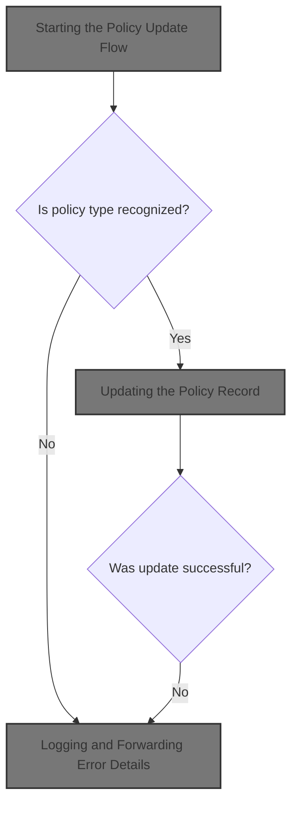
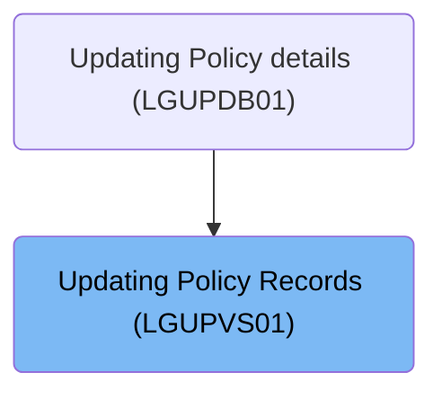
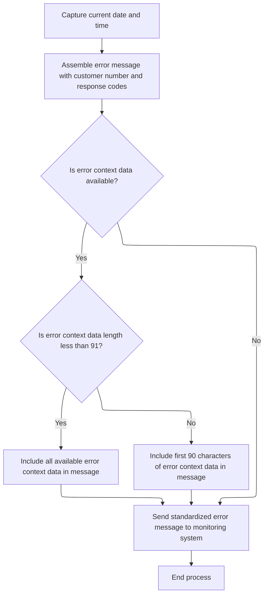
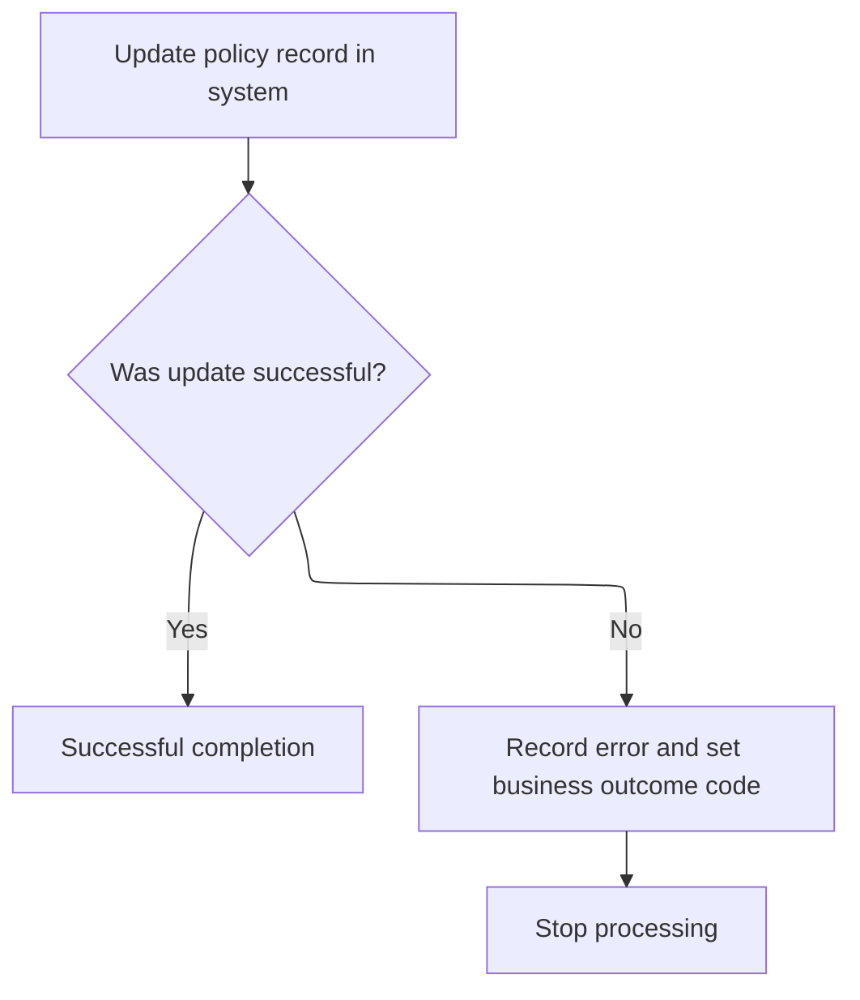

# Overview

This document describes the flow for updating policy records. The process extracts key identifiers and policy-specific data from the incoming request, retrieves the existing policy record, and updates it with new information. If retrieval or update fails, error details are logged and forwarded for monitoring.



## Dependencies

### Programs

- <SwmToken path="base/src/lgupvs01.cbl" pos="11:6:6" line-data="       PROGRAM-ID. LGUPVS01.">`LGUPVS01`</SwmToken> (<SwmPath>[base/src/lgupvs01.cbl](base/src/lgupvs01.cbl)</SwmPath>)
- LGSTSQ (<SwmPath>[base/src/lgstsq.cbl](base/src/lgstsq.cbl)</SwmPath>)

### Copybook

- LGCMAREA (<SwmPath>[base/src/lgcmarea.cpy](base/src/lgcmarea.cpy)</SwmPath>)

# Where is this program used?

This program is used once, as represented in the following diagram:



## Detailed View of the Program's Functionality

a. Starting the Policy Update Flow

The process begins by determining the length of the incoming communication area (commarea), which is a block of memory used to pass data between programs in this environment. The code then extracts key identifiers from the commarea: the request ID, policy number, and customer number. These identifiers are stored in a working area for use throughout the update process. The fourth character of the request ID is isolated and prepared, as it will be used to determine which type of policy data block should be processed.

b. Branching Based on Policy Type

The code examines the fourth character of the request ID to determine the type of policy being updated. Depending on the value, it branches as follows:

- If the character indicates a customer policy, the code copies the relevant customer policy fields (postcode, status, customer name) from the commarea into the working area.
- If it indicates an endowment policy, the code copies all endowment-specific fields (such as with-profits flag, equities, managed fund, fund name, and life assured) into the working area.
- If it indicates a house policy, the code copies house-specific fields (property type, number of bedrooms, value, postcode, and house name) into the working area.
- If it indicates a motor policy, the code copies motor-specific fields (make, model, value, and registration number) into the working area.
- If the character does not match any known policy type, the code clears the policy data fields in the working area to prevent accidental updates.

c. Reading the Policy Record

After setting up the working fields, the code moves the policy number again into the working area (likely to ensure the key is correctly set). It then issues a command to read the policy record from the main policy file, using the key fields prepared earlier. The read is performed with the intention to update, so the record is locked for update. If the read is successful, processing continues. If the read fails, the code sets error codes, logs the error, and forces an abnormal end (abend) to halt the transaction.

d. Logging and Forwarding Error Details

When an error occurs, the code performs detailed error logging. It first captures the current system date and time, formatting them for inclusion in the error message. The error message is assembled with the date, time, customer number, and response codes. This message is then sent to a separate program responsible for writing error messages to both a system queue and a Genapp-specific queue.

The error logging program (LGSTSQ) prepares the message, handles any special cases (such as custom queue names), and writes the message to both a transient data queue (for system monitoring) and a temporary storage queue (for Genapp). If the error context data is available and its length is less than 91 bytes, all of it is included in the message; otherwise, only the first 90 bytes are included. After logging, the process ends.

e. Updating the Policy Record

If the initial read was successful, the code attempts to rewrite the policy record in the file with the updated information from the working area. This is the actual update step. If the rewrite is successful, the process completes normally. If the rewrite fails, the code logs the error (again using the error logging mechanism), sets a different error code, and abends to halt the transaction.

f. Error Logging Program (LGSTSQ) Details

The error logging program receives the error message and prepares it for writing to the queues. It determines whether it was invoked directly or via a receive operation, sets up the message accordingly, and handles any custom queue name logic. The message is then written to both the system and Genapp queues. If invoked via receive, it sends a minimal response back to the terminal. Finally, the program returns control to the caller.

g. Summary

The overall flow ensures that policy updates are handled according to the type of policy, with strict error handling and logging at each step. Any failure in reading or updating the policy record results in detailed error logging and immediate termination of the transaction, ensuring data integrity and traceability. The error logging mechanism is robust, capturing both system and business context for each failure.

# Rule Definition

| Paragraph Name                                                                             | Rule ID | Category          | Description                                                                                                                                                                                                                         | Conditions                          | Remarks                                                                                                                                                       |
| ------------------------------------------------------------------------------------------ | ------- | ----------------- | ----------------------------------------------------------------------------------------------------------------------------------------------------------------------------------------------------------------------------------- | ----------------------------------- | ------------------------------------------------------------------------------------------------------------------------------------------------------------- |
| Spec, <SwmPath>[base/src/lgupvs01.cbl](base/src/lgupvs01.cbl)</SwmPath> lines 89-91        | RL-001  | Data Assignment   | The system must accept input through a commarea structure containing all request, policy, and error context fields as described in the input definition.                                                                            | Always, at the start of processing. | The commarea contains all necessary fields for request, policy, and error context. The input is mapped into working storage variables for further processing. |
| Spec, <SwmPath>[base/src/lgupvs01.cbl](base/src/lgupvs01.cbl)</SwmPath> lines 102, 106-135 | RL-002  | Conditional Logic | The system determines the policy type by inspecting the 4th character of the <SwmToken path="base/src/lgupvs01.cbl" pos="102:3:7" line-data="           Move CA-Request-ID(4:1) To WF-Request-ID">`CA-Request-ID`</SwmToken> field. | Always, after input is received.    | The 4th character of the request ID determines which policy fields are relevant for the update.                                                               |
| Spec, <SwmPath>[base/src/lgupvs01.cbl](base/src/lgupvs01.cbl)</SwmPath> lines 106-135      | RL-003  | Data Assignment   | The system prepares working storage for policy update logic, mapping commarea fields to working variables as needed for each policy type.                                                                                           | After determining policy type.      | Mappings:                                                                                                                                                     |

- 'C': <SwmToken path="base/src/lgupvs01.cbl" pos="109:3:7" line-data="               Move CA-B-Postcode  To WF-B-Postcode">`CA-B-Postcode`</SwmToken>, <SwmToken path="base/src/lgupvs01.cbl" pos="110:3:7" line-data="               Move CA-B-Status    To WF-B-Status">`CA-B-Status`</SwmToken>, <SwmToken path="base/src/lgupvs01.cbl" pos="111:3:7" line-data="               Move CA-B-Customer  To WF-B-Customer">`CA-B-Customer`</SwmToken>
- 'E': <SwmToken path="base/src/lgupvs01.cbl" pos="114:3:9" line-data="               Move CA-E-WITH-PROFITS To  WF-E-WITH-PROFITS">`CA-E-WITH-PROFITS`</SwmToken>, <SwmToken path="base/src/lgupvs01.cbl" pos="115:3:7" line-data="               Move CA-E-EQUITIES     To  WF-E-EQUITIES">`CA-E-EQUITIES`</SwmToken>, <SwmToken path="base/src/lgupvs01.cbl" pos="116:3:9" line-data="               Move CA-E-MANAGED-FUND To  WF-E-MANAGED-FUND">`CA-E-MANAGED-FUND`</SwmToken>, <SwmToken path="base/src/lgupvs01.cbl" pos="117:3:9" line-data="               Move CA-E-FUND-NAME    To  WF-E-FUND-NAME">`CA-E-FUND-NAME`</SwmToken>, <SwmToken path="base/src/lgupvs01.cbl" pos="118:3:9" line-data="               Move CA-E-LIFE-ASSURED To  WF-E-LIFE-ASSURED">`CA-E-LIFE-ASSURED`</SwmToken>
- 'H': <SwmToken path="base/src/lgupvs01.cbl" pos="121:3:9" line-data="               Move CA-H-PROPERTY-TYPE To  WF-H-PROPERTY-TYPE">`CA-H-PROPERTY-TYPE`</SwmToken>, <SwmToken path="base/src/lgupvs01.cbl" pos="122:3:7" line-data="               Move CA-H-BEDROOMS      To  WF-H-BEDROOMS">`CA-H-BEDROOMS`</SwmToken>, <SwmToken path="base/src/lgupvs01.cbl" pos="123:3:7" line-data="               Move CA-H-VALUE         To  WF-H-VALUE">`CA-H-VALUE`</SwmToken>, <SwmToken path="base/src/lgupvs01.cbl" pos="124:3:7" line-data="               Move CA-H-POSTCODE      To  WF-H-POSTCODE">`CA-H-POSTCODE`</SwmToken>, <SwmToken path="base/src/lgupvs01.cbl" pos="125:3:9" line-data="               Move CA-H-HOUSE-NAME    To  WF-H-HOUSE-NAME">`CA-H-HOUSE-NAME`</SwmToken>
- 'M': <SwmToken path="base/src/lgupvs01.cbl" pos="128:3:7" line-data="               Move CA-M-MAKE          To  WF-M-MAKE">`CA-M-MAKE`</SwmToken>, <SwmToken path="base/src/lgupvs01.cbl" pos="129:3:7" line-data="               Move CA-M-MODEL         To  WF-M-MODEL">`CA-M-MODEL`</SwmToken>, <SwmToken path="base/src/lgupvs01.cbl" pos="130:3:7" line-data="               Move CA-M-VALUE         To  WF-M-VALUE">`CA-M-VALUE`</SwmToken>, <SwmToken path="base/src/lgupvs01.cbl" pos="131:3:7" line-data="               Move CA-M-REGNUMBER     To  WF-M-REGNUMBER">`CA-M-REGNUMBER`</SwmToken> | | Spec, <SwmPath>[base/src/lgupvs01.cbl](base/src/lgupvs01.cbl)</SwmPath> lines 133-135 | RL-004 | Conditional Logic | If the request type does not match any known policy type, the system clears all policy data fields in working storage. | Request type is not 'C', 'E', 'H', or 'M'. | All policy data fields in working storage are set to spaces. | | Spec, <SwmPath>[base/src/lgupvs01.cbl](base/src/lgupvs01.cbl)</SwmPath> lines 103, 137, 139-146, 155-159 | RL-005 | Computation | The system always uses the <SwmToken path="base/src/lgupvs01.cbl" pos="103:3:7" line-data="           Move CA-Policy-Num      To WF-Policy-Num">`CA-Policy-Num`</SwmToken> field as the key for policy record operations. | For all policy record fetch and update operations. | Policy number is a string of 10 characters, used as the key in the data store. | | Spec, <SwmPath>[base/src/lgupvs01.cbl](base/src/lgupvs01.cbl)</SwmPath> lines 139-146 | RL-006 | Computation | The system fetches the policy record from the PolicyDataStore using the policy number as the key. | After mapping input fields and preparing working storage. | The data store supports keyed read operations. The key is the policy number. | | Spec, <SwmPath>[base/src/lgupvs01.cbl](base/src/lgupvs01.cbl)</SwmPath> lines 147-153, 174-205 | RL-007 | Conditional Logic | If the fetch fails, the system sets <SwmToken path="base/src/lgupvs01.cbl" pos="149:9:13" line-data="             MOVE &#39;81&#39; TO CA-RETURN-CODE">`CA-RETURN-CODE`</SwmToken> to '81', assembles an error message with timestamp, customer number, policy number, response codes, and up to 90 bytes of error context data, and writes this message to both the ErrorQueue and a system log. | Fetch operation does not return normal status. | Return code '81' indicates fetch failure. Error message format includes: date (8 chars), time (6 chars), program name, policy number (10 chars), customer number (10 chars), response codes, and up to 90 bytes of error context data. | | Spec, <SwmPath>[base/src/lgupvs01.cbl](base/src/lgupvs01.cbl)</SwmPath> lines 106-135, 156-159 | RL-008 | Data Assignment | If the fetch succeeds, the system updates the policy record in working storage with the new data from the commarea. | Fetch operation returns normal status. | Working storage is updated with the mapped fields from the commarea for the relevant policy type. | | Spec, <SwmPath>[base/src/lgupvs01.cbl](base/src/lgupvs01.cbl)</SwmPath> lines 155-159 | RL-009 | Computation | The system attempts to update (rewrite) the policy record in the PolicyDataStore with the new data. | After updating working storage with new data. | The data store supports keyed update (rewrite) operations. | | Spec, <SwmPath>[base/src/lgupvs01.cbl](base/src/lgupvs01.cbl)</SwmPath> lines 160-166, 174-205 | RL-010 | Conditional Logic | If the update fails, the system sets <SwmToken path="base/src/lgupvs01.cbl" pos="149:9:13" line-data="             MOVE &#39;81&#39; TO CA-RETURN-CODE">`CA-RETURN-CODE`</SwmToken> to '82', assembles an error message as above, and writes it to both the ErrorQueue and a system log. | Update operation does not return normal status. | Return code '82' indicates update failure. Error message format is the same as for fetch failure. | | Spec, <SwmPath>[base/src/lgupvs01.cbl](base/src/lgupvs01.cbl)</SwmPath> lines 167, 170-172 | RL-011 | Computation | If the update succeeds, the system completes the transaction and returns control. | Update operation returns normal status. | No special output format; normal transaction completion. | | Spec, <SwmPath>[base/src/lgstsq.cbl](base/src/lgstsq.cbl)</SwmPath> lines 25-32, 61-80, 174-205 | RL-012 | Data Assignment | Error messages must include: timestamp, customer number, policy number, return code, response codes, and up to 90 bytes of error context data. Messages are written to both a persistent queue (ErrorQueue) and a system log. | Whenever an error occurs during fetch or update. | Error message fields: date (8 chars), time (6 chars), program name, policy number (10 chars), customer number (10 chars), response codes, up to 90 bytes of error context data. ErrorQueue is a persistent queue or table supporting append operations. | | Spec | RL-013 | Computation | The PolicyDataStore must be a persistent database table supporting keyed read and update operations. The ErrorQueue must be a persistent queue or database table supporting append operations for error messages. | Always, for all data and error message operations. | No specific technology required, but persistence and support for described operations is mandatory. |

# User Stories

## User Story 1: Input Handling and Policy Type Determination

---

### Story Description:

As a system, I want to accept input via a commarea structure and determine the relevant policy type and fields so that I can correctly prepare data for policy updates.

---

### Business Rule Mapping:

| Rule ID | Paragraph Name                                                                                           | Rule Description                                                                                                                                                                                                                    |
| ------- | -------------------------------------------------------------------------------------------------------- | ----------------------------------------------------------------------------------------------------------------------------------------------------------------------------------------------------------------------------------- |
| RL-001  | Spec, <SwmPath>[base/src/lgupvs01.cbl](base/src/lgupvs01.cbl)</SwmPath> lines 89-91                      | The system must accept input through a commarea structure containing all request, policy, and error context fields as described in the input definition.                                                                            |
| RL-002  | Spec, <SwmPath>[base/src/lgupvs01.cbl](base/src/lgupvs01.cbl)</SwmPath> lines 102, 106-135               | The system determines the policy type by inspecting the 4th character of the <SwmToken path="base/src/lgupvs01.cbl" pos="102:3:7" line-data="           Move CA-Request-ID(4:1) To WF-Request-ID">`CA-Request-ID`</SwmToken> field. |
| RL-003  | Spec, <SwmPath>[base/src/lgupvs01.cbl](base/src/lgupvs01.cbl)</SwmPath> lines 106-135                    | The system prepares working storage for policy update logic, mapping commarea fields to working variables as needed for each policy type.                                                                                           |
| RL-004  | Spec, <SwmPath>[base/src/lgupvs01.cbl](base/src/lgupvs01.cbl)</SwmPath> lines 133-135                    | If the request type does not match any known policy type, the system clears all policy data fields in working storage.                                                                                                              |
| RL-005  | Spec, <SwmPath>[base/src/lgupvs01.cbl](base/src/lgupvs01.cbl)</SwmPath> lines 103, 137, 139-146, 155-159 | The system always uses the <SwmToken path="base/src/lgupvs01.cbl" pos="103:3:7" line-data="           Move CA-Policy-Num      To WF-Policy-Num">`CA-Policy-Num`</SwmToken> field as the key for policy record operations.           |
| RL-008  | Spec, <SwmPath>[base/src/lgupvs01.cbl](base/src/lgupvs01.cbl)</SwmPath> lines 106-135, 156-159           | If the fetch succeeds, the system updates the policy record in working storage with the new data from the commarea.                                                                                                                 |

---

### Relevant Functionality:

- **Spec**
  1. **RL-001:**
     - Receive commarea input structure
     - Map commarea fields to working storage variables for processing
  2. **RL-002:**
     - Extract 4th character from request ID
     - Use this character to select policy type for further processing
  3. **RL-003:**
     - If policy type is 'C', map customer policy fields
     - If 'E', map endowment policy fields
     - If 'H', map house policy fields
     - If 'M', map motor policy fields
  4. **RL-004:**
     - If request type is not recognized, set all policy data fields in working storage to spaces
  5. **RL-005:**
     - Use policy number from input as key for reading and updating policy records in the data store
  6. **RL-008:**
     - If fetch succeeds:
       - Update working storage policy record with new data from input

## User Story 2: Policy Record Fetch and Update

---

### Story Description:

As a system, I want to fetch and update policy records in the PolicyDataStore using the policy number as the key so that policy data is accurately maintained and persisted.

---

### Business Rule Mapping:

| Rule ID | Paragraph Name                                                                                           | Rule Description                                                                                                                                                                                                          |
| ------- | -------------------------------------------------------------------------------------------------------- | ------------------------------------------------------------------------------------------------------------------------------------------------------------------------------------------------------------------------- |
| RL-005  | Spec, <SwmPath>[base/src/lgupvs01.cbl](base/src/lgupvs01.cbl)</SwmPath> lines 103, 137, 139-146, 155-159 | The system always uses the <SwmToken path="base/src/lgupvs01.cbl" pos="103:3:7" line-data="           Move CA-Policy-Num      To WF-Policy-Num">`CA-Policy-Num`</SwmToken> field as the key for policy record operations. |
| RL-006  | Spec, <SwmPath>[base/src/lgupvs01.cbl](base/src/lgupvs01.cbl)</SwmPath> lines 139-146                    | The system fetches the policy record from the PolicyDataStore using the policy number as the key.                                                                                                                         |
| RL-009  | Spec, <SwmPath>[base/src/lgupvs01.cbl](base/src/lgupvs01.cbl)</SwmPath> lines 155-159                    | The system attempts to update (rewrite) the policy record in the PolicyDataStore with the new data.                                                                                                                       |
| RL-011  | Spec, <SwmPath>[base/src/lgupvs01.cbl](base/src/lgupvs01.cbl)</SwmPath> lines 167, 170-172               | If the update succeeds, the system completes the transaction and returns control.                                                                                                                                         |
| RL-013  | Spec                                                                                                     | The PolicyDataStore must be a persistent database table supporting keyed read and update operations. The ErrorQueue must be a persistent queue or database table supporting append operations for error messages.         |

---

### Relevant Functionality:

- **Spec**
  1. **RL-005:**
     - Use policy number from input as key for reading and updating policy records in the data store
  2. **RL-006:**
     - Attempt to read policy record from persistent data store using policy number as key
  3. **RL-009:**
     - Attempt to rewrite policy record in persistent data store with updated data
  4. **RL-011:**
     - If update succeeds:
       - Complete transaction
       - Return control to caller
  5. **RL-013:**
     - Use persistent storage for policy records (keyed read/update)
     - Use persistent queue or table for error messages (append only)

## User Story 3: Error Handling and Messaging

---

### Story Description:

As a system, I want to generate and persist detailed error messages to both the ErrorQueue and a system log when fetch or update operations fail so that errors can be tracked and diagnosed reliably.

---

### Business Rule Mapping:

| Rule ID | Paragraph Name                                                                                  | Rule Description                                                                                                                                                                                                                                                                                                                                                                                  |
| ------- | ----------------------------------------------------------------------------------------------- | ------------------------------------------------------------------------------------------------------------------------------------------------------------------------------------------------------------------------------------------------------------------------------------------------------------------------------------------------------------------------------------------------- |
| RL-007  | Spec, <SwmPath>[base/src/lgupvs01.cbl](base/src/lgupvs01.cbl)</SwmPath> lines 147-153, 174-205  | If the fetch fails, the system sets <SwmToken path="base/src/lgupvs01.cbl" pos="149:9:13" line-data="             MOVE &#39;81&#39; TO CA-RETURN-CODE">`CA-RETURN-CODE`</SwmToken> to '81', assembles an error message with timestamp, customer number, policy number, response codes, and up to 90 bytes of error context data, and writes this message to both the ErrorQueue and a system log. |
| RL-010  | Spec, <SwmPath>[base/src/lgupvs01.cbl](base/src/lgupvs01.cbl)</SwmPath> lines 160-166, 174-205  | If the update fails, the system sets <SwmToken path="base/src/lgupvs01.cbl" pos="149:9:13" line-data="             MOVE &#39;81&#39; TO CA-RETURN-CODE">`CA-RETURN-CODE`</SwmToken> to '82', assembles an error message as above, and writes it to both the ErrorQueue and a system log.                                                                                                          |
| RL-012  | Spec, <SwmPath>[base/src/lgstsq.cbl](base/src/lgstsq.cbl)</SwmPath> lines 25-32, 61-80, 174-205 | Error messages must include: timestamp, customer number, policy number, return code, response codes, and up to 90 bytes of error context data. Messages are written to both a persistent queue (ErrorQueue) and a system log.                                                                                                                                                                     |
| RL-013  | Spec                                                                                            | The PolicyDataStore must be a persistent database table supporting keyed read and update operations. The ErrorQueue must be a persistent queue or database table supporting append operations for error messages.                                                                                                                                                                                 |

---

### Relevant Functionality:

- **Spec**
  1. **RL-007:**
     - If fetch fails:
       - Set return code to '81'
       - Assemble error message with required fields
       - Write error message to ErrorQueue (persistent queue/table)
       - Write error message to system log
  2. **RL-010:**
     - If update fails:
       - Set return code to '82'
       - Assemble error message with required fields
       - Write error message to ErrorQueue (persistent queue/table)
       - Write error message to system log
  3. **RL-012:**
     - Assemble error message with required fields
     - Write message to persistent error queue
     - Write message to system log
  4. **RL-013:**
     - Use persistent storage for policy records (keyed read/update)
     - Use persistent queue or table for error messages (append only)

# Workflow

# Starting the Policy Update Flow

This section is responsible for initializing the policy update flow by extracting identifiers, determining the policy type, loading the appropriate policy data into working storage, and handling errors if the policy record cannot be read.

| Category        | Rule Name                 | Description                                                                                                                                                                                                                                         |
| --------------- | ------------------------- | --------------------------------------------------------------------------------------------------------------------------------------------------------------------------------------------------------------------------------------------------- |
| Data validation | Policy Type Determination | The policy type must be determined by evaluating the 4th character of the request ID. Only recognized policy types ('C' for customer, 'E' for endowment, 'H' for house, 'M' for motor) are allowed to proceed with loading specific policy data.    |
| Business logic  | Extract Key Identifiers   | The policy update flow must extract the request ID, policy number, and customer number from the incoming commarea and store them in working storage before any update logic is performed.                                                           |
| Business logic  | Load Policy Data by Type  | For each recognized policy type, the corresponding policy data fields must be loaded into working storage from the commarea. For example, customer policy fields for 'C', endowment fields for 'E', house fields for 'H', and motor fields for 'M'. |
| Business logic  | Policy Record Retrieval   | After preparing working storage, the policy record must be read from the policy file using the policy key. The read operation must use a key length of 21 and the length of the commarea as specified.                                              |

<SwmSnippet path="/base/src/lgupvs01.cbl" line="97">

---

In MAINLINE, this is where the flow kicks off: it grabs the commarea length, pulls out the key identifiers (request ID, policy number, customer number) from the incoming commarea, and sets up working storage for the rest of the update logic. The 4th character of the request ID is prepped for later to decide which policy data block to use. Assumes the commarea and its fields are already valid and populated.

```cobol
       MAINLINE SECTION.
      *
      *---------------------------------------------------------------*
           Move EIBCALEN To WS-Commarea-Len.
      *---------------------------------------------------------------*
           Move CA-Request-ID(4:1) To WF-Request-ID
           Move CA-Policy-Num      To WF-Policy-Num
           Move CA-Customer-Num    To WF-Customer-Num
```

---

</SwmSnippet>

<SwmSnippet path="/base/src/lgupvs01.cbl" line="106">

---

Here the code checks the 4th character of the request ID and starts branching: if it's 'C', it moves the basic customer policy fields into the working area. This sets up the right data for the update, depending on the policy type.

```cobol
           Evaluate WF-Request-ID

             When 'C'
               Move CA-B-Postcode  To WF-B-Postcode
               Move CA-B-Status    To WF-B-Status
               Move CA-B-Customer  To WF-B-Customer
```

---

</SwmSnippet>

<SwmSnippet path="/base/src/lgupvs01.cbl" line="113">

---

Next up, if the request is for an endowment policy ('E'), the code moves all the relevant endowment fields into the working area. This keeps the update logic type-specific.

```cobol
             When 'E'
               Move CA-E-WITH-PROFITS To  WF-E-WITH-PROFITS
               Move CA-E-EQUITIES     To  WF-E-EQUITIES
               Move CA-E-MANAGED-FUND To  WF-E-MANAGED-FUND
               Move CA-E-FUND-NAME    To  WF-E-FUND-NAME
               Move CA-E-LIFE-ASSURED To  WF-E-LIFE-ASSURED
```

---

</SwmSnippet>

<SwmSnippet path="/base/src/lgupvs01.cbl" line="120">

---

If the request is for a house policy ('H'), this part moves all the house-specific fields into the working area. Keeps the data aligned for house policy updates.

```cobol
             When 'H'
               Move CA-H-PROPERTY-TYPE To  WF-H-PROPERTY-TYPE
               Move CA-H-BEDROOMS      To  WF-H-BEDROOMS
               Move CA-H-VALUE         To  WF-H-VALUE
               Move CA-H-POSTCODE      To  WF-H-POSTCODE
               Move CA-H-HOUSE-NAME    To  WF-H-HOUSE-NAME
```

---

</SwmSnippet>

<SwmSnippet path="/base/src/lgupvs01.cbl" line="127">

---

For motor policies ('M'), this part loads the make, model, value, and registration number into the working fields. Keeps the update logic consistent for motor policies.

```cobol
             When 'M'
               Move CA-M-MAKE          To  WF-M-MAKE
               Move CA-M-MODEL         To  WF-M-MODEL
               Move CA-M-VALUE         To  WF-M-VALUE
               Move CA-M-REGNUMBER     To  WF-M-REGNUMBER
```

---

</SwmSnippet>

<SwmSnippet path="/base/src/lgupvs01.cbl" line="133">

---

If the request type doesn't match any known policy, this block just clears the policy data fields. That way, no accidental updates happen for unknown types.

```cobol
             When Other
               Move Spaces To WF-Policy-Data
           End-Evaluate
```

---

</SwmSnippet>

<SwmSnippet path="/base/src/lgupvs01.cbl" line="137">

---

After setting up the working fields, the code moves the policy number again and then does a CICS READ on the policy file using the key. This is the actual fetch before any update happens.

```cobol
           Move CA-Policy-Num      To WF-Policy-Num
      *---------------------------------------------------------------*
           Exec CICS Read File('KSDSPOLY')
                     Into(WS-FileIn)
                     Length(WS-Commarea-Len)
                     Ridfld(WF-Policy-Key)
                     KeyLength(21)
                     RESP(WS-RESP)
                     Update
           End-Exec.
```

---

</SwmSnippet>

<SwmSnippet path="/base/src/lgupvs01.cbl" line="147">

---

If the read fails, the code sets error codes, logs the error by calling <SwmToken path="base/src/lgupvs01.cbl" pos="150:3:7" line-data="             PERFORM WRITE-ERROR-MESSAGE">`WRITE-ERROR-MESSAGE`</SwmToken> (which writes to error and Genapp queues), then forces an ABEND to stop the transaction. This makes sure failures are recorded and don't go unnoticed.

```cobol
           If WS-RESP Not = DFHRESP(NORMAL)
             Move EIBRESP2 To WS-RESP2
             MOVE '81' TO CA-RETURN-CODE
             PERFORM WRITE-ERROR-MESSAGE
             EXEC CICS ABEND ABCODE('LGV3') NODUMP END-EXEC
             EXEC CICS RETURN END-EXEC
           End-If.
```

---

</SwmSnippet>

## Logging and Forwarding Error Details



The main product role of this section is to ensure that all relevant error details are logged and forwarded in a standardized format, enabling monitoring and troubleshooting of system issues.

| Category       | Rule Name                          | Description                                                                                                                                     |
| -------------- | ---------------------------------- | ----------------------------------------------------------------------------------------------------------------------------------------------- |
| Business logic | Standard error message composition | Every error message must include the current date and time, customer number, and both response codes.                                           |
| Business logic | Full context data inclusion        | If error context data is available and its length is less than 91 characters, the entire context data must be included in the error message.    |
| Business logic | Context data truncation            | If error context data is available and its length is 91 characters or more, only the first 90 characters must be included in the error message. |
| Business logic | Dual destination forwarding        | All error messages must be forwarded to both the transaction queue and the monitoring system for redundancy and alerting.                       |

<SwmSnippet path="/base/src/lgupvs01.cbl" line="174">

---

In <SwmToken path="base/src/lgupvs01.cbl" pos="174:1:5" line-data="       WRITE-ERROR-MESSAGE.">`WRITE-ERROR-MESSAGE`</SwmToken>, it grabs the current system time and formats it into date and time fields. This timestamp gets attached to the error message for logging.

```cobol
       WRITE-ERROR-MESSAGE.
           EXEC CICS ASKTIME ABSTIME(WS-ABSTIME)
           END-EXEC
           EXEC CICS FORMATTIME ABSTIME(WS-ABSTIME)
                     MMDDYYYY(WS-DATE)
                     TIME(WS-TIME)
           END-EXEC
```

---

</SwmSnippet>

<SwmSnippet path="/base/src/lgupvs01.cbl" line="182">

---

After setting up the error message with date, time, customer number, and response codes, the code calls LGSTSQ. That program takes care of actually writing the error to the queues.

```cobol
           MOVE WS-DATE TO EM-DATE
           MOVE WS-TIME TO EM-TIME
           Move CA-Customer-Num To EM-Cusnum
           Move WS-RESP         To EM-RespRC
           Move WS-RESP2        To EM-Resp2RC
           EXEC CICS LINK PROGRAM('LGSTSQ')
                     COMMAREA(ERROR-MSG)
                     LENGTH(LENGTH OF ERROR-MSG)
           END-EXEC.
```

---

</SwmSnippet>

<SwmSnippet path="/base/src/lgstsq.cbl" line="55">

---

LGSTSQ loads the message, handles special cases, writes to both queues, and sends a response if needed.

```cobol
       MAINLINE SECTION.

           MOVE SPACES TO WRITE-MSG.
           MOVE SPACES TO WS-RECV.

           EXEC CICS ASSIGN SYSID(WRITE-MSG-SYSID)
                RESP(WS-RESP)
           END-EXEC.

           EXEC CICS ASSIGN INVOKINGPROG(WS-INVOKEPROG)
                RESP(WS-RESP)
           END-EXEC.
           
           IF WS-INVOKEPROG NOT = SPACES
              MOVE 'C' To WS-FLAG
              MOVE COMMA-DATA  TO WRITE-MSG-MSG
              MOVE EIBCALEN    TO WS-RECV-LEN
           ELSE
              EXEC CICS RECEIVE INTO(WS-RECV)
                  LENGTH(WS-RECV-LEN)
                  RESP(WS-RESP)
              END-EXEC
              MOVE 'R' To WS-FLAG
              MOVE WS-RECV-DATA  TO WRITE-MSG-MSG
              SUBTRACT 5 FROM WS-RECV-LEN
           END-IF.

           MOVE 'GENAERRS' TO STSQ-NAME.
           IF WRITE-MSG-MSG(1:2) = 'Q=' THEN
              MOVE WRITE-MSG-MSG(3:4) TO STSQ-EXT
              MOVE WRITE-MSG-REST TO TEMPO
              MOVE TEMPO          TO WRITE-MSG-MSG
              SUBTRACT 7 FROM WS-RECV-LEN
           END-IF.

           ADD 5 TO WS-RECV-LEN.

      * Write output message to TDQ CSMT
      *
           EXEC CICS WRITEQ TD QUEUE(STDQ-NAME)
                     FROM(WRITE-MSG)
                     RESP(WS-RESP)
                     LENGTH(WS-RECV-LEN)

           END-EXEC.

      * Write output message to Genapp TSQ
      * If no space is available then the task will not wait for
      *  storage to become available but will ignore the request...
      *
           EXEC CICS WRITEQ TS QUEUE(STSQ-NAME)
                     FROM(WRITE-MSG)
                     RESP(WS-RESP)
                     NOSUSPEND
                     LENGTH(WS-RECV-LEN)

           END-EXEC.

           If WS-FLAG = 'R' Then
             EXEC CICS SEND TEXT FROM(FILLER-X)
              WAIT
              ERASE
              LENGTH(1)
              FREEKB
             END-EXEC.

           EXEC CICS RETURN
           END-EXEC.
```

---

</SwmSnippet>

<SwmSnippet path="/base/src/lgupvs01.cbl" line="191">

---

After coming back from LGSTSQ in <SwmToken path="base/src/lgupvs01.cbl" pos="150:3:7" line-data="             PERFORM WRITE-ERROR-MESSAGE">`WRITE-ERROR-MESSAGE`</SwmToken>, the code checks if any data was returned. If so, it copies up to 90 bytes into <SwmToken path="base/src/lgupvs01.cbl" pos="193:12:14" line-data="               MOVE DFHCOMMAREA(1:EIBCALEN) TO CA-DATA">`CA-DATA`</SwmToken> and links to LGSTSQ again to log or forward that data. This handles variable-length commareas safely.

```cobol
           IF EIBCALEN > 0 THEN
             IF EIBCALEN < 91 THEN
               MOVE DFHCOMMAREA(1:EIBCALEN) TO CA-DATA
               EXEC CICS LINK PROGRAM('LGSTSQ')
                         COMMAREA(CA-ERROR-MSG)
                         LENGTH(Length Of CA-ERROR-MSG)
               END-EXEC
             ELSE
               MOVE DFHCOMMAREA(1:90) TO CA-DATA
               EXEC CICS LINK PROGRAM('LGSTSQ')
                         COMMAREA(CA-ERROR-MSG)
                         LENGTH(Length Of CA-ERROR-MSG)
               END-EXEC
             END-IF
           END-IF.
           EXIT.
```

---

</SwmSnippet>

## Updating the Policy Record



<SwmSnippet path="/base/src/lgupvs01.cbl" line="155">

---

Back in MAINLINE after <SwmToken path="base/src/lgupvs01.cbl" pos="150:3:7" line-data="             PERFORM WRITE-ERROR-MESSAGE">`WRITE-ERROR-MESSAGE`</SwmToken>, the code tries to rewrite the policy record with the updated info. This is the actual update step after all the setup and error handling.

```cobol
           Exec CICS ReWrite File('KSDSPOLY')
                     From(WF-Policy-Info)
                     Length(WS-Commarea-LenF)
                     RESP(WS-RESP)
           End-Exec.
```

---

</SwmSnippet>

<SwmSnippet path="/base/src/lgupvs01.cbl" line="160">

---

If the rewrite fails, MAINLINE logs the error (again via <SwmToken path="base/src/lgupvs01.cbl" pos="163:3:7" line-data="             PERFORM WRITE-ERROR-MESSAGE">`WRITE-ERROR-MESSAGE`</SwmToken>), sets a different error code, and abends. If everything works, the function just completes and returns control.

```cobol
           If WS-RESP Not = DFHRESP(NORMAL)
             Move EIBRESP2 To WS-RESP2
             MOVE '82' TO CA-RETURN-CODE
             PERFORM WRITE-ERROR-MESSAGE
             EXEC CICS ABEND ABCODE('LGV4') NODUMP END-EXEC
             EXEC CICS RETURN END-EXEC
           End-If.
```

---

</SwmSnippet>

&nbsp;

*This is an auto-generated document by Swimm 🌊 and has not yet been verified by a human*

<SwmMeta version="3.0.0" repo-id="Z2l0aHViJTNBJTNBU3dpbW1pby1nZW5hcHAtaG91c2UlM0ElM0FHaXJpLVN3aW1t" repo-name="Swimmio-genapp-house"><sup>Powered by [Swimm](https://app.swimm.io/)</sup></SwmMeta>
